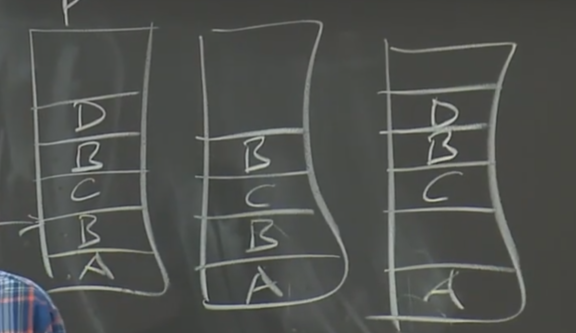
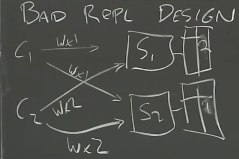

# MIT 6.824

## GFS

**矛盾与设计难点**

我们之所以采用分布式的存储方式，是为了追求更高的性能

- 为了追求更高的性能，采用了分片(sharding)的方式，将数据放置在几千台服务器之上->

- 分片之后就会存在个别服务器宕机的情况，因此需要引入Fault Tolerance->

- 为确保容错功能则需要将数据进行复制->

- 对数据进行复制之后则会导致一致性的问题->

- 一致性存在问题则又会导致低性能->

一顿操作以后，达到的效果与我们的设计初衷相违背

### GFS设计

- Big，fast
- Global：访问权限上允许即可全球化使用
- Sharding：分布式存储，以便用户并行化读取，提高吞吐量
- Automatic recovery
- Single data center
- Internal use
- Big sequential access：只处理大文件的顺序访问，而非随机访问

谷歌认为存储系统设计为弱一致性是可以忍受的，为了获取更好的性能，类似于搜索引擎查询的结果，少几条也无所谓，不需要像银行般强烈保证数据的正确性

谷歌设计为一个master server和多个chunk server，master用于进行协调调度，并且维护系统的所有元数据(命名空间，访问控制信息等)chunk为真正进行存储读取工作的节点，二者使用独立的特性进行独立设计，master能够追踪文件 chunk chunk标识符

> 如果资源允许且可以接受不稳定的应用程序代码所带来的低可靠性，那么可以轻松地在一台机器上同时运行chunkserver和client。
>
> client不会直接从master读取文件数据，而是询问master它需要与哪个chunkserver通信。

数据通过sharding分片分为多个chunk(块),存储在不同的chunk server上，注意区分 chunk与chunk server，chunk为数据的分块，包含文件的连续片段，每个chunk 的大小为64MB,chunk server为负责存储的服务器，一个chunk和chunk server并不存在一一对应的关系

master主要维护三个元数据（文件和chunk1的命名空间和两个映射）：

- 文件名到chunk handle(id)数组的映射
- chunk handle(id)到：
  - chunk server list的映射，一个chunk被存储在多个chunk server上(副本，并非将一个chunk再划分)
  - chunk的版本号
  - 对于chunk的读写操作必须早主chunk上顺序化，因此需要保存那个chunk server 为主节点和chunkserver 的租赁时间

以上数据存储在内存当中，并且部分持久化到硬盘当中(版本号)，对应master存在一个日志系统(唯一被持久化的元数据)和快照(由日志产生，同样也持久化)，日志为完整的记录，快照(checkpoint)为一个状态，master宕机后恢复通过checkpoint即可

> master不会持久化保存哪台chunkserver含有给定的chunk的副本的记录，而是简单地在启动时从chunkserver获取信息

**读取**

过程：

1. 客户端首先先向Master节点发送文件名和偏移量(读取范围)
2. Master根据文件名和偏移量进行查询，查询到对应chunk handle,再通过chunk handle查询到对应的chunk server ，将chunk handle和对应副本所在的chunk server返回给客户端
3. 客户端对chunk server的结果进行缓存，并且选择一个chunk server进行读取(通过同一个交换机的chunk server进行读取)

**写入**

首先假设写入为在尾部追加的情况，并且由于primary存在租赁的机制，因此同样假设当前并无primary节点

过程：

1. client通知master要进行文件的追加写入

2. 进行追加写入时，master首先要找到最近的版本(up tp date)

3. 之后 master在这些最新的版本的chunk server中，选择出一个primary节点，以及其他的secondary节点

4. 由于重新选择了primary节点，因此对版本号进行更新

5. 告知primary和secondary节点版本号的更新，并且对primary设置租赁时间

6. master节点把版本号持久化到磁盘当中

7. primary节点选择一个偏移量，并且告知所有的secondary节点在该偏移量出进行追加写入

8. 之后primary等待secondary的写入成功通知，如果所有的secondary都写入成功，则向client返回success，如果不是全部写入成功，则回复client "NO",之后client再重新尝试发送写入请求

   例如以下该种情况：A写入成功后B写入失败，返回给client NO，之后client便会尝试重写写入(完全重新，不对上次失败写入的成功的secondary节点做任何处理，直接进行冗余存储)，B在C写入之后重新写入，C的偏移量由primary同一决定，对于上一次写入B失败的secondary节点，选择primary确定的偏移量而不是在末尾进行追加，之前写入失败的部分保持空白即可

   

注意事项：

- 只有没用primary时版本号才会增加

- secondary出现严重错误时，master重新规划副本，丢弃掉该节点,防止对于此次写入无论客户端如何尝试，返回的结果均为No

- 租赁为超时机制，保证不会由多个primary, master的ping可能只是传输过程中丢失，但primary本身并无问题，但是master认为primary挂掉，如果重新选择primary，则会导致多个primary的问题

### 一致性

- 强一致性：对应分布式系统可认为为一个单体的服务器

单体服务器的可用性较差，一旦宕机则无法提供服务，因此便引入了多个分布式的Server，以上为一个设计的较为失败的案例：由于并未对C1和C2的写入顺序做约束，如果写入顺序按照C1在C2之前写S1,C2在C1之前写S2，最终导致了数据库的一致性出现问题，若想解决，则需要在主库和备库之间进行通信

GFS并非强一致性设计，如果想将GFS转换为强一致性，可以从以下几个角度考虑：

- primary检测重复的请求，像上述例子的冗余的第二个B到达时能够知晓，保证B不会冗余存储

- secondary需要真正的去执行primary所委派的任务，而不是直接返回错误信息
- 对于出现严重错误的secondary节点，需要将其从中剔除
- 采用两阶段提交，只有primary确定了所有的secondary有了写入的能力之后再对secondary委派任务

[《The Google File System》论文翻译（GFS-SOSP2003） - 叉鸽 MrCroxx 的博客](https://mrcroxx.github.io/posts/paper-reading/gfs-sosp2003/#41-命名空间管理与锁)

## Primary-Backup Replication

