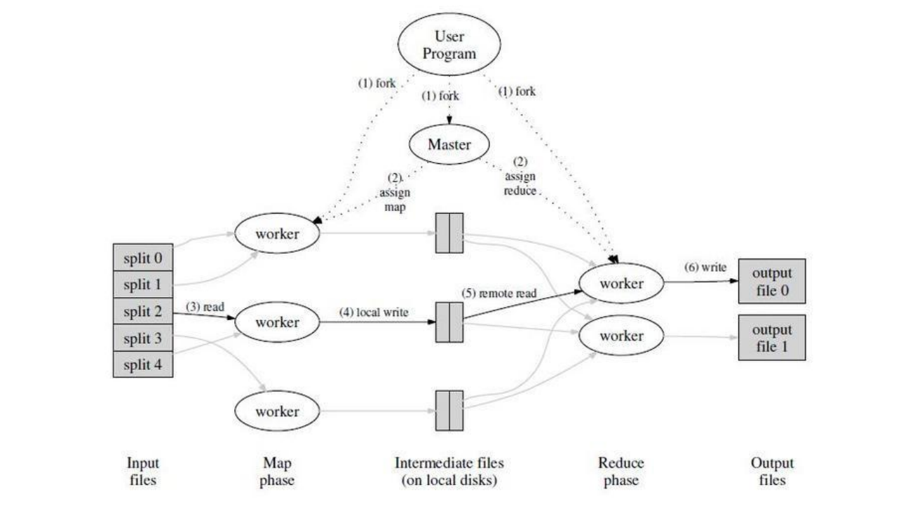
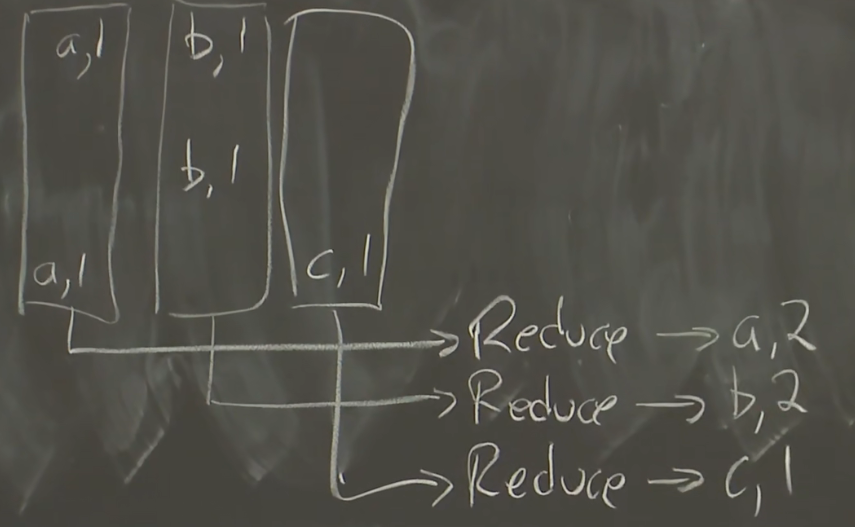

# MapReduce

## 概述

MapReduce用于分布式系统的任务分发和并行化处理，主要分为三个部分，Map函数，shuffle，和Reduce函数

- Map函数接收一个K-V键值对，产生一个中间类型的K-V 
- shuffle为一个过程，将Map的处理结果重新组织传给对应的worker
- Reduce函数对于Map传来的结果进行一个聚合，将同一个key对应的value形成一个集合(可以是一个List形式的集合，也可为计数等)

## 案例：单词统计

首先对于Map函数输入一个大型的文档，Map函数所接收的K为文档名，V为文档内容，之后Map函数在对输入的文档进行分割单词，统计在这一部分文档中该出现的次数，最后形成键值对，K为单词，V为该单词出现的次数

之后便经过一个shuffle过程，对于不同worker上的相同的单词，传送到同一个worker上面，调用reduce函数，对各个Map的计数进行一个聚合，得到这个单子在整个文档中的出现次数

- 值得注意的是，整个单词统计的大前提为分布式，即Map和Reduce都是运行在不同的worker上的，Map所统计的单词数量也仅仅只是分发给它的那一段中出现的次数，只有对所有的Map的结果进行聚合，得到的才是整个文档中的出现的次数
- Reduce的输出结果仍可以作为新的输入数据交给下层的Map函数，对其进行更为复杂的处理

### 其他案例

- 计算URL的访问频率
- 倒转网络连接图，Map对于源页面(source)中搜索所有的目标页面(target)，输出为(target,source),Reduce聚合为(target,List(source))
- 倒排索引

各种应用场景的共同点为对一个复杂庞大的任务进行拆分，并且该任务拆分的各个部分上并无时序上的要求，因此可以在同一时刻上分布在不同worker上面同时执行，即为"并行计算"，若各个任务之间需要相互等待，那么拆分也无什么意义

## 基础架构

- 程序副本：在机群中创建大量的程序副本，其中分为master和worker

  - master负责任务的分发与分配，让worker去具体执行
  - worker其中又分为执行Map函数和执行Reduce函数的

- 数据：

  - 输入数据：用户提交的原始数据，经过分割后发往不同的worker上用于执行Map函数，对应原始的文档
  - 中间数据：经过Map处理后但是尚未聚合的数据，对应单词统计中的局部文档的单词-出现次数键值对
  - 输出数据：Reduce处理后的最终结果，对应全局的单词-出现次数

### 执行流程

1. 用户程序调度MapReduce库将输入文件分成M个数据篇，然后再机群创建大量程序副本(master-worker)
2. 被分配Map任务的worker,读取数据，解析成对应的K-V形式再穿给Map函数，Map处理后生成中间K-V,缓存在内存当中
3. 缓存中的K-V通过分区函数分成R个区域，周期性写入当磁盘，并且存储位置传给master，便于master后续调度reduce
4. Reduce worker通过RPC从Map worker上读取数据，由于一个reduce函数并非处理一个key，会有多个key映射到同一个reduce任务上，因此需要对key进行**排序**，令相同的key聚合在一起
5. 遍历排序后的数据，将每一个唯一的key值，将其的K-V传给Reduce函数，Reduce函数将结果输出到对应的分区上
6. Map和Reduce都执行完成后，master唤醒用户程序，继续执行

**shuffle**

- 将Map拆成M个片段，Reduce拆成R个片段，M个片段输入给Map worker，经Map处理后得到R个分片，由M至R的过程即为shuffle

图中横向分割为M行，纵向为R列，此外M和R数值的设置与运行Map和Reduce worker的数量并无直接必然联系，不存在一对一的关系，通常M和R的值要远远大于Map worker Reduce worker的数量

### 容错 Fault Tolerance

**worker故障**

master会周期性的ping woker来确定worker是否在正确运行，若收不到回应则标记为失效

- 任务未完成：已经分配给该worker 的任务重置，等待重新调度
- 任务已完成：
  - Map的结果存储在本机上，因此Map worker宕机之后数据不可访问，一定要重新执行
  - Reduce结果如果已经存储到了全局文件系统之上则无需重新执行，本机上同样不可访问需重新执行

**master故障**

master失效之后直接终止程序，并无新的master节点的选举
