# 计算机网络

## 概述

相关术语：

- 主机/端系统
- ISP：网络提供商
- RFC：标准文档，定义了一众协议
- 协议： 定义了通讯实体之间交换报文的格式和顺序，**语法、语义、时序、动作**
- 因特网：分布式应用以及为其提供服务的基础设施

**因特网**

- 网络边缘：位于网络边缘的端系统以及应用程序
- 网络核心：端系统分组交换机和链路构成的网络
- 接入网：将端系统物理连接到边缘路由器的网络

**交换方式：**

- 电路交换
  - 对所需的资源进行预留，分配好则他人不可使用，独占性
  - 对于同一条电路划分成不同的piece进行分配带宽
  - 复用方式：频分复用、时分复用
    - 频分复用：分配固定的频率（类比电台）
    - 时分复用：分配固定长度的帧和间隙
- 分组交换
  - 端系统之间相互交换的信息称为报文，报文划分成小的数据块则称为分组(包，packet)
  - 越过通信链路使用全部的带宽
  - 复用方式：按需划分成时间片，非固定长度
  - 存储转发传输：在不同的节点之间，需要先将分组完整的存储起来，然后再转发到下一个检点，在此期间产生了延迟。总延迟为存储过程中产生的延迟和物理传输过程中的延迟(距离/速度)
  - 转发：通过目标来查询路由器，获取下一次转发的路径

**延时：**处理延时，排队延时，传输延时(上载下载速度)，传播延时(物理传播)，

### 协议层次以及模型

通过协议分层，只需关注当前层如何功能，对于下面的层次，只需调用其API即可，无需关注实现方式，(类似 controller service dao三层架构)

**协议栈**：

- 应用层：网络应用程序以及相关协议存在的位置
- 传输层：通过传输协议(TCP/UDP)进行应用层报文的传输
- 网络层：IP协议传输数据报(datagram)
- 链路层：将分组再不同的节点之间传输(MAC)，链路层分组为帧
- 物理层：一个个bit的将数据进行传输，电信号，光信号表示01

**OSI七层模型**

多出了表示层和会话层

- 表示层：使通信的应用程序能够解释交换数据的含义
- 会话层：提供数据交换的定界和同步功能

**封装**

在将分组向下一层传输时，从上一次获取到有效负载(payload)，从在负载之前加上自己的首部字段

## 应用层

### 概述

应用层所运行的为应用程序以及其所支持的协议，如web项目，邮箱服务等以及所涉及的相关协议均运行在应用层之上

**体系结构**

- 客户端-服务器（C-S）
- P2P

**进程通信**

一个进程可认为是端系统上的一个程序，此处所说的进程通信为两个端系统之间的通信，通过交换报文的方式借助socket API，将报文下交给传输层，使用TCP/UDP进行传输

**定位方式**

一个进程对应着一个端口，通过主机IP+端口即可，具体绑定方式在传输层中讨论，对于应用层只需调用socket API即可

### 应用层协议

#### HTTP

- 定义了浏览器向服务器的请求方式，以及服务器做出相应，传递页面的方式

- 以tcp作为支撑

- 无状态协议
- 默认为持续连接，即创建tcp连接(三次握手)后保持该连接

**三次握手**

1. 客户端向服务器发送tcp报文段，
2. 服务器用tcp报文段确认并作出响应
3. 客户端向服务器返回确认

通过该三次握手，第二次握手服务端确认了客户端的发送能力，客户端接收到服务端的响应后确认了服务端的接收和发送能力，第三次握手服务器确认了客户端的接收和响应能力，从而客户端和服务端的发送和接收能力都得到确认，建立起完备的连接

**HTTP报文**

- 请求报文：

  - 请求行：方法字段 url字段 http版本字段

  - 首部行：host，user-agent等，F12抓包查看即可

    **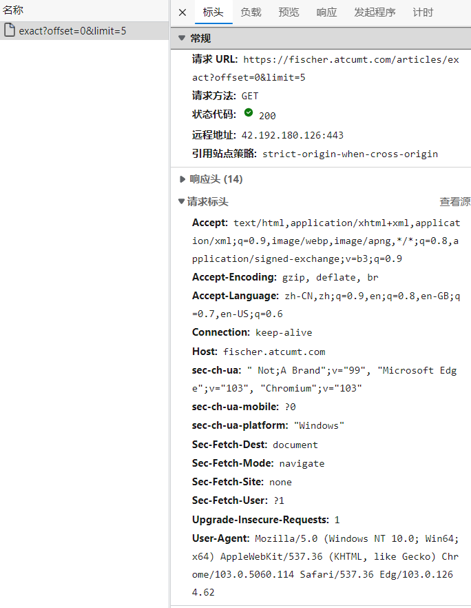**

    

- 响应报文

  - 初始状态行
  - 首部行
  - 实体

  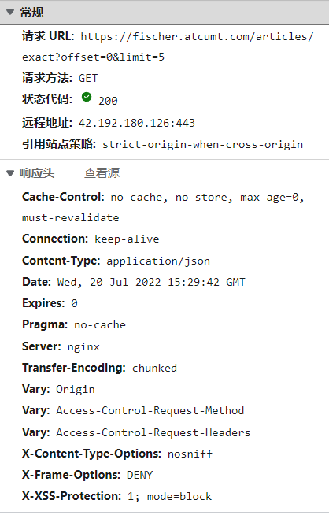

  

 **C-S交互**

- cookie&session
- JWT

**Web缓存**

正向代理服务器，在客户端侧，客户端和代理服务器建立tcp连接后向代理服务器发送http请求，若代理服务器本地有，则直接返回给客户端即可，起到了缓存的效果，如果没有，再向目标服务器建立连接发送请求。

- 代理服务器位于局域网内，客户端与代理服务器之间比和原目标服务器速度要快
- 源目标服务器被访问次数减少，压力减小，响应速度变快

#### 电子邮件协议

电子邮件系统主要由三个部分组成：

- 用户代理
- 邮件服务器
- 简单邮件传输(STMP)

电子邮件协议主要分为发送协议和访问协议：

- 发送协议：STMP
- 访问协议：常用 POP3和IMAP

**STMP**

发送过程：

1. Alice调用用户代理程序撰写报文，并提供Bob的邮箱，指示用户代理发送该报文
2. Alice用户代理把报文发送给邮件服务器，报文放在报文队列当中
3. Alice的邮件服务器上的STMP客户端发现报文，通过TCP与Bob的STMP建立连接，发送报文
4. Bob的邮件服务器上，STMP服务器接收报文，存入邮箱

> 邮件服务器为一个实体服务器，而STMP服务器邮件服务器上运行的应用程序，类似于http服务器

**POP3**

 分为三个阶段：

1. 特许(Authorization)：对用户进行鉴权
2. 事务处理：用户代理代理取回报文 （删除）
3. 更新：客户端发出quit命令，结束会话

> 最新的POP3协议可以通过配置来选择“下载删除”或"下载保留"

**IMAP**

将报文和文件夹相关联

IMAP协议中客户端和服务器上的邮件保持同步，如果不⼿动删除邮件，那么服务器上的邮件也不会被删除。IMAP这种做法可以让⽤户随时随地去访问服务器上的邮件。

**HTTP**

基于Web的电子邮件，用户代理即为Web浏览器，用户和远程邮件服务器之间的通信则使用HTTP协议，而非POP3和IMAP，邮件服务器之间的仍为STMP

#### DNS

作用：IP地址与域名之间的解析

组成：

- 分层的DNS服务器实现的分布式数据库
- 使主机能够查询分布式数据库的应用层协议

**分布式，分层数据库**

DNS服务器主要分为三个层级：

- 根DNS服务器
- 顶级域服务器(com,org,io,edu等)
- 权威服务器：组织机构保存对外公共访问的域名和IP的解析关系

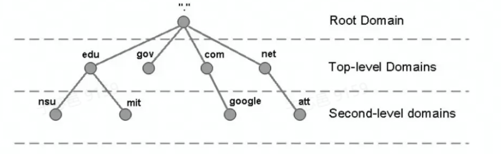

查询方式：

- 递归查询：首先向根目录发起查询请求，根目录在向顶级域发起查询，最终到提供的域名的权威服务器，权威服务器再将结果向上传达，最终由根将结果告知给用户
- 迭代查询：首先向根目录发起查询请求，根目录让用户向顶级域去发起请求，顶级域再让用户向权威服务器发起查询，最终由权威服务器将查询结果告知给用户

> 二者之间的区别为最终由谁将结果告知给查询的用户，递归为向下递归查询，再将查询的结果向上传递，由最初的根将结果返还给用户，而迭代更像是再对其进行重定向

**DNS记录和报文**

数据库中存储的资源记录格式如下：`(Name,Value,Type,TTL)`

其中，Name和Value的具体值由Type来决定：

- Type = A Name为主机名 Value为IP
- Type = NS Name为域名 Value为DNS服务器的主机名
- Type = CNAME  Name为主机的别名，Value为规范主机名
- Type = MX Name为别名，Value为规范主机名（邮件服务器）

> - 提供**主机别名**（host aliasing）服务，有着复杂主机名的主机可以有一个或者多个别名，例如aaa.xxx.com的主机可能还会有aaa.com和www.aaa.com两个别名，在这种情况下，aaa.xxx.com叫做**规范主机名**（canonical hostname）。主机别名的特征是比规范主机名更容易记忆，DNS可以提供根据主机别名获取规范主机名的服务
>
> - 提供**负载分配服务**（load distribution） 一般来说，被繁忙访问的大型站点是分布在多台服务器上的， 这个时候，主机名和IP地址就不是一一对应的关系，而是一个主机名对应一个IP地址的集合。 在大量的，连续的多次访问中，DNS通过旋转IP地址达到负载均衡的目的：在向这个主机名发出DNS请求的时候，服务器会用包含全部这些IP地址的报文进行回答， 但在每个不同的回答中会旋转这些IP地址的摆放顺序，**而客户机总向报文中排在最前的IP地址发出请求**

当查询时，提供一个域名，通过域名，在数据库中查询Type = NS类型的资源记录，找到对应的DNS服务器，在向DNS服务器进行查询，在其中找到 Type = CNAME的记录 查询出主机名，在通过主机名查询Type = A的资源记录，最终查询出域名对应的IP

**插入记录**

向注册登记机构提供 ip和基本/辅助DNS服务器的名字，将Type = A，NS类型的插入到数据库当中们同事还要确保A类型和MX类型要存储在自己的权威DNS服务器当中

#### P2P

P2P模式避免了传统C-S模式下服务器性能瓶颈的情况，每个节点既可以请求，也可以提供服务

速度分析：

- 最初只有服务器有文件，因此需要通过服务器发送给对等方${F}/{U_{s}}$F为文件大小，Us为服务器上载速度,
- 在对等方下载：$F/d_{min}$ dmin为最低下载速度
- 当有N个一同请求时：总的传输为$NF$，总的上载能力为服务器的上载能力加上N个对等方的上载能力：$u_s+∑_{i=1}^{N}u_i$

因此，最小分发时间为$D_{P2P} = max{{F}/{U_{s}},{F/d_{min}}},{NF/(u_s+∑_{i=1}^{N}u_i})$

**BitTorrent**

洪流：参与一个文件分发的所有对等方的集合

一个对等方参与到了洪流当中，下载的同时也在进行上载，在他完成下载后，可以选择离开洪流，也可以选择继续在其中无私奉献

Alice周期性的询问邻居的具有的块列表

策略：

- 请求：**最稀缺优先**，Alice首先请求在邻居中副本最少的块
- 响应：优先响应以最高速率给Alice提供服务的邻居，同时每过30s随机选出一个邻居来提供服务

#### CDN

内容分发网，通常用于进行流媒体访问加速

安置原则：

- **深入**：靠近用户
- **邀请做客**：在少量关键位置设置大集群来邀请到ISP做客

CDN通过拦截客户端的请求来确定适合该客户的CDN服务器集群，同时将请求重定向到该集群。

## 运输层

要点：

- 多路复用/解复用
- 可靠数据传输
- 流量控制
- 拥塞控制
- TCP/UDP

### 概述

运输层协议为不同主机上的应用进程之间提供了**逻辑**通信功能，在应用层的角度，直接通过socket编程的方式即可完成不同应用程序之间的通信，而不需要关注底层的网络层和链路层物理层等

运输层从应用层出接收到报文，划分成不同的段并添加上头部，形成运输层报文段，向下传递后发送给对方，对方再把报文段还原成报文上交给应用层，应用层收到报文后即为一次通信结束

### 多路复用解复用

应用程序-进程-socket-端口之间一一对应(不算进程fork出来的子进程)

网络层提供的为端到端的服务，运输层则为进程到进程的服务，因此，为了通过网络层传输运输层的报文段，实现进程到主机的对应关系，便有了多路复用/解复用

**多路复用**：

- 一个socket套接字对应着一个进程，为了让不同的进程的数据均通过网络层的IP协议传输，
- 因此在源主机从不同的套接字中手机数据块，并为每个块封装上首部信息，生成报文段，将报文段传递到网络层即为多路复用
- 生成报文段之后，在网络层看来，不断进程的数据在性质上已经相同

**多路分解**：将运输层报文段中的数据交付到正确套接字出，重新在进程层面上加以区分

**经典案例**：Ann和Bill两家之间写信通信

**多路复用要求：**

- 套接字有唯一标识符
- 每个报文段有特殊字段(源端口+目标端口)来指示该报文段要交付到的套接字

TCP使用的为四元组（源IP，源端口，目标IP，目标端口）作为特殊字段来绑定和表示套接字，完成数据到套接字的正确指派

UDP只有二元组(目标IP,目标端口)

### UDP

UDP的主要特点为无连接，并且出了多路复用和解复用和少量误差检测之外，几乎没有在IP之上添加新的功能，没有像TCP的可靠性校验和阻塞控制等，因此保证了低延时等特点，被运用于流媒体，DNS等对延时敏感的场景上

- 发送什么数据和什么时候发送的应用层更为精细

- 无须建立连接
- 无连接状态
- 分组首部开销小

**UDP报文段结构**

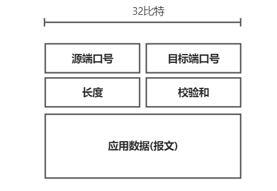

其中，校验和为源端口号+目标端口号+长度的反码，因此源端口号+目标端口号+长度+校验和的结果各个位全为1，全为1则通过校验

提供检验但是对擦错无恢复能力

### 可靠数据传输原理(RDT)

#### 停等协议

**RDT1.0**

假设底层通信完全可靠，因此在运输层不做任何可靠保障，但IP提供的为尽力而为的服务，并不提供任何可靠性保障，只是一个美好的念想

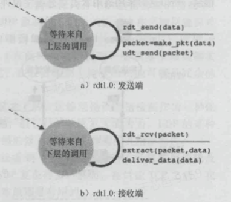

**RDT2.0**

- 发送方等待接收方的ACK或NAK
- 停等协议
- 无超时重传且无法处理ACK和NAK受损的情况

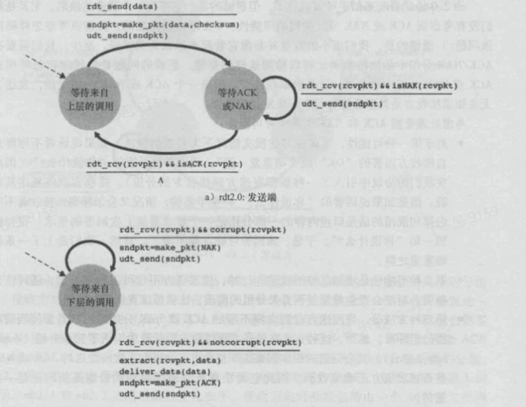

**RDT3.0**

- 加入超时重传 发送方发送后启动定时器 在分组和ACK丢失时会超时重传
- 依然为停等协议
- ACK通过 0 1表示受到了的分组的序号

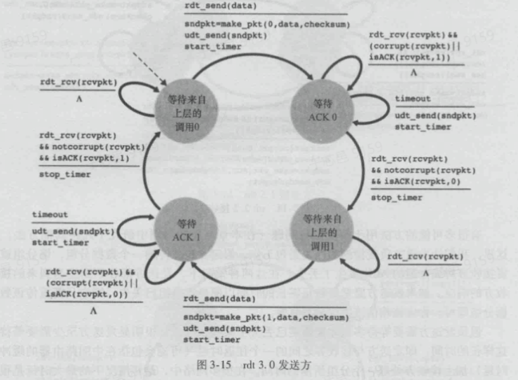

#### 流水线协议

为解决停等协议的性能和信道利用率问题，提出了流水线协议，一次发送多个报文段，根据异常处理的方式不同又可分为GBN和SR

- 发送缓冲区 >1 接收缓冲区 = 1：GBN
- 发送缓冲区 >1 接收缓冲区 > 1：SR

而发送缓冲区和接收缓冲区均为1时即为停等协议

**Go Back N：**

发送方可发送多个分组，但是接收方只能确认一个，如果已经接收到了第N个，但是第一个丢失，那么从第一个开始重发

可将分组分为四组：

- 发送且已经确认
- 发送了但还未确认
- 还未发送但是处于发送的缓冲区内
- 还未进入发送缓冲区，不可用

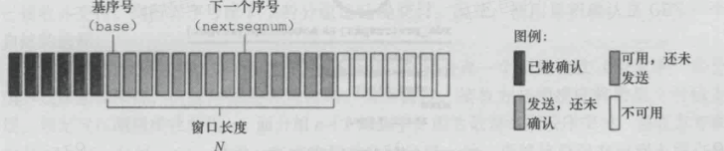

**Selective Repeat**

相比GBN多了接收缓冲区，在接收缓冲区内任一一个分组丢失，只需要对该分组进行重发

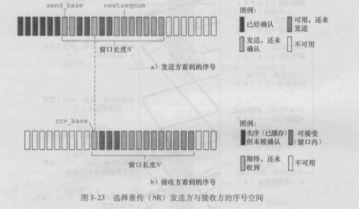

### TCP

#### 连接管理

- 逻辑连接
- 全双工服务
- 报文段的数据量受限于最大报文段长度(MSS),最大传输单元(MTU)[最大链路层帧长度]

**三次握手：**

1. 客户端现象服务端发送一个TCP报文段，不包含应用层数据，SYN位置为1
2. 服务端提取SYN报文段，为该TCP连接分配资源，像客户端发送允许连接的报文段
3. 客户端分配完资源后，服务端发送一个确认连接的报文段，至此三次握手结束

> 第一次握手服务端确认了客户端具有发送报文的能力，第二次握手客户端确认了服务端的接收和发送能力，第三次握手服务端确认了客户端的接收能力，双方均确认对方的发送和接收能力   --来自《码出高效》

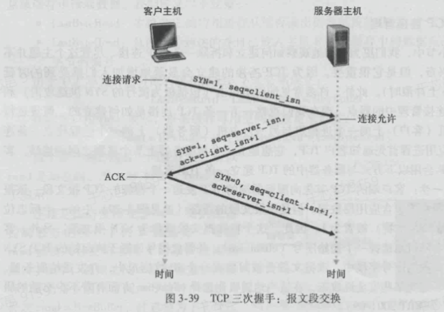

**四次挥手：**

双向关闭：

- 一二次挥手：客户端向服务端发送FIN并接收到ACK后，客户端到服务端的通道已经关闭，但此时服务端还可向客户端发送
- 三四次挥手：服务端向客户端发送FIN并接收到ACK后，服务端到客户端的通道也进行关闭，服务端接收到这个请求后，服务端就能成功变成关闭（CLOSE）状态。客户端则会等一段时间再进入关闭状态，因为第四次挥手不一定能成功发给服务端，所以要等一下，看看服务端会不会因为没收到第四次挥手，而重发第三次挥手。

#### 报文段结构

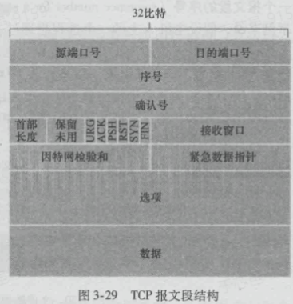

- 序号：该报文段的首字节的字节流编号(应用层向运输层提供的为字节流)
- 确认号：期望收到的下一字节的序号
- 接收窗口字段：用于流量控制
- 可选字段：用于发送方和接受方协商MSS

#### RTT

- 往返时间，可用于在超时重传时作为超时时间的参考

- 动态计算：

  $EstimatedRTT = (1-a)* EstimatedRTT +a*SampleRTT$

  对于当前测量的RTT给予较小的权重，通常设置a=0.125

- DevRTT：用于估量SimpleRTT相对EstimatedRTT的偏移程度

  $DevRTT = (1-β)*DevRTT+β*|SampleRTT-EstematedRTT|$

- 超时时间通常设置为：$TimeoutInterval = EstimatedRTT+4 * DevRTT$

> EstimatedRTT和DevRTT类似于正态分布中的u和σ的关系，$EstimatedRTT+4 * DevRTT$意为在概率为XX的情况下，该分组已经丢失

#### 可靠数据传输

大致与之前讨论的流水线方案类似，但有针对调整设计

- 超时间隔加倍：TCP每次重传后都将超时时间设为原来的两倍，而不是通过RTT估算的来的

- 快速重传：收到三个冗余ACK，则快速重传，不再等待超时定时器超时

- 丢失控制：

  - 发送方仅维持发送了但未确认和下一个要发送的

  - 接收方发送ACK时采用一个辅助定时器，在定时器到时前不发ACK，将时间段内多个ACK一同发送给发送方

  - 接收方仍设置缓存：在中间存在丢失分组，形成Gap时，返回ACK X，要求接收方来填补Gap

    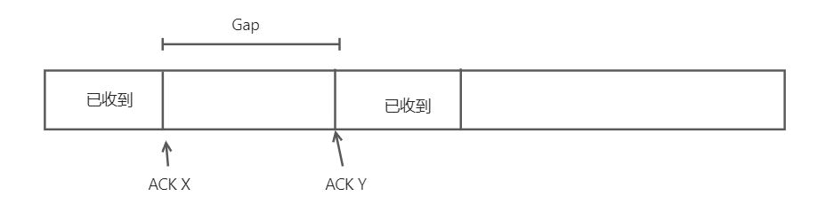

#### 流量控制

接收方维护两个变量：

- LastByteRead：从缓冲区中读出的最后一个字节编号
- LastByteRcvd：缓冲区中的最后一个字节编号

二者相减即可得到缓冲区中剩余的字节数，要求剩余的字节数小于缓冲区大小

$LastByteRcvd-LastByteRead <= RcvBuffer$

接收窗口rwnd:还能继续接收的字节数

$rwnd = RcvBuffer -[LastByteRcvd-LastByteRead]$

接收窗口这个变量交给发送方来维护，从而控制进行流量控制

同时发送方维护：

- LastByteSent：发送的最后一个
- LastByteAcked：确认的收到的最后一个

二者相减即可得到发送出但还未收到的字节数，要求这个字节数小于接收窗口的大小，即可保证接收方能正确处理

$LastByteSent-LastByteAcked <= rwnd$

#### 拥塞控制

发送方维护者一个拥塞窗口(cwnd)的变量，对TCP发送方的速率进行限制，有：

$LastByteSent-LastByteAcked <= min(rwnd,cwnd)$

若接收方缓存足够大,则有：

$LastByteSent-LastByteAcked <= cwnd$

TCP将丢包事件(超时或三个冗余ACK)视为阻塞的证明

**TCP拥塞控制算法：**

参数：

- cwnd
- ssthresh：慢启动阈值，用于结束慢启动模式

1. 慢启动：cwnd最初设置为一个MSS的大小，只要发送被确认就×2，以指数增长，检测到拥塞时将ssthresh设置为cwnd的一半，cwnd再重新从1开始继续慢启动，只要在cwnd和ssthresh相等时，慢启动模式才结束，转入拥塞避免阶段
2. 拥塞避免：每个RTT将cwnd+1,出现拥塞时同样将ssthresh设置为cwnd的一半，而对于由三个冗余ACK引发的拥塞，转入快速恢复阶段
3. 快速恢复：收到一个冗余ACK，cwnd增加一个MSS

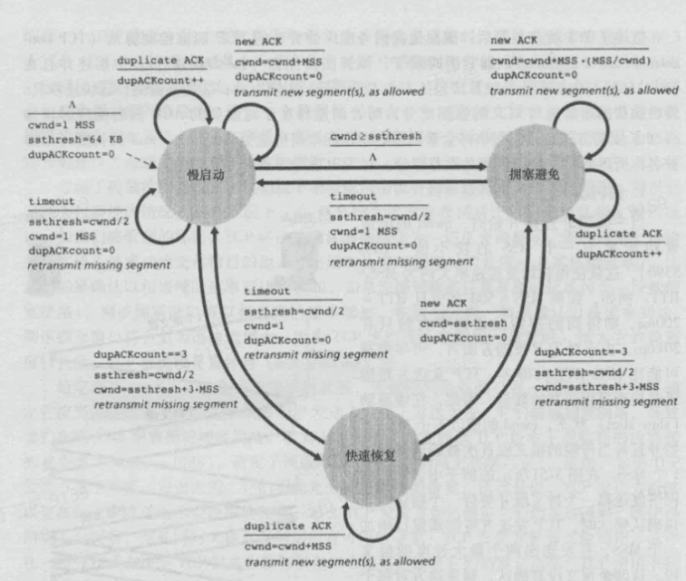

最终呈现的结果为线性增(cwnd每次增加一个MSS)，乘性减(ssthresh变为cwnd的一半):

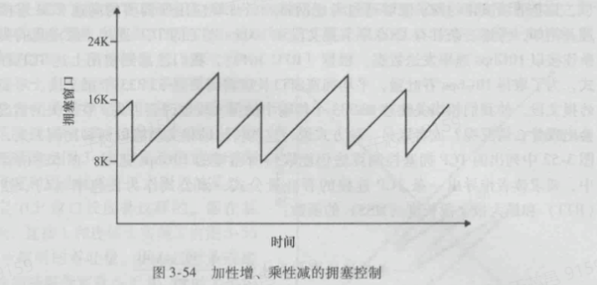

**公平性：**

对于两个TCP连接公用一条链路的情况，如果假设跳过了慢启动阶段，则拥塞窗口按照线性增，乘性减的方式，到达阈值之后二者一同÷2后+1，即便最开始二者的吞吐量相差悬殊，多次÷2+1后最终区域相同，达到公平的平衡状态

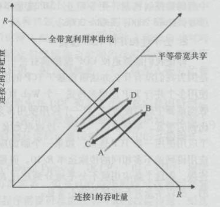

A为起始状态，A->B->C->D,最终趋于相同

而对于UDP，UDP不存在拥塞控制，因此可能出现UDP压制TCP流量的情况

## 网络层：数据平面

### 网络层概述

网络层主要分为数据平面和控制平面两个平面，分别对应着转发和路由选择的功能

控制平面通过路由选择算法为每台路由器计算出转发表(传统或SDN的方式)，路由器再根据网络层分组的首部字段，作为索引在路由表当中查询出对应的value，即为输出链路接口，即可交给下一个路由器

### 路由器

主分为四个部分：

- 输入端口：查找转发表确定输出端口，同时还执行一定的物理层和链路层的功能
- 交换结构：将输入结构和输出结构相连，一个"网络结构"
- 输出端口：存储从交换结构而来的分组，并执行物理层和链路层的功能进行传输
- 路由选择处理器：传统路由器中负责执行路由选择协议，SDN控制方式中负责与远程通信，接收传来的流表

> 在输入端口出进行查找，确定了输出端口之后再进入交换结构，向输出端口传输
>
> 此处的端口并非在应用层所说的软件端口，而是路由器的物理接入和输出接口

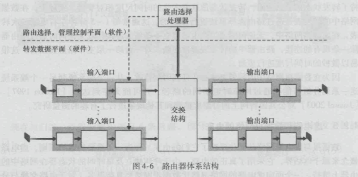

**输入端口处理**

在输入端口出执行路由表的查询，来寻找输出端口，转发决策在本地做出，无需调用集中式路由选择处理器，避免了集中式处理的瓶颈

通过最长前缀匹配原则，将一定范围内的IP地址和路由器的输出接口做映射，为保证速度，采用硬件逻辑

其他工作：

- 进行物理层和链路层的处理
- 检查分组的版本号，TTL，校验
- 更新用于网络管理的计时器

**交换**

- 经内存交换：在CPU的控制下直接完成
- 经总线交换
- 经互联网络交换：通过控制线路的导通和闭合来确定线路

**输出端口处理**

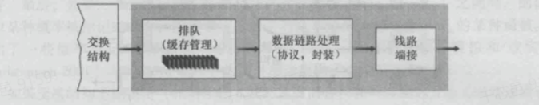

**分组调度**

当传输速度超过处理速度时，便会出现排队与阻塞，即分组位与输出和输入接口的缓存当中，而当缓冲区满时，则会出现丢包，网络层为尽力而为的服务，不会对丢包进行任何处理，可靠性交给运输层的TCP来进行保障

此时便需要相应的调度算法来确认分组的处理顺序

- FIFO
- 优先权排队：缓冲区分为多个队列，队列内FIFO，队列之间优先处理高优先级的
- 循环排队：分为多个类别的队列，队列内FIFO，队列之间循环选择
- 加权公平排队：分为多个权重不同的队列，分组按照权重分配给不同的队列，导致各队列内分组数量不同，队列之间循环选择。

### 网络协议

#### IPV4

**数据报格式**

- 版本号：IP协议版本，标识是IPV4还是IPV6
- 寿命：TTL，还能存活几跳
- 上层协议：标识是TCP还是UDP

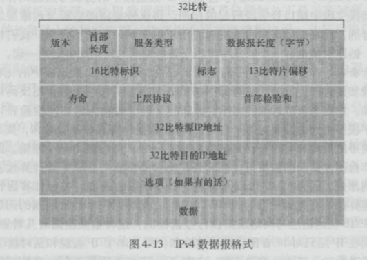

**数据报分片**

最大传送单元(MTU)：链路层帧能承载的最大数据量

IP数据报封装在链路层帧中进行传输，因此受MTU的限制，需要对IP数据报进行分片，在传输到对方的网络层之后再进行重组拼接

通过数据报中的标识，标志，偏移量来确定该段分片在整个数据报中的位置

**IPV4编址**

IP长度32比特，点分十进制记法

IPV4总共有40多亿个地址，因此直接通过路由寻址到精确完整的IPV4地址开销较大，在公网中，以子网为单位进行寻址，便有了子网掩码

> 为了确定子网，分开主机和路由器的每个接口，产生的几个隔离的网络岛，使用接口段接这些隔离的网络的端点，这些隔离的网络中的每一个都叫一个子网

在同一个子网内的IP，左侧的几位是相同的，称为子网地址，并通过子网掩码来进行区分

例 IP地址均为231.1.1.XXX,左侧24位为子网地址，子网掩码可以表示为/24，也可表示为255.255.255.0

图中共六个子网：

- 223.1.1.0/24  223.1.2.0/24  223.1.3.0/24
- 223.1.9.0/24  223.1.8.0/24  223.1.7.0/24

*路由聚合*：

ISP对子网进行聚合，向外界通告，将XXX.XXX.XXX.XXX/XX的IP均发给我

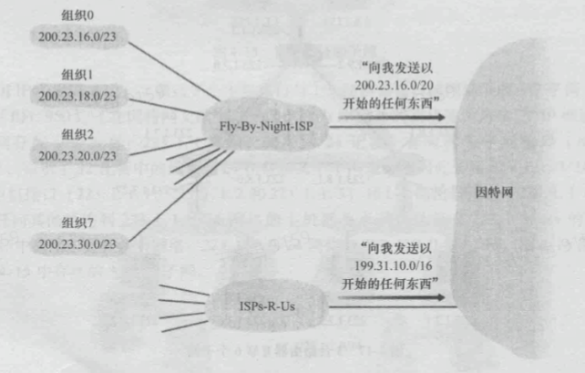

在CIDR被采用之前，IP地址采用的为分类编址，即分为A，B，C类，网络部分长度分别为8,16,25比特，B类子网中可以有65534个地址，而C类只有255个地址，因此导致B类被很快抢完，并且子网内的地址却用不完，C类又不够用

因此为解决这种情况，提出了五类别域间路由选择(CIDR)，将子网寻址的概念一般化，均使用IP+子网掩码的方式，众生平等

**地址分配**

1. 从ISP获取一块地址，或通过ICANN

2.  获取主机地址：DHCP
   1. DHCP客户生成包含DHCP发现报文的数据包，通过链路层广播到子网的所有节点，让DHCP服务器发现客户
   2. DHCP提供服务，向其提供IP地址，子网掩码和地址租用期
   3. DHCP请求，客户从一个或多个服务器中选择一个，做出响应
   4. DHCP ACK，交互完成

#### 地址转换

公网中以子网为路由单位，子网内部可以使用如10.0.0.0/24这类的内网IP进行通讯，但是在对外时内网IP显然无法使用

因此每个内网通过一个NAT路由器对外进行访问，在外部看来，NAT路由器像是个单一IP的单一设备，对外隐藏了内网的细节

而由外向内时，通过NAT转换表来将NAT的IP+端口转换到子网内一台设备上的子网IP+端口

#### IPV6

- 地址扩容 32bit->128bit
- 流标签，标识一条数据包中的流，给出一条流中的某些数据报给出优先权

通过隧道的方式实现IPV4到IPV6的迁移，即在两个IPV6路由器之间设置一个IPV4路由器，中间的IPV4路由器集合称为隧道，将整个IPV6数据报放置在IPV4数据报的载荷内，隧道中间的IPV4路由器不知该数据报中含有IPV6的数据报，只是当作正常的IPV4数据报处理，隧道另一边的IPV6路由器确定含有IPV6数据报，取出之后为IPV6数据报提供路由
