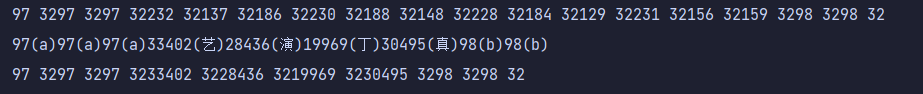
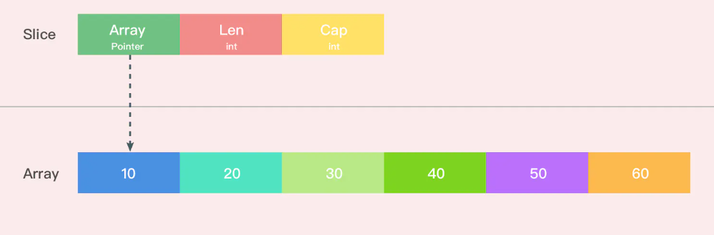
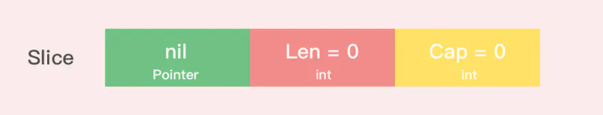
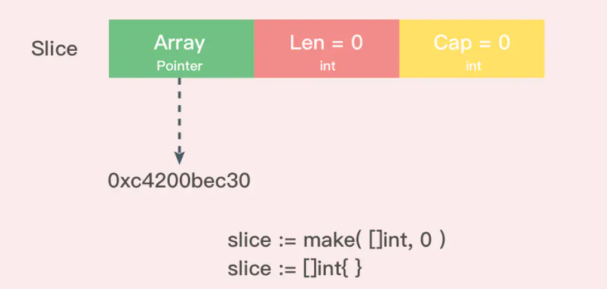
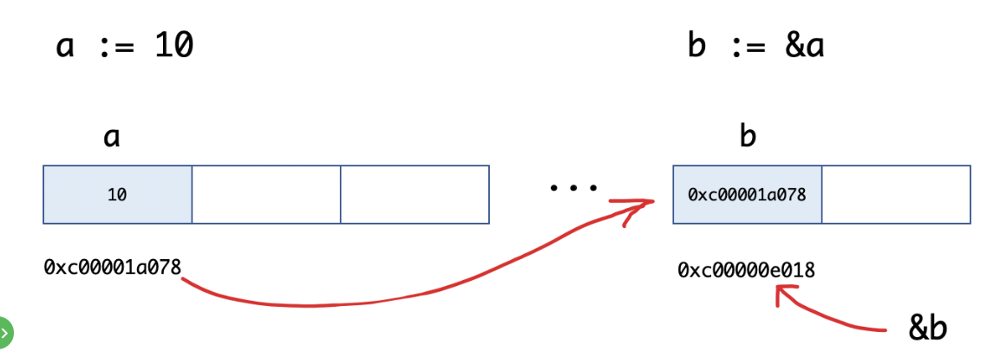

# Go基础

## hello world

```go
package main

import "fmt"
func main() {
	var age int=1;
	fmt.Println(age)
fmt.Println("hello"+" world")
}

```

> - 第一行代码 *package main* 定义了包名。你必须在源文件中非注释的第一行指明这个文件属于哪个包，如：package main。package main表示一个可独立执行的程序，每个 Go 应用程序都包含一个名为 main 的包。
> - 第二行导入fmt包，fmt包含了格式化IO的函数
> - func定义函数，main为主函数

## 基础语法

### 变量

**格式化输出**

整形

| 格 式 | 描 述                                           |
| ----- | ----------------------------------------------- |
| %b    | 整型以二进制方式显示                            |
| %o    | 整型以八进制方式显示                            |
| %d    | 整型以十进制方式显示                            |
| %x    | 整型以十六进制方式显示                          |
| %X    | 整型以十六进制、字母大写方式显示                |
| %c    | 相应Unicode码点所表示的字符                     |
| %U    | Unicode 字符, Unicode格式：123，等同于 "U+007B" |

浮点数

| 格 式 | 描 述                                                 |
| ----- | ----------------------------------------------------- |
| %e    | 科学计数法，例如 -1234.456e+78                        |
| %E    | 科学计数法，例如 -1234.456E+78                        |
| %f    | 有小数点而无指数，例如 123.456                        |
| %g    | 根据情况选择 %e 或 %f 以产生更紧凑的（无末尾的0）输出 |
| %G    | 根据情况选择 %E 或 %f 以产生更紧凑的（无末尾的0）输出 |

布尔类型

| 格 式 | 描 述         |
| ----- | ------------- |
| %t    | true 或 false |

通用占位符

| 格 式 | 描 述                              |
| ----- | ---------------------------------- |
| %v    | 值的默认格式。                     |
| %+v   | 类似%v，但输出结构体时会添加字段名 |
| %#v   | 相应值的Go语法表示                 |
| %T    | 相应值的类型的Go语法表示           |
| %%    | 百分号,字面上的%,非占位符含义      |

```go
var identifier type
```

- 如果再声明时进行赋值则可以省略类型,也可进行简写,使用`:=`后省略var，`:=`只可在声明时使用，对已经声明过的使用会编译错误，`:=`创建的为局部变量

```go
var s="hello"
s:="hello"//此种方法创建的为局部变量，只能存在于函数之中
```

- 未初始化的

  - 数值型默认为0值

  - 布尔为false

  - 字符串为空

  - > ```
    > //以下为nil(null)
    > var a *int
    > var a []int
    > var a map[string] int
    > var a chan int
    > var a func(string) int
    > var a error // error 是接口
    > ```

- 基本类型如`int、float、bool、string`等为值类型，赋值时为值传递，进行拷贝赋值

  &i可以获得其地址

 ### 常量

```go
const identifier [type] = value
```

type可省略，编译器自动推断

**iota**

iota，特殊常量，可以认为是一个可以被编译器修改的常量。

iota 在 const关键字出现时将被重置为 0(const 内部的第一行之前)，const 中每新增一行常量声明将使 iota 计数一次(iota 可理解为 const 语句块中的行索引)。

```
const (
   a = iota   //0
   b          //1
   c          //2
   d = "ha"   //独立值，iota += 1
   e          //"ha"   iota += 1
   f = 100    //iota +=1
   g          //100  iota +=1
   h = iota   //7,恢复计数
   i          //8
)
fmt.Println(a,b,c,d,e,f,g,h,i)
```

输出结果为：0 1 2 ha ha 100 100 7 8

### 字符串

在内存中，一个字符串实际上是一个双字结构，即一个指向实际数据的指针和记录字符串长度的整数。因为指针对用户来说是完全不可见，因此我们可以依旧把字符串看做是一个值类型，也就是一个字符数组。

字符串 `string s = "hello"` 和子字符串 `t = s[2:3]` 在内存中的结构可以用下图表示：


单行字符串的表示与java一致，多行字符串使用`来包围：

```
s1:=`
line1
line2
line3
`
```

常用操作：

| 方法                                                 | 介绍                       |
| :--------------------------------------------------- | :------------------------- |
| len(str)                                             | 求长度                     |
| +或fmt.Sprintf                                       | 拼接字符串                 |
| strings.Split                                        | 分割                       |
| strings.Contains(s, substr string) bool              | 判断是否包含               |
| strings.HasPrefix,strings.HasSuffix                  | 前缀/后缀判断              |
| strings.Index(s, str string) int,strings.LastIndex() | 子串出现的位置             |
| strings.Join(a[]string, sep string)                  | join操作                   |
| strings.Replace(str, old, new string, n int) string  | 将str中的前n个old替换为new |
| strings.Count(s, str string) int                     | s再str中出现的非重叠次数   |

**byte和rune类型**

通过单引号包围的叫做字符，go中的字符主要有：

- uint8类型，或者叫byte类型，为一个ASCII码的一个字符
- rune类型，代表一个UTF-8类型

当需要处理中文、日文或者其他复合字符时，则需要用到`rune`类型。`rune`类型实际是一个`int32`。
Go 使用了特殊的 `rune` 类型来处理 `Unicode`，让基于 `Unicode`的文本处理更为方便，也可以使用 `byte` 型进行默认字符串处理，性能和扩展性都有照顾

```go
s1:="aaa艺演丁真bb"
	b:=strings.Split(s1,"aa")
	fmt.Println(s1)
	fmt.Println(b)
	for i:=0;i<len(s1);i++{
		fmt.Print(s1[i],' ')
	}
	fmt.Println("")
	for _,r:=range s1{
		fmt.Printf("%v(%c)",r,r)
	}
	fmt.Println("")
	for _,r:=range s1{
		fmt.Print(r,' ')
	}
```

分别对应以下的三种结果：



因为UTF8编码下一个中文汉字由`3~4`个字节组成，所以我们不能简单的按照字节去遍历一个包含中文的字符串，否则就会出现上面输出中第一行的结果。

字符串底层可以被看做一个byte数组，具体的类型由上面所述，所以可以和[]byte类型相互转换。字符串是**不能修改的** 字符串是由byte字节组成，所以字符串的长度是byte字节的长度。 rune类型用来表示utf8字符，一个rune字符由一个或多个byte组成。

对于rune直接输出显然也无法得到我们想要的效果

字符串同java一样无法修改，需要先转换成[]byte或者[]rune,对数组进行修改之后在传唤为string

由于字符串本身不可变，因此对于进行修改依旧需要借助[]byte或者[]rune

**类型转换**

Go中只有强制类型转换，没有隐式类型转换，只能在两个类型之间支持互相转换的时候使用

```go
T(表达式)
```

其中，T表示要转换的类型。表达式包括变量、复杂算子和函数返回值等.

比如计算直角三角形的斜边长时使用math包的Sqrt()函数，该函数接收的是float64类型的参数，而变量a和b都是int类型的，这个时候就需要将a和b强制类型转换为float64类型。

```go
    func sqrtDemo() {
        var a, b = 3, 4
        var c int
        // math.Sqrt()接收的参数是float64类型，需要强制转换
        c = int(math.Sqrt(float64(a*a + b*b)))
        fmt.Println(c)
    }
```

### 时间

通过time包来获取对于时间的操作

当前时间可以使用 `t:=time.Now()` 获取，获取完当前时间后使用 `t.Day()`、`t.Minute()` 等等来获取时间的一部分；你甚至可以自定义时间格式化字符串，例如： `fmt.Printf("%02d.%02d.%4d\n", t.Day(), t.Month(), t.Year())` 将会输出 `21.07.2011`。

Duration 类型表示两个连续时刻所相差的纳秒数，类型为 int64。Location 类型映射某个时区的时间，UTC 表示通用协调世界时间。

包中的一个预定义函数 `func (t Time) Format(layout string) string` 可以根据一个格式化字符串来将一个时间 t 转换为相应格式的字符串，你可以使用一些预定义的格式，如：`time.ANSIC` 或 `time.RFC822`。

自定义格式化设计：按照go语言的创建时间 `02 Jan 2006 15:04 `为基准进行格式化

```go
package main
import (
	"fmt"
	"time"
)

var week time.Duration
func main() {
	t := time.Now()
	fmt.Println(t) // e.g. Wed Dec 21 09:52:14 +0100 RST 2011
	fmt.Printf("%02d.%02d.%4d\n", t.Day(), t.Month(), t.Year())
	// 21.12.2011
	t = time.Now().UTC()
	fmt.Println(t) // Wed Dec 21 08:52:14 +0000 UTC 2011
	fmt.Println(time.Now()) // Wed Dec 21 09:52:14 +0100 RST 2011
	// calculating times:
	week = 60 * 60 * 24 * 7 * 1e9 // must be in nanosec
	week_from_now := t.Add(time.Duration(week))
	fmt.Println(week_from_now) // Wed Dec 28 08:52:14 +0000 UTC 2011
	// formatting times:
	fmt.Println(t.Format(time.RFC822)) // 21 Dec 11 0852 UTC
	fmt.Println(t.Format(time.ANSIC)) // Wed Dec 21 08:56:34 2011
	// The time must be 2006-01-02 15:04:05
	fmt.Println(t.Format("02 Jan 2006 15:04")) // 21 Dec 2011 08:52
	s := t.Format("20060102")
	fmt.Println(t, "=>", s)
	// Wed Dec 21 08:52:14 +0000 UTC 2011 => 20111221
}
```


### 数组

> 1. 数组数据类型相同，长度固定
> 2. 定义：var a[len]int 长度为常量，定义后不可改变
> 3. 长度为数组类型的一部分，var a[5]int和var a[10]int为不同类型的数组
> 4. 可以通过下标访问0~len-1,使用[]进行访问
> 5. 支持"=="和"!="操作符
> 6. 指针数组 [n]*T,数组指针\*[n]T(后面学到指针后再讨论)、

**一维数组初始化**

```go
var arr0[5] int=[5]int{1,2,3,4}//为初始化的元素为默认值
	fmt.Println(arr0)
	var arr1[5] int=[5]int{1,2,3,4,0}
	if arr1==arr0{
		fmt.Println(arr1)
	}
	var arr3 =[5]int{1,2,3,4,5}//指定长度
	fmt.Println(arr3)
	var arr4=[...]int{1,2,3,4,5,6}//通过元素个数知晓长度
	fmt.Println(arr4)
	var arr5=[5]string{3:"hello world",4:"go"}//按照索引进行初始化，未指定为默认值
	fmt.Println(arr5)
```

输出结果：

```
[1 2 3 4 0]
[1 2 3 4 0]
[1 2 3 4 5]
[1 2 3 4 5 6]
[   hello world go]
```


**多维数组初始化**

```go
	var arr0 [5][3]int
	var arr1 [2][3]int= [...][3]int{{1,2,3},{3,4,5}}//第二维度不可省略
	fmt.Println(arr1)
	fmt.Println(arr0)

```

输出结果

```
[[1 2 3] [3 4 5]]
[[0 0 0] [0 0 0] [0 0 0] [0 0 0] [0 0 0]]
```

**多维数组遍历**

range在遍历array，*array，string时，返回两个值，分别为索引和值，遍历map时为key value

```go
for i:=0;i<len(arr1);i++{
		for j:=0;j<len(arr1[0]);j++{
			fmt.Print(arr1[i][j]," ")
		}
	}
	fmt.Println()
	for k1, v1 := range arr1 {
		for k2, v2 := range v1 {
			fmt.Printf("(%d,%d)=%d ", k1, k2, v2)
		}
		fmt.Println()
	}
```

输出结果

```go
1 2 3 3 4 5 
(0,0)=1 (0,1)=2 (0,2)=3 
(1,0)=3 (1,1)=4 (1,2)=5 
```


### 切片slice

slice 并不是数组或数组指针。它通过内部指针和相关属性引用数组片段，以实现变长方案。

**注意** 绝对不要用指针指向 slice。切片本身已经是一个引用类型

> ```
>     1. 切片：切片是数组的一个引用，因此切片是引用类型。但自身是结构体，值拷贝传递。
>     2. 切片的长度可以改变，因此，切片是一个可变的数组。
>     3. 切片遍历方式和数组一样，可以用len()求长度。表示可用元素数量，读写操作不能超过该限制。 
>     4. cap可以求出slice最大扩张容量，不能超出数组限制。0 <= len(slice) <= len(array)，其中array是slice引用的数组。cap所求出的最大容量即为数组的长度
>     5. 切片的定义：var 变量名 []类型，比如 var str []string  var arr []int。
>     6. 如果 slice == nil，那么 len、cap 结果都等于 0。
> ```

**切片初始化**

```go
var arr=[...]int{1,2,3,4,5,6,7,8,9}
	var slice0 =arr[0:5]//自动推断类型
	var slice1 []int=arr[1:6]
	var slice2 []int =arr[:6]//省略起始位置和结束位置
	var slice3 []int =arr[1:]
	var slice4 []int=arr[:len(arr)-1]//去除掉最后一个元素，不按数字处理，如果按照数字处理那么得到的则为整个数组
```

输出结果

```
slice0: [1 2 3 4 5]
slice1: [2 3 4 5 6]
slice2: [1 2 3 4 5 6]
slice3: [2 3 4 5 6 7 8 9]
slice4: [1 2 3 4 5 6 7 8]
```

**make创建切片**

```go
var slice[]int =make([]int,10)
fmt.Printf("%v", slice)//指定len，省略cap，默认cap=len
var slice1[]int =make([]int,10,10)//指定len与cap
fmt.Printf("%v", slice1)
```

```
[0 0 0 0 0 0 0 0 0 0]
```

得到的为未进行初始化的0值

**make与new的区别**

- new(T) 为每个新的类型 T 分配一片内存，初始化为 0 并且返回类型为 *T 的内存地址：这种方法 **返回一个指向类型为 T，值为 0 的地址的指针**，它适用于值类型如数组和结构体；它相当于 `&T{}`。
- make(T) **返回一个类型为 T 的初始值**，它只适用于 3 种内建的引用类型：切片、map 和 channel。

1.slice、map 以及 channel 都是 golang 内建的一种引用类型，三者在内存中存在多个组成部分， 需要对内存组成部分初始化后才能使用，而 make 就是对三者进行初始化的一种操作方式

2.new 获取的是存储指定变量内存地址的一个变量，对于变量内部结构并不会执行相应的初始化操作， 所以 slice、map、channel 需要 make 进行初始化并获取对应的内存地址，而非 new 简单的获取内存地址

```go
arr1:=new([]int)
fmt.Println(arr1)
fmt.Printf("%T\n",arr1)
arr2:=make([]int,0)
fmt.Println(arr2)
fmt.Printf("%T",arr2)
```

输出结果：

```
&[]
*[]int
[]
[]int
```

由此可见，通过new分配内存得到的为一个[]类型的指针，而make已经进行初始化，指向一个空的数组


**初始化表达式构造**

```go
s1 := []int{1,2,6: 100}//直接创建slice对象，自动分配底层数组(无需指定长度)
fmt.Printf("%v",s1)
```

```
[1 2 0 0 0 0 100]
```

**切片与原数组**

读写操作实际上操作的目标未底层数组，只需要注意索引号的差别

```go
data:=[...]int{0,1,2,3,4,5}
	slice1:= data[2:4]
	slice1[1]+=100;
	slice1[0]+=200;
	fmt.Printf("%v\n",slice1)
	fmt.Printf("%v\n",data)
```

```
[202 103]
[0 1 202 103 4 5]
```

可以见到原数组的值也发生了变化

**切片扩容**

通过重新划分切片可以对现有切片进行扩容，与append不同的是，通过该方法扩容不能超出原数组的长度，也不能分配新的底层数组

```
arr1:=[...]float32{1,3,4,6,7,8.6,4,23,2,1}
//fmt.Printf("%f",sum_array(&arr1))
slc:=arr1[1:4]
fmt.Printf("%v\n",slc)
slc=slc[0:len(slc)+3]
fmt.Printf("%d,%d",len(slc),cap(slc))
```

**切片追加**

使用append内置函数，向尾部添加数据，返回一个slice对象

```go
	var a=[]int{1,2,3,4}
	var b=[]int{3,4,6,7,8}
	c:=append(a,b...)//两切片相加
	fmt.Println(c)
	var ap=append(a,3)//追加一个数
	fmt.Println(ap)
	apm:=append(a,3,4,5,6)//追加多个数
	fmt.Println(apm)
```

```
[1 2 3 4 3 4 6 7 8]
[1 2 3 4 3]
[1 2 3 4 3 4 5 6]
```

追加超出cap的限制之后会重新分配底层数组，原本的底层数组被释放回收，即便原数组并未填满

```go
	data := [...]int{0, 1, 2, 3, 4, 10: 0}
	s := data[:2:3]
	fmt.Printf("%d\n",cap(s))
	fmt.Printf("data:%v\n",data)
	s=append(s,100,100)
	fmt.Println(cap(s))
	s[2]=192
	fmt.Printf("data:%v",data)
```

```
3
data:[0 1 2 3 4 0 0 0 0 0 0]
6
data:[0 1 2 3 4 0 0 0 0 0 0]
```

容量由3重新分配为6，通常长度小于1024时以 2 倍容量重新分配底层数组，大于1024时，按照1.25倍进行扩容。

重新分配后，便于原数组不再产生任何联系，修改不会作用于原数组

在大批量添加数据时，建议一次性分配足够大的空间，以减少内存分配和数据复制开销。或初始化足够长的 len 属性，改用索引号进行操作。及时释放不再使用的 slice 对象，避免持有过期数组，造成 GC 无法回收。

**切片拷贝**

```go
    s1 := []int{1, 2, 3, 4, 5}
    fmt.Printf("slice s1 : %v\n", s1)
    s2 := make([]int, 10)
    fmt.Printf("slice s2 : %v\n", s2)
    copy(s2, s1)
    fmt.Printf("copied slice s1 : %v\n", s1)
    fmt.Printf("copied slice s2 : %v\n", s2)
    s3 := []int{1, 2, 3}
    fmt.Printf("slice s3 : %v\n", s3)
    s3 = append(s3, s2...)
    fmt.Printf("appended slice s3 : %v\n", s3)
    s3 = append(s3, 4, 5, 6)
    fmt.Printf("last slice s3 : %v\n", s3)
```

```
    slice s1 : [1 2 3 4 5]
    slice s2 : [0 0 0 0 0 0 0 0 0 0]
    copied slice s1 : [1 2 3 4 5]
    copied slice s2 : [1 2 3 4 5 0 0 0 0 0]
    slice s3 : [1 2 3]
    appended slice s3 : [1 2 3 1 2 3 4 5 0 0 0 0 0]
    last slice s3 : [1 2 3 1 2 3 4 5 0 0 0 0 0 4 5 6]
```

copy ：函数 copy 在两个 slice 间复制数据，复制长度以 len 小的为准。两个 slice 可指向同一底层数组，允许元素区间重叠。

长度大的向长度小的拷贝，多余的被舍去，长度小的向长度大的进行拷贝，剩余的部分不进行操作

**数组和切片转字符串**

```go
	array_or_slice := []int{1,2,3,4,5,6}
	temp:=strings.Replace(strings.Trim(fmt.Sprint(array_or_slice), "[]"), " ", ",", -1)
	fmt.Printf(temp)
```

```
1,2,3,4,5,6
```

- `fmt.Sprint`使用默认格式返回字符串，返回的结果为`[1,2,3,4,5,6]`
- `strings.Trim`去除前后两端包含cunset的utf-8码值
- `strings.replace`进行替换，n为从前端开始进行替换的个数，n<0时表示没有限制

### 切片的底层实现

Go的数组为值类型，赋值和函数传参都会赋值整个数组

用切片传数组参数，既可以达到节约内存的目的，也可以达到合理处理好共享内存的问题。打印结果第二行就是切片，切片的指针和原来数组的指针是不同的。

切片内部实现的数据结构通过指针引用底层数组，通过len和cap讲读写操作限定在指定的区域内，如果超出这个限定的区域就会重新分配底层数组。切片本身是一个只读对象，工作机制类似数组指针的一种封装

```go
type slice struct {
    array unsafe.Pointer
    len   int
    cap   int
}
```

Pointer 是指向一个数组的指针，len 代表当前切片的长度，cap 是当前切片的容量。cap 总是大于等于 len 的。



**nil切片**

```go
var slice []int
```



nil 切片被用在很多标准库和内置函数中，描述一个不存在的切片的时候，就需要用到 nil 切片。比如函数在发生异常的时候，返回的切片就是 nil 切片。nil 切片的指针指向 nil。

**空切片**

空切片一般会用来表示一个空的集合。比如数据库查询，一条结果也没有查到，那么就可以返回一个空切片。



nil切片指向一个空的内存地址，但是空切片会指向一个内存地址，但是长度和容量为0且无元素

**切片与原数组的关系**

当操作的位置没有超过原数组的长度时，此时切片会指向原数组，对切片的操作也会影响到原数组,同时也会影响到该数组的其他切片

```go
	array:=[...]int{10,20,30,40,10,20}
	slice1:= array[0:2]
	slice1=append(slice1,20)
	fmt.Printf("slice: %v\n",slice1)
	fmt.Printf("array: %v\n",array)
	fmt.Printf("array: %v\n",array)

```

```
slice: [10 20 20]
array: [10 20 30 40 10 20]
array: [10 20 20 40 10 20]
```

原来数组的容量已经达到了最大值，再想扩容， Go 默认会先开一片内存区域，把原来的值拷贝过来，然后再执行 append() 操作，重新分配底层数组后，此时切片和原本的底层数组不再有任何关系，操作不会影响到原数组

```
slice: [10 20 20]
array: [10 20]
array: [10 20]
```

### 指针

go中的指针不能像C++当中的那样进行压缩

Go中的有关指针的操作只有以下这两个符号

- &：取地址，返回的为这个变量的指针
- *：根据地址取值，得到的为该指针指向地址中存的值

```go
	a:=10
	b:=&a
	fmt.Printf("a:%v ptr:%p\n",a,&a)
	fmt.Printf("b:%v type:%T\n",b,b)
	fmt.Printf("value of b:%d",*b)
```

```
a:10 ptr:0xc0000aa058
b:0xc0000aa058 type:*int
a:10 ptr:0xc00000a098
b:0xc00000a098 type:*int
value of b:10
```



总结： 取地址操作符&和取值操作符`*`是一对互补操作符，`&`取出地址，`*`根据地址取出地址指向的值。

```
    1.对变量进行取地址（&）操作，可以获得这个变量的指针变量。
    2.指针变量的值是指针地址。
    3.对指针变量进行取值（*）操作，可以获得指针变量指向的原变量的值。
```

在书写表达式类似 `var p *type` 时，切记在 * 号和指针名称间留有一个空格，因为 `- var p*type` 是语法正确的，但是在更复杂的表达式中，它容易被误认为是一个乘法表达式！

不能获取字面量或常量的地址

**空指针**

```go
	var p *string
	fmt.Println(p)
	fmt.Printf("p的值是%v\n", p)
	if p != nil {
		fmt.Println("非空")
	} else {
		fmt.Println("空值")
	}
```

```
<nil>
p的值是<nil>
空值
```

```go
	var a *int
	*a = 100
	fmt.Println(*a)
```

执行上面的代码会引发panic， 在Go语言中对于引用类型的变量，我们在使用的时候不仅要声明它，还要为它分配内存空间，否则我们的值就没办法存储。而对于值类型的声明不需要分配内存空间，是因为它们在声明的时候已经默认分配好了内存空间。要分配内存，就引出来今天的new和make。 Go语言中new和make是内建的两个函数，主要用来分配内存

**new**

```
 func new(Type) *Type
```

- Type为类型，new只接受一个参数，参数为一个类型
- *Type表示类型指针，new返回一个指向该类型内存地址的指针

new函数不太常用，使用new函数得到的是一个类型的指针，并且该指针对应的值为该类型的零值,再通过*的方式进行复制

```go
	a:=new(int)
	fmt.Printf("%p\n",a)
	fmt.Printf("%d\n",*a)
	*a=10
	fmt.Printf("%d",*a)
```

```
0xc00000a098
0
10
```

**make**

make也是用于内存分配的，区别于new，它只用于slice、map以及chan的内存创建，而且它返回的类型就是这三个类型本身，而不是他们的指针类型，因为这三种类型就是引用类型，所以就没有必要返回他们的指针了。make函数的函数签名如下：

```
func make(t Type, size ...IntegerType) Type
```

**new与make的区别**
    1.二者都是用来做内存分配的。
    2.make只用于slice、map以及channel的初始化，返回的还是这三个引用类型本身；
    3.而new用于类型的内存分配，并且内存对应的值为类型零值，返回的是指向类型的指针。

### Map

Go语言中 map的定义语法如下

```
    map[KeyType]ValueType
```

其中，

```
    KeyType:表示键的类型。

    ValueType:表示键对应的值的类型。
```

map类型的变量默认初始值为nil，需要使用make()函数来分配内存。语法为：

```
    make(map[KeyType]ValueType, [cap])
```

其中cap表示map的容量，该参数虽然不是必须的，但是我们应该在初始化map的时候就为其指定一个合适的容量。

```go
	scoreMap:=make(map[string]int,8)
	scoreMap["张三"]=90
	scoreMap["reese"]=100
	fmt.Println(scoreMap)
	fmt.Printf("type:%T",scoreMap)
```

```
map[reese:100 张三:90]
type:map[string]int
```

map可以在声明的时候就往其中放入值,此时不需要make来申请内存空间

值得注意的是，与json不同的是，最后一行也要加上逗号

```go
	user:=map[string]string{
		"id":"1234",
		"username":"fischer",
		"password":"123",
	}
	fmt.Println(user)
```

```
map[id:1234 password:123 username:fischer]
```

判断一个值是否存在

value为其中的值，ok为一个布尔类型，表明是否存在,如果不存在value为0,ok为false

```
	value,ok:=user["id"]
	fmt.Printf("value:%v,ok:%v\n",value,ok)
```

```
value:1234,ok:true
```

**遍历**

```
for k,v:=range user{
   fmt.Printf("%v:%v\n",k,v)
}
```

```
id:1234
username:fischer
password:123
```

**删除**

```
delete(map,key)
```

**元素为map类型的切片**

可以直接对单个元素进行声明复制，也可将先声明一个map，再将map声明给其中的一个元素

```
var mapSlice=make([]map[string]string,4)
	mapSlice[0] = make(map[string]string, 10)
	mapSlice[0]["name"]="fischer"
	mapSlice[0]["id"]="1234"
	mapSlice[0]["password"]="123"

	map1:=map[string]string{
		"id":"123455",
		"name":"矿大摆烂王",
		"password":"123",
	}
	mapSlice[1]=map1
	//fmt.Printf("%v",mapSlcie)
	for index,value:=range mapSlice{
		fmt.Printf("index%v: value%v\n",index,value)
	}
```

```
index0: valuemap[id:1234 name:fischer password:123]
index1: valuemap[id:123455 name:矿大摆烂王 password:123]
index2: valuemap[]
index3: valuemap[]
```

**值为切片的map**

```go
	var sliceMap=make(map[string][]string,10)
	fmt.Println(sliceMap)
	value:=[]string{"北京","徐州"}
	sliceMap["city"]=value
	fmt.Println(sliceMap)
```


### 结构体

**自定义类型**

自定义类型是定义了一个全新的类型。我们可以基于内置的基本类型定义，也可以通过struct定义

**类型别名**

本质上为同一个类型，只是起了一个别名

通过输出结果可以看出，第一个为main包下的MyInt类型，第二个单纯为int基本类型

```go
type MyInt int
type myIn =int

var a MyInt
var b myIn
fmt.Printf("%T\n",a)
fmt.Printf("%T",b)
```

```
main.MyInt
int
```

**结构体定义**

```
    type 类型名 struct {
        字段名 字段类型
        字段名 字段类型
        …
    } 
    
type user struct {
	id string
	username string
	password string
}    
```

**实例化**

声明结构体类型变量进行实例化

```go
var user1 user
user1.password="123"
user1.id="1234"
user1.username="fischer"
```

通过指针进行实例化

```go
	var user1 = new(user)
	fmt.Printf("%T\n", user1)
	user1.username = "fischer"
	user1.id = "1234"
	user1.password = "123"
	fmt.Printf("%v", user1)
```

单个变量赋值

```
user1.password="123"
user1.id="1234"
user1.username="fischer"
```

使用键值对进行初始化

```
user1:=user{
   id:       "123",
   username: "fischer",
   password: "1234",
}
```

可以不指明键的类型

- 必须初始化所有字段
- 填充顺序与声明顺序一致
- 不能与键值对方式混用

```

user1:=user{
   "123",
   "fischer",
   "1234",
}
```

**匿名结构体**

```
var admin struct{
   id string
   username string
   password string
}
admin.id="1234"
```


**构造函数**

Go中的结构体并没有构造函数，因此我们需要在外面单独声明一个函数来作为其结构体的构造函数

 因为struct是值类型，如果结构体比较复杂的话，值拷贝性能开销会比较大，所以该构造函数返回的是结构体指针类型。

```
type user struct {
   id       string
   username string
   password string

}
func NewUser(id string,username string ,password string) *user {
   return &user{
      id:       id,
      username: username,
      password: password,
   }
}
func main() {

   fischer:=NewUser("1234","fischer","123")
   fmt.Printf("%v\n%T",fischer,fischer)

}
```

```
&{1234 fischer 123}
*main.user
```

**方法和接收者**

Go语言中的方法（Method）是一种作用于特定类型变量的函数。将这种特定类型变量叫做接收者（Receiver）。接收者的概念就类似于其他语言中的this或者 self。

将该方法与该变量进行绑定，可以通过该类型的变量进行调用，直接调用该方法则会报错

 非本地类型不能定义方法，也就是说我们不能给别的包的类型定义方法。

```
func (user1 user) Dream(){
   fmt.Println(user1.username+" is dreaming...")
}
func main() {

   fischer:=NewUser("1234","fischer","123")
   fmt.Printf("%v\n%T\n",fischer,fischer)
   fischer.Dream()
   fische2:=NewUser("1234","fischer","123")
   fische2.Dream()
   //Dream()直接调用dream会报错

}
```

```
&{1234 fischer 123}
*main.user
fischer is dreaming...
fischer is dreaming...
```

指针类型的接收者由一个结构体的指针组成，由于指针的特性，调用方法时修改接收者指针的任意成员变量，在方法结束后，修改都是有效的。这种方式就十分接近于其他语言中面向对象中的this或者self。 例如我们为Person添加一个SetAge方法，来修改实例变量的年龄。

使用值类型的接收者，在运行代码时会将值复制一份，函数内部可以获取到，但是无法对值进行修改

```
func (user1 *user)changePassword(password string){
   user1.password=password
}
func main() {

   fischer:=NewUser("1234","fischer","123")
   fmt.Printf("%v\n%T\n",fischer,fischer)
   fischer.Dream()
   fischer.changePassword("12345")
   fmt.Printf("%v\n%T\n",fischer,fischer)

   //Dream()

}
```

```
&{1234 fischer 123}
*main.user
fischer is dreaming...
&{1234 fischer 12345}
*main.user
```

**嵌套匿名结构体**

当访问结构体成员时会先在结构体中查找该字段，找不到再去匿名结构体中查找。

在不同的匿名结构体的字段存在冲突时需要指定匿名结构体，而不能再直接去访问匿名结构体的字段

```
type Address struct {
   Province string
   City     string
}
//User 用户结构体
type User struct {
   Name    string
   Gender  string
   Address //匿名结构体
}
func main() {
var user1 User
user1.City="理塘"//直接访问匿名结构体的字段
user1.Address.Province="四川"//通过匿名结构体字段名进行访问
fmt.Println(user1.Address)
}
```

**继承**

```go
//Animal 动物
type Animal struct {
    name string
}

func (a *Animal) move() {
    fmt.Printf("%s会动！\n", a.name)
}

//Dog 狗
type Dog struct {
    Feet    int8
    *Animal //通过嵌套匿名结构体实现继承
}

func (d *Dog) wang() {
    fmt.Printf("%s会汪汪汪~\n", d.name)
}

func main() {
    d1 := &Dog{
        Feet: 4,
        Animal: &Animal{ //注意嵌套的是结构体指针
            name: "乐乐",
        },
    }
    d1.wang() //乐乐会汪汪汪~
    d1.move() //乐乐会动！
}
```

**结构体字段的可见性**

结构体中字段大写开头表示可公开访问，小写表示私有（仅在定义当前结构体的包中可访问）。

**结构体标签**

Tag是结构体的元信息，可以在运行的时候通过反射的机制读取出来。

Tag在结构体字段的后方定义，由一对反引号包裹起来，具体的格式如下：

```
    `key1:"value1" key2:"value2"`  
```

结构体标签由一个或多个键值对组成。键与值使用冒号分隔，值用双引号括起来。键值对之间使用一个空格分隔。 注意事项： 为结构体编写Tag时，必须严格遵守键值对的规则。结构体标签的解析代码的容错能力很差，一旦格式写错，编译和运行时都不会提示任何错误，通过反射也无法正确取值。例如不要在key和value之间添加空格。

例如我们为Student结构体的每个字段定义json序列化时使用的Tag：

```go
//Student 学生
type Student struct {
    ID     int    `json:"id"` //通过指定tag实现json序列化该字段时的key
    Gender string //json序列化是默认使用字段名作为key
    name   string //私有不能被json包访问
}

func main() {
    s1 := Student{
        ID:     1,
        Gender: "女",
        name:   "pprof",
    }
    data, err := json.Marshal(s1)
    if err != nil {
        fmt.Println("json marshal failed!")
        return
    }
    fmt.Printf("json str:%s\n", data) //json str:{"id":1,"Gender":"女"}
} 
```


### 运算符


与java基本一致，正常按习惯使用即可

### Init函数和main函数

main函数为入口函数，需要位于package main下面

```go
   func main(){
        //函数体
    }
```

init函数用于包的初始化，如初始化包内的变量

- 一个包可以有多个init函数
- 包的每个源文件也可以有多个init函数
- 同一个包的多个init函数执行顺序没有明确定义
- 同一个文件中的init执行顺序为从上到下
- 不同包的init函数按照包导入的依赖关系决定初始化函数的执行顺序
- init在main执行之前被自动调用，不能被其他函数调用

## 流程控制

### 条件语句

**if**

无括号

```
var temp=5
if temp>1{

   fmt.Println("确实")
}
```

**if else**

else不可换行，必须紧跟在if的花括号后面

```
var temp=5
if temp>1{

   fmt.Println("确实")
} else {
   fmt.Println("是这样的")
}
```

**嵌套if**

```
var temp=5
if temp>1{
   if temp>4{

      fmt.Println("确实")
   }
}
```

 if 结构内有 break、continue、goto 或者 return 语句时，Go 代码的常见写法是省略 else 部分。无论满足哪个条件都会返回 x 或者 y 时，一般使用以下写法：

```
if condition {
	return x
}
return y
```

**switch**

无需break

var1 可以为任意类型的，如int，string，指针等，case 中的条件也可为相同的任意类型

```
var1 := 1
switch var1 {
case 1:
   fmt.Println("1")
case 2:
   fmt.Println("2")
default:
```

多个case合并：`case val1, val2, val3`

**fallthrough**

使用fallthrough强制执行后面的一条case语句，不判断下一个case是否为true

```
switch {
case false:
   fmt.Println("1、case 条件语句为 false")
   fallthrough
case true:
   fmt.Println("2、case 条件语句为 true")
   fallthrough

default:
   fmt.Println("6、默认 case")
}
```


三条全部执行

**select**

### 循环语句

Go 中的循环关键词只有for一种，for支持三种循环方式，包括类似while的语法

```go
arr:=[...]int{1,2,3,4,5}
//常规for循环
for i:=0;i<len(arr);i++{
   fmt.Printf("%d ",arr[i])
}
fmt.Println()
n:= len(arr)-1
//while循环
for n>=0 {
   fmt.Printf("%d ",arr[n])
   n--
}
//等同于for true{} 死循环
for{
   fmt.Println(1)
}
```

嵌套循环

```go
arr:=[...]int{1,2,3,4,5}
	for i:=0;i<len(arr);i++{
		for j:=0;j<len(arr);j++{
			fmt.Printf("%d ",arr[i])
		}
	}
```

**range**

Golang range类似迭代器操作，返回 (索引, 值) 或 (键, 值)。

for 循环的 range 格式可以对 slice、map、数组、字符串等进行迭代循环。格式如下：

```go
for key, value := range oldMap {
    newMap[key] = value
}   
```


|             | 1st value | 2nd value |               |
| :---------- | :-------- | :-------- | :------------ |
| string      | index     | s[index]  | unicode, rune |
| array/slice | index     | s[index]  |               |
| map         | key       | m[key]    |               |
| channel     | element   |           |               |

可忽略不想要的返回值，或 `"_"` 这个特殊变量。

```go
arr:=[...]int{1,2,3,4,5}
for index,value:=range arr{
   fmt.Printf("%d:%d ",index,value)
}
fmt.Println()
for _,value:=range arr{
   fmt.Printf("%d ",value)
}
fmt.Println()
for index,_:=range arr{
   fmt.Printf("%d ",index)
}
```

## 函数

**函数特点**

>   • 无需声明原型。
>   • 支持不定 变参。
>   • 支持多返回值。
>   • 支持命名返回参数。 
>   • 支持匿名函数和闭包。
>   • 函数也是一种类型，一个函数可以赋值给变量。
>
>   • 不支持 嵌套 (nested) 一个包不能有两个名字一样的函数。
>   • 不支持 重载 (overload) 
>   • 不支持 默认参数 (default parameter)。 

```
func test(参数列表)(返回值){
  函数主体
   return n,m
}
```

返回值没有可以不写，有返回值的函数，必须有明确的终止语句，否则会引发编译错误。

```
func test(x int ,y string)(int,string){
   n:=x*2
   m:=y+"22222"
   return n,m
}
func main() {
   t1,t2:=test(14,"2323")
   fmt.Printf("%d ",t1)
   fmt.Println(t2)
}
```

### 参数

分为值传递和引用传递两种，默认情况下为值传递

x为值传递，y为引用传递

```
func test(x int ,y *string)(int,string){
   n:=x*2
   m:=*y+"22222"
   return n,m
}

func main() {
	y:="23232"
	t1,t2:=test(14,&y)
	fmt.Printf("%d ",t1)
	fmt.Println(t2)
}
```


> 注意1：无论是值传递，还是引用传递，传递给函数的都是变量的副本，不过，值传递是值的拷贝。引用传递是地址的拷贝，一般来说，地址拷贝更为高效。而值拷贝取决于拷贝的对象大小，对象越大，则性能越低。
>
> 注意2：map、slice、chan、指针、interface默认以引用的方式传递。

**不定参数传值**
就是函数的参数不是固定的，后面的类型是固定的。（可变参数）

Golang 可变参数本质上就是 slice。只能有一个，且必须是最后一个。

在参数赋值时可以不用用一个一个的赋值，可以直接传递一个数组或者切片，特别注意的是在参数后加上“…”即可。

```go
  func myfunc(args ...int) {    //0个或多个参数
  }

  func add(a int, args…int) int {    //1个或多个参数
  }

  func add(a int, b int, args…int) int {    //2个或多个参数
  }
```

```go
func add(a int,args...int){
   sum:=0
   for _,value:=range args{
      sum+=value
   }
   fmt.Println(a+sum)
}
func main() {
add(1,2,3,5,67,78,8)
s1:=[]int{1,2,3,4}
add(1,s1...)//传入切片时必须展开，写作 slice...
}
```

### 返回值

`"_"`标识符，用来忽略函数的某个返回值

Go 的返回值可以被命名，并且就像在函数体开头声明的变量那样使用。

返回值的名称应当具有一定的意义，可以作为文档使用。

没有参数的 return 语句返回各个返回变量的当前值。这种用法被称作“裸”返回。

直接返回语句仅应当用在像下面这样的短函数中。在长的函数中它们会影响代码的可读性。

```go
//正常写法
func test(x int ,y string)(int,string){
   n:=x*2
   m:="12121212"
   return n,m
}
//裸返回
func test1(x int ,y string)(n int,m string){
   n=x*2
   m="12121212"
   return 
}

func main() {
a,_:=test(5,"111")//_用于进行忽略，和range中的处理情形相似
fmt.Println(a)
}
```

多返回值可直接作为其他函数调用实参。

```go
func add(args...int){
   sum:=0
   for _,value:=range args{
      sum+=value
   }
   fmt.Println(sum)
}
func add2(x int,args...int){
   sum:=0
   for _,value:=range args{
      sum+=value
   }
   fmt.Println(sum+x)
}
func main() {
add(test1(5,1212))
//add2(14,test1(5,23123)) 错误写法,单值上下文中存在多值 test1(...) (int, int)
//虽然也是也是对应一个切片
}
```

### 匿名函数

go中匿名函数可以像普通变量一样进行传递或者使用，支持随时在代码中定义匿名函数 

匿名函数由一个不带函数名的函数声明和函数体组成。匿名函数的优越性在于可以直接使用函数内的变量，不必申明。

```go
func main() {
getsqrt:=func(a float64) float64{
   return math.Sqrt(a)
}
fmt.Println(getsqrt(17))
}
```

定义了一个名为getSqrt的变量，通过一个匿名函数进行初始化，作为匿名函数的返回值，并且对getsqrt的操作即为对函数的操作

### 闭包

**过程**：

1. 首先定义一个函数a，a的返回类型为一个返回类型为int的函数

2. 在a其中，定义了变量i和函数b，最后返回b

3. 在b其中，对于在i中定义的变量进行++操作，最后进行返回
4. 在main函数中将a指向c，因为返回类型为一个函数，因此可以对c进行调用，连续调用三次查看结果

**原理**

在执行完c:=a()后，c实际上指向了a返回的b，在执行函数c则会执行b中的代码

这段代码就创建了一个闭包。因为函数a()外的变量c引用了函数a()内的函数b()，就是说：

当函数a()的内部函数b()被函数a()外的一个变量引用的时候，就创建了一个闭包。
在上面的例子中，由于闭包的存在使得函数a()返回后，a中的i始终存在，这样每次执行c()，i都是自加1后的值。
从上面可以看出闭包的作用就是在a()执行完并返回后，闭包使得Javascript的垃圾回收机制GC不会收回a()所占用的资源，因为a()的内部函数b()的执行需要依赖a()中的变量i。

在给定函数被多次调用的过程中，这些私有变量能够保持其持久性。变量的作用域仅限于包含它们的函数，因此无法从其它程序代码部分进行访问。

闭包的另外一要素为引用环境，如果在声明c1指向a，则为一个新的环境，此时，i的值无法再得以保存，为一个新的值

```go
func a() func()int{
   i:=0
   b:= func() int{
      i++
      fmt.Println(i)
      return i
   }
   return b
}
func main() {

   c:=a()
   c()
   c()
   c()
}
```

闭包复制的是原对象指针，这就很容易解释延迟引用现象。

外部引用函数参数局部变量

```go
package main

import "fmt"

// 外部引用函数参数局部变量
func add(base int) func(int) int {
    return func(i int) int {
        base += i
        return base
    }
}

func main() {
    tmp1 := add(10)
    fmt.Println(tmp1(1), tmp1(2))
    // 此时tmp1和tmp2不是一个实体了
    tmp2 := add(100)
    fmt.Println(tmp2(1), tmp2(2))
}
```

### 递归

与其他语言的写法基本一致

```go
func factorial(i int) int {
    if i <= 1 {
        return 1
    }
    return i * factorial(i-1)
}
```

go中的两个递归函数可以相互递归调用

```go··
func even (num int) int{
   if(num < 0){
      return 0
   }
   fmt.Printf("even is running %d\n" ,num)
   if(num%2==0) {
      return odd(num - 1)
   }
   return even(num-1)

}
func odd(num int) int  {
   if(num < 0){
      return 0
   }
   fmt.Printf("odd is running %d\n" ,num)
   if(num%2==0) {
      return odd(num - 1)
   }
   return even(num-1)

}
func main() {
   even(99)
}
```

### defer

关键字 defer 允许我们推迟到函数返回之前（或任意位置执行 `return` 语句之后）一刻才执行某个语句或函数

以下为一个简单demo

```
func f1()  {
   fmt.Println("In function 1")
   defer  f2()
   fmt.Println("end of function 1")

}
func f2(){
   fmt.Println("using function 2")
}
func main() {

   f1()
}
```

执行顺序和输出结果如下：

由于defer的作用，再f1函数结束之前才调用了f2

```
In function 1
end of function 1
using function 2
```

当有多个defer行为被注册时，会逆序执行，类似于栈的先进后出

```
for i:=0;i<5;i++{
   defer fmt.Printf("%d ",i)
}
```

```
4 3 2 1 0 
```

对于defer的其他特性还有待后续继续学习


