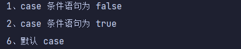

# Go基础

## hello world

```go
package main

import "fmt"
func main() {
	var age int=1;
	fmt.Println(age)
fmt.Println("hello"+" world")
}

```

> - 第一行代码 *package main* 定义了包名。你必须在源文件中非注释的第一行指明这个文件属于哪个包，如：package main。package main表示一个可独立执行的程序，每个 Go 应用程序都包含一个名为 main 的包。
> - 第二行导入fmt包，fmt包含了格式化IO的函数
> - func定义函数，main为主函数

## 基础语法

### 变量

- 

```go
var identifier type
```

- 如果再声明时进行赋值则可以省略类型,也可进行简写,使用`:=`后省略var，`:=`只可在声明时使用，对已经声明过的使用会编译错误

```go
var s="hello"
s:="hello"
```

- 未初始化的

  - 数值型默认为0值

  - 布尔为false

  - 字符串为空

  - > ```
    > //以下为nil(null)
    > var a *int
    > var a []int
    > var a map[string] int
    > var a chan int
    > var a func(string) int
    > var a error // error 是接口
    > ```

- 基本类型如`int、float、bool、string`等为值类型，赋值时为值传递，进行拷贝赋值

  &i可以获得其地址

  

 ### 常量

```go
const identifier [type] = value
```

type可省略，编译器自动推断

**iota**

iota，特殊常量，可以认为是一个可以被编译器修改的常量。

iota 在 const关键字出现时将被重置为 0(const 内部的第一行之前)，const 中每新增一行常量声明将使 iota 计数一次(iota 可理解为 const 语句块中的行索引)。

```
const (
   a = iota   //0
   b          //1
   c          //2
   d = "ha"   //独立值，iota += 1
   e          //"ha"   iota += 1
   f = 100    //iota +=1
   g          //100  iota +=1
   h = iota   //7,恢复计数
   i          //8
)
fmt.Println(a,b,c,d,e,f,g,h,i)
```

输出结果为：0 1 2 ha ha 100 100 7 8

### 条件语句

**if**

无括号

```
var temp=5
if temp>1{

   fmt.Println("确实")
}
```

**if else**

else不可换行，必须紧跟在if的花括号后面

```
var temp=5
if temp>1{

   fmt.Println("确实")
} else {
   fmt.Println("是这样的")
}
```

**嵌套if**

```
var temp=5
if temp>1{
   if temp>4{

      fmt.Println("确实")
   }
}
```

**switch**

无需break

```
var1 := 1
switch var1 {
case 1:
   fmt.Println("1")
case 2:
   fmt.Println("2")
default:
```

多个case合并：`case val1, val2, val3`

**fallthrough**

使用fallthrough强制执行后面的case语句，不判断下一个case是否为true

```
switch {
case false:
   fmt.Println("1、case 条件语句为 false")
   fallthrough
case true:
   fmt.Println("2、case 条件语句为 true")
   fallthrough

default:
   fmt.Println("6、默认 case")
}
```



三条全部执行