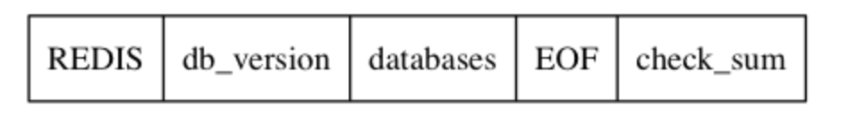
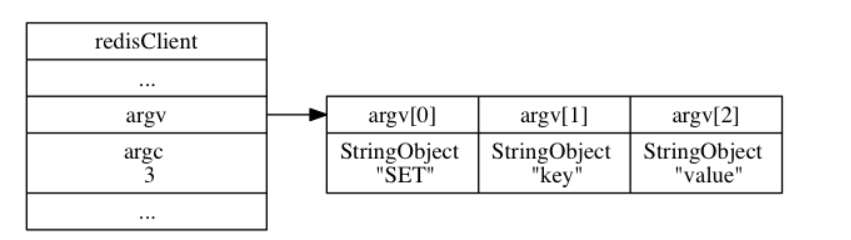

# Redis设计与实现

## 数据结构

redis中的数据结构主要分为两个层次，一是底层实现，为数据的真实存储方式，如链表，SDS，跳表等，二是对象系统，在底层数据结构之上进行创建，将底层数据结构作为对象的实现方式。对象系统作为Value存储在K-V数据库当中

### 底层实现

#### 简单字符串SDS

定义：

```c
struct sdshdr {
    // buf数组中已经使用的长度
    int len;
    // buf数组中空余的字节数
    int free;
    //真实存储的字符数组，符合C的规范，以\0结尾
    char buf[];
}
```

特点：

- 杜绝缓冲区溢出
  - 对于传统的C字符串，两个相邻的字符串，对第一个进行修改时如果超出边界则会溢出到后一个字符串上，导致第二个的内容被修改
  - SDS在修改时会判断是否超限，超限则自动扩容
- 通过free属性，减少重新分配内存的操作，分配时预先分配，预先分配的空间计入到free其中，回收时惰性回收，回收但未释放的空间计入到free当中
- 二进制安全
- buf遵循C字符串的规则，因此兼容C的字符串函数

#### 链表

Redis中实现为双向链表，分为节点和链表本身，定义如下

```c
typedef struct listNode {
    struct listNode *prev;
    
    struct listNode *next;
    
    void *vaule;
}
```

链表：

```c
typedef struct list {
    listNode *head;
    
    listNode *tail;
    
    unsigned long len;
    // 复制节点保存的值
    void *(*dup) (void *ptr);
    // 释放节点
    void (*free) (void *ptr);
    // 比较节点和输入的值
    int (*match) (void *ptr,void *key);
}
```

**多态**：其中 节点的值以及free dup match函数均使用void *无类型指针来表示，可以指向任意一种数据类型，从而实现了链表可以存储多种数据类型，不存在泛型，设计思想类似于Java中的Object类

#### 字典

字典的底层实现为哈希表，字典再对于哈希表进行进一步封装，用于特定操作和复制

**哈希表**

实现：

```c
typedef struct dictht {
    
    dictEntry **table;
    
    unsigned long size;
    // 哈希表大小掩码，用于计算索引值 等于size - 1
    unsigned long sizemask;
    // 已使用的节点数
    unsigned long used;
    
} dictht;
```

table为一个数组，数组中的每一个元素指向一个dictEntry结构的指针，多个dictEntry，通过链表的形式组织起来形成哈希桶，结构如下

```c
typedef struct dictEntry {
    void *key;
    
    union {
        void *val;
        unit64_t u64;
        int64_t s64;
    } v;
    
    struct dictEntry *next;
    
}dictEntry;
```

dictEntrty ，K-V类型V通过union的形式，存储的值为三者其中之一，三者共用同一段内存，存在内存覆盖

**字典实现**

```c
typedef struct dict {
    dictType *type;
    
    void *privdata;
    
    dictht ht[2];
    
    int rehashidx;
}
```

其中type为一组特定函数封装成的结构体，privdata保存的为传给type中函数的参数，

ht为两个哈希表，正常情况下只使用ht[0]，在rehash复制时才使用到ht[1]

trehashidx为rehash的进度

**哈希算法**

K-V为(k0,v0),首先通过type中的hashFunction函数计算出哈希值,在根据sizemask计算出索引值

```c
hash = dict->type->hashFunction(k0);
index = hash&dict->ht[0].sizemask // 
```

通过位与运算，可将计算处的哈希值转换到[0,size-1]的范围之内，获得合适的索引

**冲突/rehash**

redis中通过链表的形式来解决哈希冲突的问题，索引为同一个哈希桶时通过链表加到**表头(O(1)复杂度)**，但是由于没有对单个哈希桶降低复杂度的策略(像Java中HashMap中在链表过长时转换成红黑树)，导致后续复杂度过高，因此需要rehash进行解决

rehash：集中性的rehash时间消耗过大，导致服务器一段时间不可用，因此采用的为渐进多次rehash：

1. 开始rehash时为ht[1]分配空间，过程中一直保持ht[1]
2. 修改rehashidx = 0，表示rehash 正式开始
3. 每次对字典CRUD时，将rehashidx位置上的k-v迁移到ht[1]之中，rehashidx++
4. 完成后rehashidx置为-1

#### 跳表

有序数据结构，本质上为一个有序链表，核心设计思想为通过分层的思想，设计不同级别的索引，实现每次跳跃不同的距离，层数越高，对应的索引每次的跳跃幅度就越大，从而达到快速搜索的目的


**实现**

```c
typedef struct zskiplistNode {
    // 后退指针
    struct zskiplistNode *backward;
    // 分值
    double score;
    // 成员对象
    robj *obj;
    // 层
    struct zskiplistLevel {
        // 前进指针
        struct zskiplistNode *forward;
        // 跨度
        unsigned int span;
    } level[];
    
} zskiplistNode;
```

其中，后退指针用于向后遍历，指向后面的一个节点，

分值用于进行排序，obj为真正存储的对象

level为层数组，表示每一层指向的下一个节点和这两个这点直接的跨度

通过跳表节点即可形成跳表

跳表：

```c
typedef struct zskiplist {
   
    zskiplistNode * header;
    
    zskiplistNode *tail;
    
    unsigned long length;
    
    int level;
    
} zskiplist
```

**跳表构建**

除了level层索引之外，构建的过程和链表一致，而对于level,Redis设计的level的层数为1-32之间的随机整数，具体的实现过程为二分确定，即构建新节点时，新增加一个层的概率为1/4，即三层的概率为 `1/4 * 1/4 * 3/4`

**跳表定位**

跳表的搜索过程与二叉树的思想类似，通过不断缩小区间确定最终的值，在性能上也与二叉搜索相当，复杂度为O(logn)

过程：

1. 先搜索最高层索引,直至找到了目标值

2. 相等则直接返回，如果目标值大于当前节点的值则继续向后遍历
3. 如果当前节点的值小于目标值，而当前节点的下一个值大于目标值，即定位到了区间，通过回退指针找到下一层索引的上一个节点，继续重复上述操作

相比二叉树的优点：

- 使用了更少的指针，节约空间
- 更加适合区间遍历，适配ZRANGE等操作

#### 整数集合

存储的类型为int16_t,int32_t,int_64t,且不可重复出现

结构定义：

```c
typedef struct intset {
    uint32_t encoding;
    
    uint32_t length;
    
    int8_t contents[];
} intset;
```


contents的类型定义为int8_t，但是实际的存储类型由编码格式而定，为int16_t,int32_t,int64_t的其中一种，并且整个集合的存储类型保持一致，为保持一致，涉及到升级和降级的过程

 **升级：**

若之前存储的为三个int16_t类型，在新增int64_t类型时， 首先分配空间64*4(原本+新增)，再将原本的进行转换，和新增的一同插入到新分配的空间当中。通过升级的策略，存储更加灵活且且节约内存

降级过程同理

#### 压缩列表

用于节约内存，分配连续空间来存放各个节点，各个节点保存一个整数值或者字节数组

节点由previous_length,encoding,content组成：

- previous_entry_length:本身为一个字节或五个字节，内容以字节为单位，保存前一个节点的在内存中所占的字节数，为previous_entry_length,encoding,content三个元素总字节数，而非content的长度，当前节点的起始指针减去previous_entry_length即可得到上一个节点的起始指针
- encoding表示content中的数据类型和长度，
- content保存节点的值

**连锁更新**

假设存在连续的几个节点的previous_entry_length均使用一个字节，内容为254,但最前方插入一个新的长度>255字节的节点时，1个字节无法表示255以上的值，从而需要换成5字节长度，previous_entry_length长度自身的增加导致节点长度超出了255，引发后续节点的prevous_enrty_length的改变扩容，导致连锁更新

删除节点同样也会引起连锁更新

最坏情况下(在列表头部插入),需要进行N次内存分配，每次内存分配的复杂度为O(N),最终的最坏复杂度为$O(N^2)$

### 对象

Redis中的每一个对象通过一个对象系统redisObject来表示

```c
typedef struct redisObject {
    unsigned  type;
    unsigned encoding;
    void *ptr;
    // ...
} robj;
```

type表示对象的类型，encoding表示底层编码的实现方式


#### 字符串对象

可作为元素嵌套在其他的对象其中

编码方式：

- int：用于表示整数形式，void* 指向一个long类型的数据
- embstr：表示短字符串，长度小于39字节，一次性分配redisObject和sdshdr的空间
- raw：通常存储较长的字符串，或者embstr中的内容经过修改后编码格式也变成raw，分两次分配redisObejct和sdshdr的空间，在内存中不连续

编码转换：

- int中存储的字符串不再是整数时，转换为raw
- embstr中内容修改后，转换为raw,embstr无相应的修改程序，embstr实际上为只读字符串，因此修改后转换为embstr

#### 列表对象

- ziplist编码，底层实现为压缩链表
- linkedlist编码，底层实现为双端链表

#### 哈希对象

- ziplist编码，底层实现为压缩尾端，K-V相邻存储，K在前，V在后，新节点追加在列表尾端
- hashtable编码，底层实现为字典

#### 集合对象

- intset编码，整数集合，用于存储整数值
- hashtable编码，底层实现为dict，K作为集合中的元素，V为null

#### 有序集合对象

- ziplist编码，每个原始使用两个相邻的压缩列表节点，第一个存储元素，第二个存储分值用于排序
- skiplist编码，同时使用跳表和字典作为实现。
  - 跳表升序存储元素和值
  - 字典的K为元素的成员，V为元素的分值，可以以O(1)的复杂度来查询
  - 跳表和字典通过指针共享成员，不会浪费额外的内存

#### 内存回收

通过维护引用计数确定对象的引用计数信息，计数为0时释放内存

#### 对象共享

对于两个值相同的对象，通过指针的方式来进行共享，节省内存

新的键通过引用指向旧的键的对象，对象的引用计数+1

值得注意的是，在redis初始化服务器时，会创建[0,9999]个字符串对象，用于进行引用，在5.0.14版本时，引用计数为INT_MAX-1

## 数据库基础架构

Redis主要分为redisClient和redisServer以及AOF/RDB，事件处理主要部分：

- redisClient：用于保存数据库的客户端的连接状态，如目标数据库号等
- redisServer：保存数据库的服务器状态，维护当前的数据库等
- AOF/RDB：持久化数据
- 事件处理：监听套接字/定时，接受事件调用对应的文件事件处理器

 redisClient结构体维护着客户端信息，如当前整连接的数据库，套接字描述符等

redisServer结构体维护着服务端的信息，连接了的客户端状态，其中redisDb维护者数据库空间，通过两个字典保存当前所有的K-V和存在过期时间的K-V

### RDB持久化

RDB文件中的databases保存的为数据库**状态**，即原始的键值对，以及一些额外的附加信息，相比之下：

- MySQL中的redolog记录的为物理操作，即对哪个数据进行了什么修改
- MySQL中的binlog记录的为语句的原始逻辑 statement形势下记录的为原始是sql，row记录的为执行的操作
- Redis中的AOF记录的Redis的命令，类似于MySQL中statement 形式的binlog

通过对redolog binlog RDB AOF的比较，可以看出Redis中持久化和MySQL中日志的异同：

- 二者都可以对数据库进行记录，并且恢复处当前的状态
- 但是日志系统是力求记录每一时刻的状态，最终能够恢复到特定(redolog 断电)/指定(binlog 备份归档)的状态
- 而持久化侧重于将内存中的状态保存到磁盘当中，磁盘当中只存在一个状态，即便是AOF会和binlog一样，一条条的记录命令语句，但是也会因为AOF重写，重新读取状态生成新的AOF导致AOF语句之间的逻辑变得模糊

#### 创建与载入

可以通过SAVE和BGSAVE两种命令创RDB文件，二者均为调用rdbSave()函数来进行RDB文件的创建，只不过BGSAVE(background) 是通过fork处一个子进程来进行创建，（fork相关知识点详见操作系统）

- BGSAVE在创建RDB文件的期间，Redis服务器在此期间依旧可以处理客户端发来的请求
- BGSAVE执行时，为防止父子进程之间竞争，SAVE命令被禁止
- AOF重写命令BGWRITEAOF会在BGSAVE执行结束后再执行

载入：在服务器启动时，会载入RDB文件来恢复redis状态，并且服务器会阻塞，直至载入完成。但是RDB的优先级低于AOF文件，在开启了AOF持久化后会优先从AOF中载入

#### 保存

```c
typedef struct redisServer {
    // ...
    //条件数组
    struct saveparm *saveparams;
    // 修改计数器，距上一次rdbSave后修改次数
    long long dirty;
    // 上次执行保存的时间
    time_t lastsave;
}
```


通过配置条件来进行自动保存，在redisServer结构体中，通过saveparms数组来维护不同的保存条件

saveparm结构如下

```c
typedef struct saveparm {
    // 时间段
    time_t seconds;
    // 修改次数
    int changes;
}
```

表明在seconds时间段内,如果修改了changes次，则触发自动写RDB

serverCron函数每过100ms被调用一次，遍历saveparms判断条件是否满足

#### 文件结构

二进制文件，并非C字符串



- REDIS为五个字符，用于辨别是否为RDB文件
- db_version为当前的版本号
- databases为数据库的状态信息
- EOF:End Of Flie,一字节的标志位
- check_sum:校验和，由前四个字段计算出

**databases**

结构：

databases:

- selectdb：标志下一位为一个数据库号码
- db_number：数据库号码
- key_value_pairs：键值对 type为对象类型或底层编码，EXPIRETIME_MS为标志下一位为过期时间
  - 不带过期时间：
  - 带过期时间：

对于不同的type,value的具体结构也不同

### AOF持久化

#### 写入与载入

**写入**

redisServer维护一个aof_buf,服务器在执行完一个写命令之后， 会以协议格式将被执行的写命令追加到服务器状态的 `aof_buf` 缓冲区的末尾：

```c
struct redisServer {

    // AOF 缓冲区
    sds aof_buf;

    // ...
};
```

服务器进程为一个事件循环(详情见事件)，每次循环结束之前，调用`flushAppendOnlyFile`把缓冲区中的内容写到硬盘中的AOF文件当中`flushAppendOnlyFile`的行为由appendfsync来控制：

- always:把缓冲区中所有的都写入并同步到AOF文件当中
- ererysync:缓冲区内容全部写入，如果距上次同步事件超过一秒，再进行同步
- no:全部写入，但是同步过程交给操作系统决定

> 在现代os中，为了提高文件的写入操作，当用户调用到write函数将数据写入文件时，os先将数据写入到一个内存缓冲区里，正常是等到缓冲区满了或是规定时间到了，才真正地将缓冲区里的数据写入磁盘，这时才是持久化完成。

**载入**

创建一个不带网络连接的伪客户端，执行AOF中保存的命令

#### AOF重写

对于多条对同一个K-V进行操作的命令，可以精简合并为一条命令，从而减少空间占用

具体实现方式为重新读取当前服务器中数据库的状态，重新生成一个AOF文件，替代原有的AOF文件

如果列表、哈希表、集合、有序集合中的元素超出了REDIS_AOF_REWRITE_ITEMS_PER_CMD的值时，会分成多条语句来进行记录

#### 后台重写

创建一个子进程来进行AOF重写，父进程可以继续处理命令请求

再子进程进行后台AOF重写时，创建了一个AOF重写缓冲区，新添加的命令会同时发送给AOF缓冲区和AOF重写缓冲区，在子进程完成重写后，再将AOF重写缓冲区中的内容写入到新的AOF文件当中

### 事件

Redis为事件驱动程序，即针对不同的事件来进行响应和处理

主要分为文件事件和时间事件：

- 文件事件：服务器对套接字操作的抽象，服务器和客户端之间通信便会产生响应的文件事件，服务器监听套接字并进行处理
- 时间事件：服务器中的定时执行的函数

#### 文件事件

通过I/O多路复用来监听多个套接字，将套接字放到一个队列之中，并向文件事件分派器传送产生了事件的套接字，文件事件分派器再调用对应的事件处理器

> I/O 多路复用程序可以监听多个套接字的 `ae.h/AE_READABLE` 事件和 `ae.h/AE_WRITABLE` 事件， 这两类事件和套接字操作之间的对应关系如下：
>
> - 当套接字变得可读时（客户端对套接字执行 `write` 操作，或者执行 `close` 操作）， 或者有新的可应答（acceptable）套接字出现时（客户端对服务器的监听套接字执行 `connect` 操作）， 套接字产生 `AE_READABLE` 事件。
> - 当套接字变得可写时（客户端对套接字执行 `read` 操作）， 套接字产生 `AE_WRITABLE` 事件。
>
> I/O 多路复用程序允许服务器同时监听套接字的 `AE_READABLE` 事件和 `AE_WRITABLE` 事件， 如果一个套接字同时产生了这两种事件， 那么文件事件分派器会优先处理 `AE_READABLE` 事件， 等到 `AE_READABLE` 事件处理完之后， 才处理 `AE_WRITABLE` 事件。
>
> 这也就是说， 如果一个套接字又可读又可写的话， 那么服务器将先读套接字， 后写套接字。

**文件事件处理器**

- 连接应答处理器
- 命令请求处理器
- 命令回复处理器

#### 时间事件

主要分为定时事件和周期事件

时间事件属性：

- id
- when
- timeProc:时间事件处理器

**实现：**

服务器将所有的时间事件都放置在一个无序链表中，时间事件执行器运行时，遍历整个链表，，查找已经到达的时间事件，调用对应的处理器

### 客户端

#### 客户端属性

redis客户端的信息主要靠redisClient结构体进行维护，其中保存着所连接的数据库号：

```c
typedef struct redisClient {
    // 当前正在连接的数据库，指向数据库数组中的一个元素
    redisDb *db;
    // 正在使用的套接字描述符 -1为伪客户端 大于-1的整数为正常客户端
    int fd;
    // 客户端名称 正常情况下没名字，可手动设置
    robj *name
    // 客户端角色和客户端当前处于的状态
    int flags;
    // 输入缓冲区 存放命令
    sds querybuf;
    // 命令参数
    robj **argv;
    // 命令参数的个数
    int argc;
    // 命令的实现函数
    struct redisCommand *cmd;
    // 存放给客户端的回复 固定长度
    char buf[REDIS_REPLY_CHUNK_BYTES];
    // 当前已经使用的字节数量
    int bufpos;
    // 可变大小缓冲区
    list *reply
    // 身份验证位，1为通过验证，0为未通过验证，则只能调用AUTH命令
    int authenticated;
    // 时间相关参数
    // 客户端创建的时间
    time_t ctime;
    // 最后一次互动的时间
    time_t lastinteration;
    // 缓冲区第一次达到软限制的时间
    time_t obuf_soft_limit_reached_time;
    
    // ...
    
}
```

**解释**

- fd ：

  - -1为伪客户端，通过 AOF文件或lua脚本创建
  - 大于-1的整数为正常客户端，通过套接字和服务器通信

- flags：可以为单个标志，也可为多个标志，通过二进制的各个位来表述是否处于当前的状态

- querybuf：根据客户端发送的命令请求动态变化大小，但是最大不超过1GB，否则关闭客户端

- 参数相关：

  - argv 当前命令解析成的参数数组 
  - argc 参数数量

  例：`SET KEY VALUE`解析成：

  

- 命令实现函数：在命令解析完成后，通过argv[0],即具体的命令动作，区查询命令表，找到对应的实现函数，将其赋给cmd

  

- 回复缓冲区：存储回复给客户端的命令，较短的使用固定长度的字节数组，REDIS_REPLY_CHUNK_BYTES默认大小为16*1024，即大小为16KB，当固定数组存慢了之后便改用可变长度，使用reply链表，串联起多个字符串对象

#### 创建与关闭

**创建：**

客户端使用connect函数连接，服务器调用连接事件处理器，为客户端创建连接状态，，将连接状态追加到 clients链表的尾部

**关闭：**

客户端因为多种原因被关闭，如客户端进程退出或被杀死，不符合协议格式的命令请求，或者输出，输入缓冲区大小超出限制

输出硬性限制(hard limit)：超出之后直接关闭客户端

输出软性限制(soft limit)：超出之后如果在指定时间内不再超出，则不会关闭客户端

### 服务器

#### 服务器属性

```c
typedef struct redisServer {
    // db数组，元素为redisDb结构，代表一个数据库
    redisDb *db;
    // 数据库数量根据配置的database选项决定
    int dbnum;
    // 秒级unix时间戳
    time_t unixtime;
    // 毫秒级unix时间戳
    long long mstime;
    // 内存峰值
    size_t stat_peak_memory；
    
}
```

#### 数据库键空间

```c
typedef struct redisDb {
    // ...
    // 数据库键空间,保存数据库中所有的K-V
    dict *dict;
    // 过期字典，保存过期时间
    dict *expires;
}
```

dict和expires为两个键指向同一个键对象，不造成空间浪费

CRUD即为对这两个字典进行操作

**过期策略**

单独定时删除对CPU不友好，占用CPU事件检查，单独惰性删除对内存不友好，过期的键仍存在内存当中，因此Redis采用二者相结合的方式

惰性删除：Redis在命令执行前先调用`expireIfNeeded`函数对输入键进行检查，过期则删除，否则则不采取动作，类似加了一层拦截器，判断完键的状态再放行

定期删除：规定时间内分多次遍历各个数据库，随机检查一部分键的过期时间，删除过期键

RDB文件不会保存过期但还未从内存中删除的键

载入时：

- 主服务器模式下运行时，过期的键不进行载入
- 从服务器模式下运行时，所有的键全部进行载入

AOF在键过期时追加一条命令显示记录键被删除，重写时不会对过期的键进行重写

#### 命令请求

1. 用户输入命令，客户端将命令转换为协议，然后将协议发送给服务器
2. 协议保存到缓冲区之后对其进行解析，填充argv和argc
3. 调用命令执行器
   1. 通过argv[0]来查找命令表找到对应的命令，并将对应的命令保存到cmd当中
   2. 执行预备操作，检查cmd指针是否为null,argv是否大于等于三等
   3. 调用相关实现函数
   4. 执行后续工作，慢查询，AOF等
4. 将命令回复发送给客户端，客户端接收打印显示


