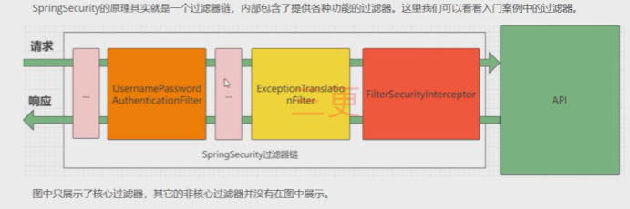
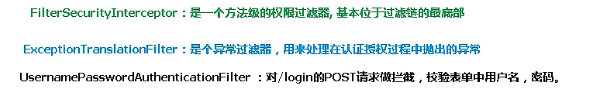
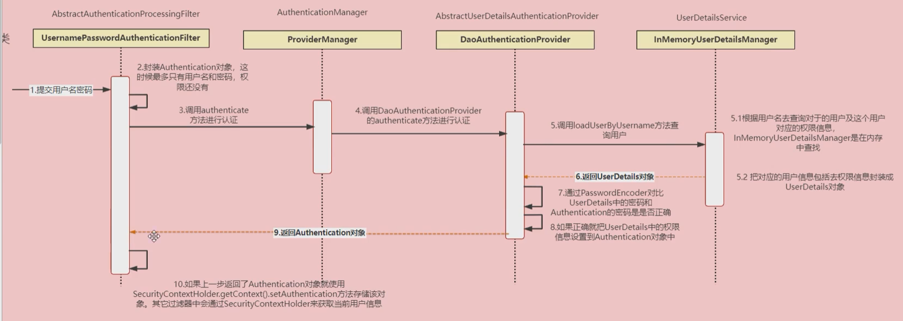
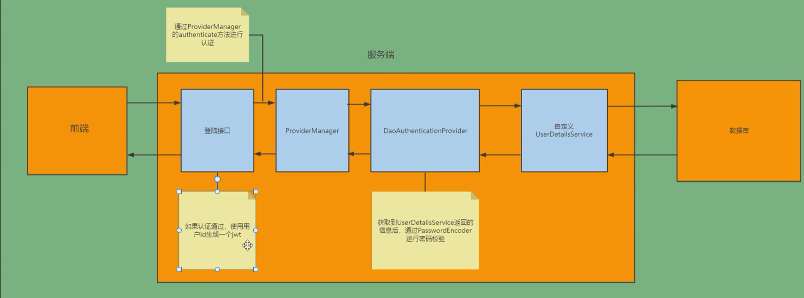

# SpringSecutiy

## 快速入门

导入springboot和springsecurity依赖

```xml
	<dependency>
            <groupId>org.springframework.boot</groupId>
            <artifactId>spring-boot-starter-security</artifactId>
            <version>2.6.4</version>
        </dependency>
```

配置简单的Controller

```java
@RestController
@RequestMapping("/test")
public class TestController {
    @GetMapping("hello")
    public String add(){
        return "hello security";
    }
}

```

访问/test/hello后会弹出一个登录界面


启动项目后控制台会生成一个password，用户名默认为user，即可完成登录

**spring security本质为一个过滤器链**





## Web权限方案

- UserDetailsService

  查询数据库用户名和密码过程

  - 创建类继承UsernamePasswordAuthenticationFilter，重写三个方法
  - 创建类实现UserDetailService，编写查询数据过程，返回User对象，这个User对象是安全框架提供的对象

- PasswordEncoder

  数据加密接口，用于返回User对象里面的密码加密



### 用户认证

**设置登录的用户名和密码**

1. 配置文件

   ```yaml
   spring:
     security:
       user:
         name: fischer
         password: 123
   
   ```

2. 通过配置类

   ```java
   @Configuration
   public class SecurityConfig extends WebSecurityConfigurerAdapter {
       @Override
       protected void configure(AuthenticationManagerBuilder auth) throws Exception {
           //实现密码加密
           BCryptPasswordEncoder passwordEncoder = new BCryptPasswordEncoder();
           //指定用户、密码与角色
           String password = passwordEncoder.encode("123");
           auth.inMemoryAuthentication()
                   .withUser("fischer")
                   .password(password)
                   .roles("admin");
       }
   	//自定义对象提前进行加载，否则获取不到BcryptPasswordEncoreder
       @Bean
       PasswordEncoder passwordEncoder(){
           return new BCryptPasswordEncoder();
       }
   }
   ```

   

3. 自定义编写实现类

   配置类

   在配置类中注入自己自定义的UserDetailsService，不再直接在其中设置用户名和密码

   Autowired按找类型匹配，自定义的MyUserDetailsService实现了UserDetailsService接口，因此此处直接写接口类型即可

   ```java
   @Configuration
   public class SecurityConfigTest extends WebSecurityConfigurerAdapter {
   
       @Autowired
       private UserDetailsService userDetailsService;
       @Override
       protected void configure(AuthenticationManagerBuilder auth) throws Exception {
           auth.userDetailsService(userDetailsService).passwordEncoder(password());
   
       }
       @Bean
       PasswordEncoder password(){
           return new BCryptPasswordEncoder();
       }
   }
   
   ```

   MyUserDetailsService

   auths为对应的角色，在此处先暂时先设置上去，不做过多讨论

   返回一个new的User，在其中设置相关信息，此处的User为SpringSecurity框架提供的User

   ```java
   ublic class MyUserDetailsService implements UserDetailsService {
       @Override
       public UserDetails loadUserByUsername(String username) throws UsernameNotFoundException {
           List<GrantedAuthority> auths = AuthorityUtils.commaSeparatedStringToAuthorityList("role");
           return new User("fischer",new BCryptPasswordEncoder().encode("123"),auths);
       }
   }
   ```

   

 ### 整合数据库



   **数据库配置：**

   ```
   spring:
     datasource:
       driver-class-name: com.mysql.cj.jdbc.Driver
       url: jdbc:mysql://localhost:3306/security?serverTimezone=UTC #修改ip以及端口 和密码
       username: root
       password: 1234
       type: com.alibaba.druid.pool.DruidDataSource
   
   mybatis-plus:
     configuration:
       log-impl: org.apache.ibatis.logging.stdout.StdOutImpl
     mapper-locations: dao/*.xml
   
   ```

   **实体类：**

   ```java
   package com.fischer.pojo;
   
   import com.baomidou.mybatisplus.annotation.TableName;
   import lombok.Data;
   import lombok.NoArgsConstructor;
   
   @Data
   @NoArgsConstructor
   @TableName("users")
   public class Users {
       private String id;
       private String username;
       private String password;
   
   }
   
   ```

   **mp**

   ```java
   @Mapper
   public interface UserMapper extends BaseMapper<Users> {
   }
   ```

   

**UserDetailsService:**

```java
@Service
public class MyUserDetailsService implements UserDetailsService {
    @Autowired
    private UserMapper userMapper;
    @Override
    public UserDetails loadUserByUsername(String username) throws UsernameNotFoundException {
        QueryWrapper<Users> wrapper=new QueryWrapper<>();
        wrapper.eq("username",username);
        Users one = userMapper.selectOne(wrapper);
        if(one==null){
            throw new UsernameNotFoundException("用户名不存在");
        }
        String password = one.getPassword();
        List<GrantedAuthority> auths = AuthorityUtils.commaSeparatedStringToAuthorityList("role");
        return new User("fischer",new BCryptPasswordEncoder().encode(password),auths);
    }
}

```

我们只需要负责用户名的校验即可，查询该用户名对应的user是否存在于数据库当中，如果不存在则直接抛出用户不存在的异常

如果存在则将查询到的密码交给springsecurity，让springsecurity完成数据校验

### 自定义登陆界面

在前面的基础之上我们只需要修改springsecurity的配置类，使用HttpSecurity的configure方法

```java
 @Override
    protected void configure(HttpSecurity http) throws Exception {
        http.formLogin()//自定义登录界面
                .loginPage("/login.html")//登陆界面设置
                .loginProcessingUrl("user/login")//登录访问路径
                .defaultSuccessUrl("/test/index").permitAll()//访问成功之后进行跳转的路径
                .and().authorizeRequests()
                .antMatchers("/","/test/hello","user/login").permitAll()//设置放行的路径
                .anyRequest().authenticated()//尚未匹配的任何URL要求用户进行身份验证
                .and().csrf().disable();//关闭csrf防护

    }
```

登陆界面

添加一个简单的表单

此处表单的name必须为username和password，springsecurity按照字段username和password字符串的名称进行匹配

```html
<form action="/user/login" method="post">
   用户名 <input type="text" name="username"/>
    <br/>
   密码 <input type="text" name="password"/>
    <br/>
</form>
```

## 前后端分离

### 具体思路

**登录：**

1. 自定义登录接口
   - 调用ProviderManager的方法进行认证，如果认证通过则生成jwt
   - 用户信息存入redis
2. 自定义UserDetailsService
   - 在其中实现查询数据库

**校验：**

1. 定义jwt认证过滤器
   - 获取token
   - 解析token
   - 从redis中获取用户信息
   - 存入SecurityContextHolder

### 基本实现

**自定义LoginUser**

自定义LoginUser来实现UserDetails，内部成员变量设置为自己的实体类User并且重写getPassword方法和个体Username方法，此时SpringSecurity便是根据从数据库中查询到的实体类中的信息进行校验

将查询到的实体类中的username和以及password和填入的进行比较

```java
package com.fischer.security;


@Data
@NoArgsConstructor
@AllArgsConstructor
public class loginUser implements UserDetails {
    private User user;

    @Override
    public Collection<? extends GrantedAuthority> getAuthorities() {
        return null;
    }

    @Override
    public String getPassword() {
        return user.getPassword();
    }

    @Override
    public String getUsername() {
        return user.getUsername();
    }

    @Override
    public boolean isAccountNonExpired() {
        return true;
    }

    @Override
    public boolean isAccountNonLocked() {
        return true;
    }

    @Override
    public boolean isCredentialsNonExpired() {
        return true;
    }

    @Override
    public boolean isEnabled() {
        return true;
    }
}

```


**自己定义UserDetailsServiceImpl**:

实现UserDetailsService

重写其中的loadUserByUsername方法，返回类型为UserDetails，由于我们自己声明的LoginUser类实现了UserDetails，因此直接返回LoginUser即可

```java
@Service
public class UserDetailServiceImpl implements UserDetailsService {

    @Autowired
    private UserMapper userMapper;
    @Override
    public UserDetails loadUserByUsername(String username) throws UsernameNotFoundException {
        LambdaQueryWrapper<User> lqw=new LambdaQueryWrapper<>();
        lqw.eq(Strings.isNotEmpty(username),User::getUsername,username);
        User user = userMapper.selectOne(lqw);
        if(user==null){
            throw new UsernameNotFoundException("用户名或者密码错误");
        }
        return new loginUser(user);
    }
}

```

注意：如果要测试，需要往用户表中写入用户数据，并且如果你想让用户的密码是明文存储，需要在密码前加{noop}。例如注意：如果要测试，需要往用户表中写入用户数据，并且如果你想让用户的密码是明文存储，需要在密码前加{noop}。例如


这样登陆的时候就可以用sg作为用户名，1234作为密码来登陆了。

### 密码加密与校验

 实际项目中我们不会把密码明文存储在数据库中。

 默认使用的PasswordEncoder要求数据库中的密码格式为：{id}password 。它会根据id去判断密码的加密方式。但是我们一般不会采用这种方式。所以就需要替换PasswordEncoder。

 我们一般使用SpringSecurity为我们提供的BCryptPasswordEncoder。

 我们只需要使用把BCryptPasswordEncoder对象注入Spring容器中，SpringSecurity就会使用该PasswordEncoder来进行密码校验。

 我们可以定义一个SpringSecurity的配置类，SpringSecurity要求这个配置类要继承WebSecurityConfigurerAdapter。

```java
@Configuration
public class SecurityConfig extends WebSecurityConfigurerAdapter {
    @Bean
    PasswordEncoder password(){
        return new BCryptPasswordEncoder();
    }
}
```

### 登录接口

接下我们需要自定义登录接口，然后让SpringSecurity对这个接口放行,让用户访问这个接口的时候不用登录也能访问。

​	在接口中我们通过AuthenticationManager的authenticate方法来进行用户认证,所以需要在SecurityConfig中配置把AuthenticationManager注入容器。

​	认证成功的话要生成一个jwt，放入响应中返回。并且为了让用户下回请求时能通过jwt识别出具体的是哪个用户，我们需要把用户信息存入redis，可以把用户id作为key。

**controller：**

```java\
package com.fischer.controller;

@RestController
@RequestMapping("user")
public class UserController {

    @Autowired
    private UserService userService;
    @Autowired
    StringRedisTemplate redisTemplate;

    @GetMapping("hello")
    public ResponseEntity hello(){

        ResultType resultType=new ResultType(200,"hello","访问成功");
        return ResponseEntity.ok(resultType);
    }

    @PostMapping
    public ResponseEntity login(@RequestBody LoginParam loginParam){
        UserWithToken user=userService.login(loginParam);
        ResultType resultType=new ResultType(200,user,"登陆成功");
        return ResponseEntity.ok(resultType);
    }

    @DeleteMapping
    public ResponseEntity logout(@RequestHeader("Authorization") String token){
        Boolean logout = userService.logout(token);
        if(logout){
            return ResponseEntity.ok(new ResultType(204,null,"注销成功"));
        }
        else{
            throw new BizException(HttpStatus.INTERNAL_SERVER_ERROR,"服务器异常，注销失败");
        }
    }

}

```
**配置类：**

```java
package com.fischer.config;

@Configuration
@EnableGlobalMethodSecurity(prePostEnabled = true)
public class SecurityConfig extends WebSecurityConfigurerAdapter {

    //创建BCryptPasswordEncoder注入容器
    @Bean
    public PasswordEncoder passwordEncoder(){
        return new BCryptPasswordEncoder();
    }
    @Autowired
    private Myfilter jwtAuthenticationTokenFilter;
    @Autowired
    private AccessDeniedHandler accessDeniedHandler;
    @Autowired
    private AuthenticationEntryPoint authenticationEntryPoint;

    @Override
    protected void configure(HttpSecurity http) throws Exception {
        http
                //关闭csrf
                .csrf().disable()
                //不通过Session获取SecurityContext
                .sessionManagement().sessionCreationPolicy(SessionCreationPolicy.STATELESS)
                .and()
                .authorizeRequests()
                // 对于登录接口 允许匿名访问
                .antMatchers("/user/login").anonymous()
                // 除上面外的所有请求全部需要鉴权认证
                .anyRequest().authenticated();

        //添加过滤器
        http.addFilterBefore(jwtAuthenticationTokenFilter, UsernamePasswordAuthenticationFilter.class);

        //配置异常处理器
        http.exceptionHandling()
                //配置认证失败处理器
                .authenticationEntryPoint(authenticationEntryPoint)
                .accessDeniedHandler(accessDeniedHandler);

        
    }

    @Bean
    @Override
    public AuthenticationManager authenticationManagerBean() throws Exception {
        return super.authenticationManagerBean();
    }


}

```


```java
@Service
public class loginServiceImpl implements LoginService {

    @Autowired
    private AuthenticationManager authenticationManager;
    @Autowired
    private JwtService jwtService;
    @Autowired
    private StringRedisTemplate redisTemplate;
    @Override
    public UserWithToken login(LoginParam loginParam) {

        UsernamePasswordAuthenticationToken authenticationToken
                =new UsernamePasswordAuthenticationToken(
                        loginParam.getUsername(),loginParam.getPassword());
        Authentication authenticate = authenticationManager.authenticate(authenticationToken);
        if(Objects.isNull(authenticate)){
            throw new BizException(HttpStatus.BAD_REQUEST,"用户名或密码错误");
        }
        LoginUser loginUser = (LoginUser) authenticate.getPrincipal();
        User user = loginUser.getUser();
        String token = jwtService.toToken(user);
        redisTemplate.opsForValue().set("login:"+user.getId(),user.getUsername());
        return new UserWithToken(user, token);
    }
}

```

1. AuthenticationManager的authenticate方法会调用UserDetailsService中的loadUserByUsername方法进行认证

2. 而我们已经自己定义类实现类UserDetailsService重写了loadUserByUsername方法，因此会按照我们重写的方法取数据库中查询该用户是否存在，最后返回一个UserDetails类

3. UserDetails被我们的loginUser实现类实现，并且重写了其中的方法，最终封装的UserDetails中的username和password为我们从数据库中查询到的数据

4. 最后AuthenticationManager的authenticate方法再将数据与前端提交的数据进行比较，完成整个校验过程

### Token+过滤器

**拦截器且不使用框架的思路：**

- 对需要携带token的访问路径全部进行拦截，对token进行解析，判断该用户是否存在于redis当中，如果存在于redis当中则为已登录，有权限访问，否则进行拦截，抛出异常
- 对于不需要携带token，可以匿名访问的则直接进行放行

**springsecurity的思路**

由于SpringSecurity使用的是过滤器链，因此不能再像往常那样使用拦截器进行认证

自己编写一个用于验证登录后token的过滤器，并将其加入到过滤器链当中，在该过滤器当中完成认证的过程，即`SecurityContextHolder.getContext().setAuthentication(authenticationToken);`,

与之前的拦截器基本一致，只是需要在过滤器中进行判断

- 不携带token的全部进行放行，由于直接进行放行，因此不携带token就无法执行` SecurityContextHolder.getContext().setAuthentication(authenticationToken);`，之后则看springsecurity中是否配置了该路径可以匿名访问，如果配置了，则访问成功，否则则被拦截下
- 携带token的在拦截器中进行token解析，解析成功则为认证成功，可以访问该路径

与之前拦截器思路不同的是，在此处过滤器只负责进行认证，判断是否已经登录，后续的拦截工作交给springsecurity去完成，过滤器不再负责具体的拦截

```java
package com.fischer.interceptor;

@Component
public class Myfilter extends OncePerRequestFilter {
    @Autowired
    private JwtService jwtService;
    @Autowired
    private UserMapper userMapper;
    @Autowired
    private StringRedisTemplate redisTemplate;
    private static final Set<String> ALLOWED_PATHS= Collections.unmodifiableSet(new HashSet<>(
            Arrays.asList("/user/login")));
    @Override
    protected void doFilterInternal(HttpServletRequest request, HttpServletResponse response, FilterChain filterChain) throws ServletException, IOException {
        String token = request.getHeader("Authorization");
        if(Strings.isEmpty(token)){
            //throw new BizException(HttpStatus.UNAUTHORIZED,"未携带token，请求被拦截");
            //原本此处直接抛出异常进行拦截，现在直接放行则不会完成认证的工作，由springsecurity判断是否拦截(该路径是否配置了匿名访问)
            filterChain.doFilter(request,response);
            return;
        }
        Optional<String> subFromToken = jwtService.getSubFromToken(token);
        if(!subFromToken.isPresent()){
            throw new BizException(HttpStatus.UNAUTHORIZED,"token解析失败，token有误或者不存在该用户");
        }
        String id="loginUser:"+subFromToken.get();
        String s = redisTemplate.opsForValue().get(id);
        if(Strings.isEmpty(s)){
            throw new BizException(HttpStatus.UNAUTHORIZED,"未登录！请先登录");
        }
        LambdaQueryWrapper<User>lqw=new LambdaQueryWrapper<>();
        lqw.eq(User::getUsername,s);
        User user = userMapper.selectOne(lqw);
        LoginUser loginUser=new LoginUser(user);
        UsernamePasswordAuthenticationToken authenticationToken=
                new UsernamePasswordAuthenticationToken(loginUser,null,null);
        SecurityContextHolder.getContext().setAuthentication(authenticationToken);
        filterChain.doFilter(request,response);
    }
}

```

**将自定义的过滤器添加到SpringSecurity的过滤器链当中**

```java
 //添加过滤器
        http.addFilterBefore(jwtAuthenticationTokenFilter, UsernamePasswordAuthenticationFilter.class);
```

### 自定义失败处理

主要针对未认证和未授权两种状态，但是似乎springsecurity默认返回的响应码全为403，有待后续测试

**AuthenticationEntryPoint**

AuthenticationEntryPoint 是 Spring Security Web 一个概念模型接口，顾名思义，他所建模的概念是：“认证入口点”。
它在用户请求处理过程中遇到认证异常时，被 ExceptionTranslationFilter 用于开启特定认证方案 (authentication schema) 的认证流程。

这里参数 `request `是遇到了认证异常 `authException `用户请求，`response `是将要返回给客户的相应，方法 `commence `实现，也就是相应的认证方案逻辑会修改 `response `并返回给用户引导用户进入认证流程。

**AccessDeniedHandler**

AccessDeniedHandler 仅适用于已通过身份验证的用户。未经身份验证的用户的默认行为是重定向到登录页面（或适用于正在使用的身份验证机制的任何内容）。

而二者失败时返回的状态码似乎均为403，并不是像网上搜到的那样，只要是403就是用AccessDeniedHandler进行处理，被CSDN上的部分文章坑了好久

定义两个实现类：

**AccessDeniedHandlerImpl**

```java
@Component
public class AccessDeniedHandlerImpl implements AccessDeniedHandler {
    @Override
    public void handle(HttpServletRequest request, HttpServletResponse response, AccessDeniedException accessDeniedException) throws IOException, ServletException {
        ResultType resultType=new ResultType(403,null,"暂无权限访问");
        ObjectMapper objectMapper=new ObjectMapper();
        String s = objectMapper.writeValueAsString(resultType);
        response.setStatus(200);
        response.setContentType("application/json");
        response.setCharacterEncoding("utf-8");
        response.getWriter().print(s);
    }
}
```

**AuthenticationEntryPointImpl **

```java
@Component
public class AuthenticationEntryPointImpl implements AuthenticationEntryPoint {
    @Override
    public void commence(HttpServletRequest request, HttpServletResponse response, AuthenticationException authException) throws IOException, ServletException {
        ResultType resultType=new ResultType(403,null,"暂无权限访问");
        ObjectMapper objectMapper=new ObjectMapper();
        String s = objectMapper.writeValueAsString(resultType);
        response.setStatus(200);
        response.setContentType("application/json");
        response.setCharacterEncoding("utf-8");
        response.getWriter().print(s);
    }
}
```

**SecurityConfig进行配置**

```java
 //配置异常处理器
        http.exceptionHandling()
                //配置认证失败处理器
                .authenticationEntryPoint(authenticationEntryPoint)
                .accessDeniedHandler(accessDeniedHandler);
```

### 静态资源访问

在security中进行配置，即可实现对项目中现有的静态资源进行放行

```java
@Override
    public void configure(WebSecurity web) throws Exception {
        web.ignoring().antMatchers("/img/**");
    }
```

```java
 @Override
    protected void configure(HttpSecurity http) throws Exception {
        http
                //关闭csrf
                .csrf().disable()
                //不通过Session获取SecurityContext               .sessionManagement().sessionCreationPolicy(SessionCreationPolicy.STATELESS)
                .and()
                .authorizeRequests()
                // 对于登录接口 允许匿名访问
   //对静态资源进行放行             .antMatchers("/user/login").anonymous()
                .antMatchers("/img/**").permitAll()
//                .antMatchers("/testCors").hasAuthority("system:dept:list222")
                // 除上面外的所有请求全部需要鉴权认证
                .anyRequest().authenticated();
        //添加过滤器
        http.addFilterBefore(jwtAuthenticationTokenFilter, UsernamePasswordAuthenticationFilter.class);
        //配置异常处理器
        http.exceptionHandling()              //配置认证失败处理器
                .authenticationEntryPoint(authenticationEntryPoint)
                .accessDeniedHandler(accessDeniedHandler);

    }
```

**进行文件路径映射**

经过上述配置，对于项目中的静态资源，如html，css等，已经能够成功访问，但是对于存储在项目外的文件，或者刚上传到static目录中的文件，没有被加载到项目当中去，虽然重启项目就可以把新上传的文件加载到项目当中，但这显然不符合我们的需求

因此我们需要进行路径映射，让其能够直接访问本地存储的文件，无论是不是刚上传，是不是在项目当中

这一步为通用操作，如果使用拦截器进行认证也需要进行同样操作

```java
@Configuration
public class StaticConfig implements WebMvcConfigurer {
    @Value("${web.upload-path}")
    private String uploadFolder;

    @Override
    public void addResourceHandlers(ResourceHandlerRegistry registry) {
        registry.addResourceHandler("/img/**").addResourceLocations("file:" + uploadFolder);
        WebMvcConfigurer.super.addResourceHandlers(registry);
    }
}
```

**配置文件：**

```yaml
web:
  upload-path: D:\learn_software\program_file\IDEAProgject\personal_blog\src\main\resources\static\img\
  realpath: D:/learn_software/program_file/IDEAProgject/personal_blog/src/main/resources/static/
```


 
