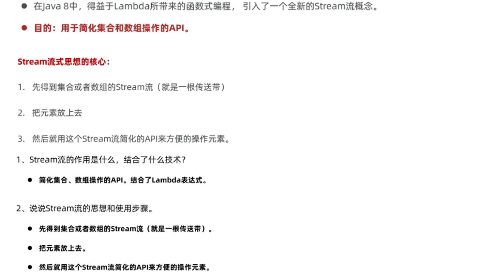
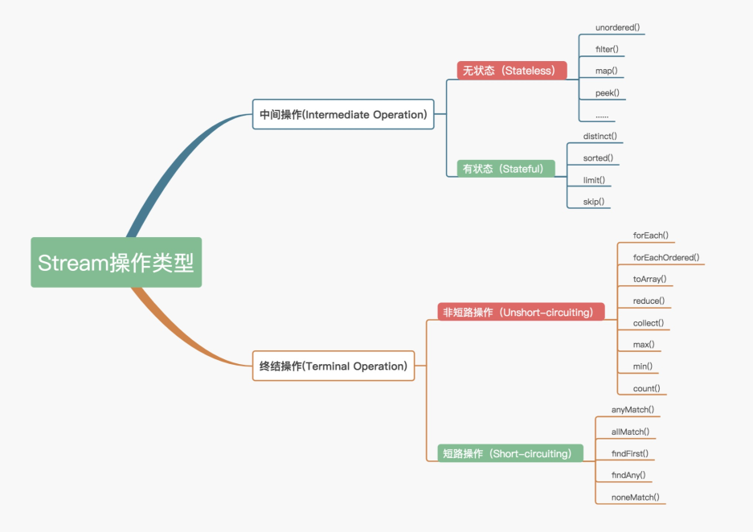

# Stream流

## 简介



流遵循了做什么而非怎么做的原则，只需要描述要做什么即可

- 元素是特定类型的对象，形成一个队列。 Java中的Stream并不会存储元素，而是按需计算。
- **数据源** 流的来源。 可以是集合，数组，I/O channel， 产生器generator 等。
- **聚合操作** 类似SQL语句一样的操作， 比如filter, map, reduce, find, match, sorted等。

和以前的Collection操作不同， Stream操作还有两个基础的特征：

- **Pipelining**: 中间操作都会返回流对象本身。 这样多个操作可以串联成一个管道， 如同流式风格（fluent style）。 这样做可以对操作进行优化， 比如延迟执行(laziness)和短路( short-circuiting)。
- **内部迭代**： 以前对集合遍历都是通过Iterator或者For-Each的方式, 显式的在集合外部进行迭代， 这叫做外部迭代。 Stream提供了内部迭代的方式， 通过访问者模式(Visitor)实现。

## 流的三类方法


### 生成流

生成方式：

- Collection接口的stream方法可以将任何一个集合转换成流
- 对于一个数组，可以使用Array.stream
- Stream.of可以将任何一个数组或者多个元素转换为一个流

```java
Collection<String> list=new ArrayList<>();
        Stream<String> s=list.stream();
        Map<String,Integer> maps=new HashMap<>();
        //键流
        Stream<String> keyStream=maps.keySet().stream();
        //值流
        Stream<Integer> valueStream=maps.values().stream();
        //键值对流
        Stream<Map.Entry<String,Integer>>keyAndValueStream=maps.entrySet().stream();
		//由数组获取流
        String[] names={"122","2323"};
        Stream<String> nameStream= Arrays.stream(names);
        Stream<String> nameStreams= Stream.of(names);

```



### 常用中间操作方法API

- Stream <T> filter（Predicate<? super T>predicate)

按条件过滤元素

```java
List<String>strings = Arrays.asList("abc", "", "bc", "efg", "abcd","", "jkl");
// 获取空字符串的数量
long count = strings.stream().filter(string -> string.isEmpty()).count();
```

- Stream <T>limit(long maxSize)

选取前几个元素

```java
Random random = new Random();
random.ints().limit(10).forEach(System.out::println);//获取前10个元素后遍历打印
```

- Stream <T>skip（long n）

跳过前n个元素

```java
 names.stream().filter(s -> s.startsWith("张")).skip(2).forEach(s -> System.out.println(s));
```

- Stream <T>distinct()

去除流中重复的元素。依赖（hashCode和equals方法）

- Stream <T>map(Function<? super T, ? extends R> mapper)

加工map：Function内前一个泛型为加工前的，后一个为加工后得到的类型，对应返回类型

```java
//Lambda表达式形式
comments.stream()//传入所有评论用户的id的集合
                  .map(commentData -> commentData.getProfileData().getId())
                  .collect(Collectors.toList()));

 /*Lambda简化*/
	        names.stream().map( s-> "fishcer的"+s).forEach(s -> System.out.println(s));

```

```java
//匿名内部类形式
names.stream().map(new Function<String, String>() {
	            @Override
	            public String apply(String s)
	            {
	                return "fishcer的"+s;
	            }
	        });

```


- Stream <T>concat

将两个流合并成同一个流

```java
//   public static <T> Stream<T> concat(Stream<? extends T> a, Stream<? extends T> b)
	        // 要求：两个占位符代表的泛型均继承于T，然后返回一个T
	        // 通过公共的父类流来合并两个子类流
	        // 一般用同一类型的流，合并不同的流可以用Object类(为所有类的父类)
	        Stream<String> s1=names.stream().filter(s -> s.startsWith("张"));
	        Stream<String> s2=Stream.of("Java1","Java2");
	        Stream<String> s3=Stream.concat(s1,s2);
	    }

```

#### 终结流

- void forEach(Consumer action)

对每个元素进行遍历

```java
Random random = new Random();
random.ints().limit(10).forEach(System.out::println);
```

- long count()

返回流中的元素数

```java
List<String> strings = Arrays.asList("abc", "", "bc", "efg", "abcd","", "jkl");
// 获取空字符串的数量
long count = strings.parallelStream().filter(string -> string.isEmpty()).count();
```

**收集**

通过一个collect方法，他接受一个collector接口的实例，Collectors提供用于生成常见收集器的工厂方法，如Collectors.toList,Collectors.toSet等

### 开发中的实际应用

```java
comments.stream()
                  .map(commentData -> commentData.getProfileData().getId())
                  .collect(Collectors.toList()));
//map用于进行类型转换，将CommentData类型转换为int
//collect转化为List
```


