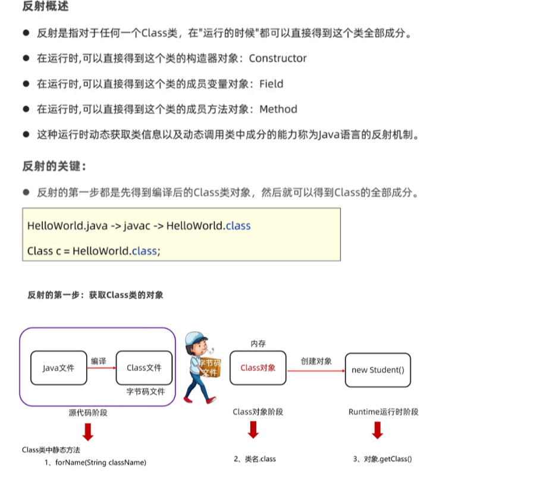

# 反射



类的完整加载过程:

（1）在编译时，Java 编译器编译好 `.java` 文件之后，在磁盘中产生 `.class` 文件。`.class` 文件是二进制文件，内容是只有 JVM 能够识别的机器码。

（2）JVM 中的类加载器读取字节码文件，取出二进制数据，加载到内存中，解析.class 文件内的信息。类加载器会根据类的全限定名来获取此类的二进制字节流；然后，将字节流所代表的静态存储结构转化为方法区的运行时数据结构；接着，在内存中生成代表这个类的 `java.lang.Class` 对象。

（3）加载结束后，JVM 开始进行连接阶段（包含验证、准备、初始化）。经过这一系列操作，类的变量会被初始化。

## Class对象

要想使用反射，首先需要获得待操作的类所对应的 Class 对象。**Java 中，无论生成某个类的多少个对象，这些对象都会对应于同一个 Class 对象。这个 Class 对象是由 JVM 生成的，通过它能够获悉整个类的结构**。所以，`java.lang.Class` 可以视为所有反射 API 的入口点。

## 使用反射


Java 中的 `java.lang.reflect` 包提供了反射功能。`java.lang.reflect` 包中的类都没有 `public` 构造方法。

`java.lang.reflect` 包的核心接口和类如下：

- `Member` 接口 - 反映关于单个成员(字段或方法)或构造函数的标识信息。
- `Field` 类 - 提供一个类的域的信息以及访问类的域的接口。
- `Method` 类 - 提供一个类的方法的信息以及访问类的方法的接口。
- `Constructor` 类 - 提供一个类的构造函数的信息以及访问类的构造函数的接口。
- `Array` 类 - 该类提供动态地生成和访问 JAVA 数组的方法。
- `Modifier` 类 - 提供了 static 方法和常量，对类和成员访问修饰符进行解码。
- `Proxy` 类 - 提供动态地生成代理类和类实例的静态方法。

**class的获取方式:**

- Class.forname()+全限定名,在jdbc获取驱动时曾经使用过

  ```java
    Class c1 = Class.forName("com.fischer.pojo.Article");
  ```

- 通过类直接获取

  ```java
    Class<Article> articleClass = Article.class;
  ```

  

## 创建实例

通过反射来创建实例对象主要有两种方式：

- 用 `Class` 对象的 `newInstance` 方法。
- 用 `Constructor` 对象的 `newInstance` 方法。

```
Class c1 = Class.forName("com.fischer.pojo.Article");
try {
    Article o = (Article)c1.newInstance();
} catch (InstantiationException e) {
    e.printStackTrace();
}
```

```javaConstructor constructor = c2.getConstructor(String.class);        //根据构造器创建实例        String str2 = (String) constructor.newInstance("bbb");
Constructor constructor = c2.getConstructor(String.class);
        //根据构造器创建实例
        String str2 = (String) constructor.newInstance("bbb");

```


## Field

`Class` 对象提供以下方法获取对象的成员（`Field`）：

- `getFiled` - 根据名称获取公有的（public）类成员。
- `getDeclaredField` - 根据名称获取已声明的类成员。但不能得到其父类的类成员。
- `getFields` - 获取所有公有的（public）类成员。
- `getDeclaredFields` - 获取所有已声明的类成员。

declared相关的只要声明了就可以拿到,无关public or private,突破了封装性

```java
	 @Test
	    public void getDeclaredField()throws Exception
	    {
	        Class c=Student.class;
	        Field ageF=c.getDeclaredField("age");
	        System.out.println(ageF.getName()+"===>"+ageF.getType());
	        //赋值前首先获取一个对象
	        ageF.setAccessible(true);
	        Student s=new Student();
	        ageF.set(s,18);//s.setAge(18)
	        System.out.println(s);
	        int age=(int)ageF.get(s);//返回的为object,强转为int
    }
```

## Method

`Class` 对象提供以下方法获取对象的方法（`Method`）：

- `getMethod` - 返回类或接口的特定方法。其中第一个参数为方法名称，后面的参数为方法参数对应 Class 的对象。
- `getDeclaredMethod` - 返回类或接口的特定声明方法。其中第一个参数为方法名称，后面的参数为方法参数对应 Class 的对象。
- `getMethods` - 返回类或接口的所有 public 方法，包括其父类的 public 方法。
- `getDeclaredMethods` - 返回类或接口声明的所有方法，包括 public、protected、默认（包）访问和 private 方法，但不包括继承的方法。

获取一个 `Method` 对象后，可以用 `invoke` 方法来调用这个方法。

```java
 Class c=lists3.getClass();
	        Method add=c.getDeclaredMethod("add", Object.class);
	        boolean result=(boolean) add.invoke(lists3,"黑马");
	        boolean result2=(boolean) add.invoke(lists3,39.9);
	        boolean result3=(boolean) add.invoke(lists3,lists1);

```

## Constructor

`Class` 对象提供以下方法获取对象的构造方法（`Constructor`）：

- `getConstructor` - 返回类的特定 public 构造方法。参数为方法参数对应 Class 的对象。
- `getDeclaredConstructor` - 返回类的特定构造方法。参数为方法参数对应 Class 的对象。
- `getConstructors` - 返回类的所有 public 构造方法。
- `getDeclaredConstructors` - 返回类的所有构造方法。

获取一个 `Constructor` 对象后，可以用 `newInstance` 方法来创建类实例。

```java
 @Test
    //获得全部构造器对象
    public void getConstructors()
    {   //获取类对象
        Class c=Student.class;
        //提取构造器对象
        Constructor[] constructors= c.getConstructors();
        //遍历构造器
        for(Constructor constructor:constructors)
        {
            System.out.println(constructor.getName()+"====>"+constructor.getParameterCount());
        }
        
    }
    @Test
    //获得单个构造器对象
    public void getConstructor ()throws Exception
    {   //获取类对象
        Class c=Student.class;
        //提取构造器对象
        Constructor cons= c.getConstructor();
        System.out.println(cons.getName()+"====>"+cons.getParameterCount());
    }
    @Test
    //获得私有构造器对象
    public void getDeclaredConstructor ()throws Exception
    {   //获取类对象
        Class c=Student.class;
        //提取构造器对象
        Constructor cons= c.getDeclaredConstructor();
        System.out.println(cons.getName()+"====>"+cons.getParameterCount());
        Constructor cons1=c.getDeclaredConstructor(String.class,int.class);
        System.out.println(cons1.getName()+"====>"+cons1.getParameterCount());
        
    }
```


参考链接：https://juejin.cn/post/6844903807755747342
