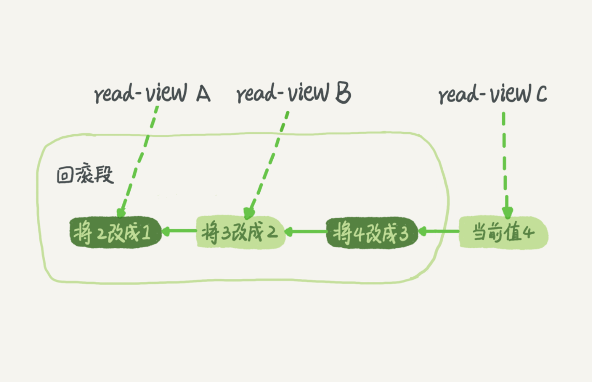

# 事务

四大特性：ACID（原子性、一致性、隔离性、持久性）

用于保证一组SQL语句执行的完整性并且执行期间不会受到其他不相关的SQL语句的影响

## 事务隔离

事务的隔离级别：

- 读未提交：事务未提交时所做的变更就已经能被别的事务看到
- 读提交：事务提交后做的变更才能被别的事务看到，视图在每个SQL语句执行前创建
- 可重复读：事务在开始时会创建一个视图，在事务执行的整个过程中，事务看到的数据都以这个视图为准，整个过程中数据一致，只有自己的事务所进行的修改才为可见
- 串行化：对于同一行一句，读加读锁，写加写锁，读写冲突时后面的事务需要等待前面的事务提交

四种隔离级别自上而下，随着隔离级别的提高，并发性能依次下降，InnoDB默认的隔离级别为可重复读。

**事务启动方式**

`set autocommit = 1`，再通过显示的方法启动事务，手动begin commit

可以使用`commit work and chain`,可以提交当前事务并开启下一个事务，减少一次交互，在频繁使用事务的业务中使用

**事务的启动时机**

- 对于bein/start transsaction，在执行到第一个操作InnoDB表的语句时，才最终启动事务
- start transaction with consistent snapshot 立即启动事务，创建一致性视图

**视图**

分为两种：

- 一种为view，通过查询结果而创建，为一个虚拟表，可以当作一个表来进行查询，为真实的物理结构
- 另一种为consistent read view,为一致性读视图，用于实现MVCC,在读提交和一致性读的隔离级别下存在，不存在真实的物理结构，只是定义的概念

## 回滚日志

可重复读需要保证在整个事务的执行过程当中的数据的一致性，在此期间，如果有别的事务对数据进行的修改，则需要通过回滚日志 undolog找到视图创建时的版本

值得注意的是，对于回滚日志，回滚日志中记录的是每一步的操作，想要得到前几步的结果需要通过当前数据加计算得到，因此长事务的回滚，性能开销也较大，会导致慢sql的问题

**回滚日志的删除**

当没有事务需要这个回滚日志时，即与该回滚日志相关的事务均已提交，该日志则会被删除

## 版本快照

**transaction id**

在事务开始时，InnoDB会向事务分配一个transaction id，按照严格递增的顺序

**trx_id**

数据库中的每一行都有自己的版本，版本号即为trx_id

数据由事务产生，在事务更新数据时,将transaction id赋值给该行的trx_id,借此，便将事务和数据关联起来。

### 活跃数组

由于trx_id是由transaction id生成的，因此二者之间便存在统一性，对于事务A，如果事务B是在事务A之后创建的，那么B的transaction id即大于A，同样trx_id也大于A，便可以借此将B操作产生的数据给"屏蔽掉"

实现上，InnoDB为**每个事务**，用于保存这个事务启动瞬间时所有事务的状态，为一个静态数组，可认为拍了一张快照保存状态

- 活跃指的是启动了但还未提交的事务,以最小的transaction id作为低水位，以最大的作为高水位
- 低水位之下的为已提交的事务
- 高水位之上的为目前还未开始的事务

**数据的可见性**

- 如果trx_id小于低水位，那么数据为当前事务开始前产生的，可见
- trx_id大于高水位,数据为当前事务开始之后其他事务做出的更新，不可见
- trx_id位于高低水位之间，则：
  - 如果trx_id存在于活跃数组当中，则表明该数据由未提交的事务产生，不可见
  - 不存在于活跃数组当中，则表明该事务已经提交，数据可见

> 对于高低水位，只能表明出一个范围，但是在此范围之间的可见性还要根据活跃数组来判断。
>
> 例如，低水位对应的事务为一个长事务，事务B为一个短事务，事务B在低水位事务开始后开始，transaction id大于低水位事务，但是B为短事务，在事务A开始时事务B已经提交，那么事务B则不存在于事务A的活跃数组当中，因此事务B更新的行对于A为可见的

在可重复读的隔离级别下，通过回滚日志undolog，找到对自己可见的trx_id的数据即可

### 当前读

在进行更新操作时，可重复的理念与并发更新存在冲突，并发更新在当前的最新值基础上进行更新，而可重复读又恰好看不到当前的最新值，有点类似于操作系统中其他线程产生的最新值还在寄存器当中，而该线程的更新无法读取到寄存器当中的值。

因此，为了解决这种情况，存在这样一条规则

更新数据都是先读后写的，而这个读，只能读当前的值，称为“当前读”（current read）。

先读出最新的版本号的数据，在此之上进行更新

当前读的语句：

- update
- select 加锁时的情况：`for update / lock in share mode`

由于读写锁之间的冲突，只有等待事务提交之后，select 语句才能读到update所作出的变更

