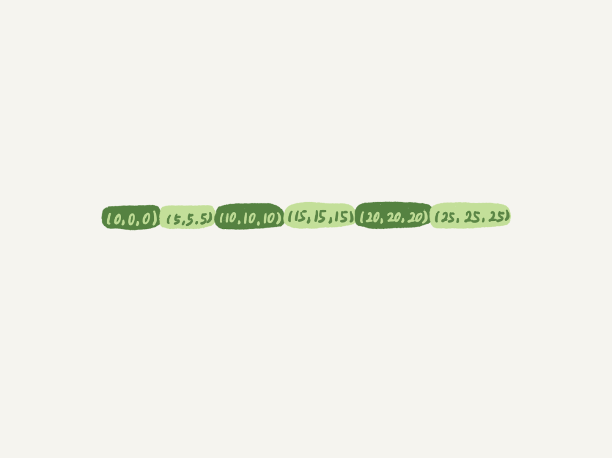

# 并发与锁

## 概述

设计用于控制并发问题，保证并发状态下的合理的控制资源的访问规则
在粒度上，可以分为全局锁，表锁，行锁
相关名词：

- 全局锁：锁住整个数据库
- 表锁：锁住表
- 行锁：锁索引
- 共享锁
- 排他锁
- 悲观锁（抽象）
- 乐观锁（抽象）


## 全局锁


**效果**：锁住整个数据库，整个数据库都处于只读的状态，DDL和DML和更新类的事务提交语句都被阻塞
**命令**：

- 推荐使用 Flush tables with read lock
- set global readonly=true的影响范围较大，风险较高
  **使用场景**：做全库备份，锁住保证主库备库的逻辑一致

## 表级锁

共有两种表级锁：元数据锁(MDL)和表锁

在限制上可以分为读锁和写锁，写锁和写锁，写锁和读锁冲突，读锁和读锁之间不产生冲突

**表锁**：

- 显式使用，表锁语法为：`lock tables...read/wrtie` ，可以通过unlock tables主动释放锁，也可在客户端断开连接时自动释放
- lock tables除了会限制别的线程的读写，也会限制本线程接下来的操作对象以及读写

线程A执行`lock tables t1 read ,t2 wrtie`，此后其他线程对t1写，t2的读写均会冲突，此外，线程A也只能对t1进行读，t2进行读写，无法对t1,t2进行其他操作，更无法对其他表进行操作

**MDL**：

- 隐式使用，在访问表时会被自动加上
- 作用：防止DDL和DML之间并发发生冲突

- - 进行DDL(CRUD）时，加读锁
  - 进程DML(变更表结构)时，加写锁

基于以上，对于一张表的CRUD同加上读锁，之间不会互相冲突，而在有表结构改变时，不允许其他线程同样对结构进行改变，也不允许CRUD，

CRUD之间的逻辑正确性由事务隔离+行锁进行负责，无需MDL

以上这种情况，A与C之间读写锁冲突，导致C被阻塞，C又将后续的读锁给阻塞

解决方案

- 解决长事务，让事务A尽快结束，释放MDL读锁
- 改变等待时间，默认的50s超时时间过长

## 行锁

在引擎层由各个引擎负责实现，如MyISAM即不支持行锁，被InnoDB取代

innodb加行锁的前提是：必须是通过索引条件来检索数据，否则会切换为表锁。行锁是加在索引上的，比如某个表中id字段是主键，如果给id=2这条记录加锁，那这把锁是加在主键索引(聚簇索引)上的。如果为某个没有索引的字段加锁，最终会在主键索引上锁住所有的记录。

InnoDB中实现的算法

- 记录锁(Record Lock) 对单个行记录进行上锁
- 间隙锁(Gap Lock) 对两行之间的间隙进行上锁，可以视为开区间，主要用于解决幻读的问题，即单靠Record Lock无法锁住即将新加进来的数据
- Next-Key Lock 等同于记录锁+间隙锁，为左开右闭的区间。

**两段式锁协议**

行锁在需要时加上，只有在事务结束后才释放，因此，最可能造成锁冲突，最影响并发度的语句应当处于一个事务中较后的位置，减少占用锁的时间，获取锁后尽快结束事务

### 记录锁

记录锁如同字面意思，锁住对应的记录行，为标准意义上的行锁

但是就像上面所说的那样，真正锁住的时这一行的索引，只有涉及到了被锁住的索引的操作才会被阻塞

### 间隙锁

锁住两条记录之间的间隙，如5到10之间的区间(5,10),在此区间内进行插入操作会被阻塞

同样也是针对某一个索引上锁，较为好理解，由于使用不同索引得到的排序结果也不尽相同，因此该区间也只是针对该索引才适用

间隙锁是在可重复读隔离级别下才会生效的

**作用**：

主要用于解决幻读问题，记录锁只能对当前已用的行进行上锁，即便是锁住了所有行，也无法阻止当前不存在而未来要插入的数据，因此提出了间隙锁的概念

在记录锁的情况下，与锁冲突的为另一把锁，而对于间隙锁，与间隙锁冲突的为向间隙中加锁的这个操作，不同的线程之间可以对同一个间隙进行加锁，目的均为保护这个间隙不允许其插入值，合乎逻辑，但是埋下了死锁的风险


事务A和事务B均为向(5,10)这个间隙上加间隙锁，二者之间不存在冲突问题，但是B的插入被A阻塞，A的插入又被B的间隙锁所阻塞，死锁形成。

### 邻键锁

记录锁和间隙锁合并在一起成为邻键锁，在整个数轴上构成了连续的区间，对于单独的区间，为左开右闭的形式，如(5,10]

将邻键锁next-key lock作为加锁的基本单位，再某些特定场合下进行优化，令其退化成记录锁和间隙锁

### 上锁机制

**上锁规则**：

1. 原则 1：加锁的基本单位是 next-key lock。next-key lock 是前开后闭区间。
2. 原则 2：查找过程中访问到的对象才会加锁。访问到的对象指的是在索引树上访问到的记录，而非最终查询的结果，如x<10对于非唯一索引，需要比较到10才会停止搜索，查询得到的结果中并没有10，但是10确是被访问到的，10这一行会被加上锁，之后再可根据优化二进行优化，得到的为一个间隙锁
3. 优化 1：索引上的等值查询，给唯一索引加锁的时候，next-key lock 退化为行锁。
4. 优化 2：索引上的等值查询，向右遍历时且最后一个值不满足等值条件的时候，next-key lock 退化为间隙锁。
5. 一个 bug：唯一索引上的范围查询会访问到不满足条件的第一个值为止。

1. 1. 再正常的唯一索引访问过程中，只需要访问到最后一个满足条件的记录即可，
   2. 不满足条件的第一个值，对于此次范围查询并无任何意义
   3. 并且会对要访问不满足条件的第一个值的其他事务造成阻塞

因此可以称为一个bug

**加锁位置**

**主要和使用到的索引和锁的种类有关**

- **使用到的索引指的是在查询过程中真正访问，搜索了的索引，而并非只是作为查询条件的索引，例如在回表过程中锁访问了的主键索引，便也会被一同锁上**
- **锁的种类指的是共享锁/排他锁，即在语句中是指定为for update 还是lock in share mode**

只讨论最基础的等值条件存在的情况，在均基于select *  for update的情况：

-  查询条件为主键索引时，在主键索引上进行锁
  
-  查询条件为唯一索引时，由于使用的为排他锁for update,故系统认为要对其进行数据的更新，因此防止其他事务通过其他索引找到这行进行数据修改，或者进行读取，在唯一索引和主键上进行加锁，如`delete from t where name = 'john'` `select * from t where name =jhon lock in share mode`均会产生冲突
  
-  查询条件为非唯一索引时，对非唯一索引加上next-key lock，在主键索引上加上记录锁 
-  当查询条件为非索引时，无论是等值查询还是范围查询，无论是否存在查询结果，都会对表中所有的记录加邻键锁，也就是我们常说的“锁表” 

而在使用lock in share mode时

1. 事务A查询id，直接使用C覆盖索引，因此并未对主键进行加锁的操作
2. 事务B通过主键索引进行更新，发现没有锁，更新成功

若A的查询语句为`select * from t where c=5 lock in share mode`：

1. 因为涉及回表操作，故同样对主键索引加上了锁
2. 此时事务B再进行根据主键索引进行更新时，则会被阻塞

若A的查询语句为`select * from t where c=5 for update`：

​	系统会认为你接下来要更新数据，因此会顺便给主键索引上满足条件的行加上行锁，此时事务B也同样会被阻塞，与上述for update的情况分析一致

### 共享锁/排他锁

逻辑关系为读写锁，读写，写写之间存在冲突，多个共享锁之间不存在冲突

本质上为广义上的行锁，即只在sql中通过for update 和lock in share mode声明共享锁和排他锁，而具体是记录锁，间隙锁，还是邻键锁要按照加锁原则来上具体的锁

MySQL InnoDB引擎默认的update，delete，insert语句会自动给涉及到的数据加上排他锁，select语句默认不会加任何锁。加排他锁可以使用select ...for update语句，加共享锁可以使用select ... lock in share mode语句。

- 共享锁： 

- - 又称为读锁，多个事务可以对于同一事务共享一把锁，进行数据访问，只能读不能修改
  - 使用方式 `slect * from t lock in share mode`

- 排他锁： 

- - 称为写锁，保证对数据的独占性，加上排他锁之后其他事务无法进行读和写的操作
  - 使用方式 `select * from for update`

### 理解等值查询

例：

```mysql
select * from t where id>9 and id<12 order by id desc for update;
```



由于按照降序排序，因此首先找到12，由于InnoDB索引底层为B+树，因此首先使用**等值查询**找到对应的边界值(非叶子节点），由于表中无12，因此只找到了（10，15）这个间隙，在找到对应的叶子节点，开始遍历搜索(遍历的过程即为区间查询，而非等值查询)

因此，最终的加锁区间为(0,5],(5,10],(10,15)

- (0,5]对应1个bug：唯一索引上的范围查询会访问到第一个不满足条件的值，即为5，因此加上了(0,5]的锁，但是5实际上由于不满足条件，无需加锁，故称为1个bug，并且已经在MySQL8.0中进行了修复
- (10,15)使用了优化2:(10,15]退化为间隙锁

因此，**等值查询**与是等号还是不等号并无关系，真正决定等值查询的是InnoDB底层B+树的搜索方式，先等值查询确定位置，在进行遍历筛选或确定范围

## 悲观锁/乐观锁

乐观锁与悲观锁是一种广义上的概念，非真正存在的锁类型其实是对线程同步的不同角度看法。在Java和数据库中都有此概念对应的实际应用。

悲观锁：对于同一个数据的并发操作，悲观锁认为自己在使用数据的时候一定有别的线程来修改数据，因此在获取数据的时候会先加锁，确保数据不会被别的线程修改。Java中，synchronized关键字和Lock的实现类都是悲观锁。而在MySQL当中，排他锁即为悲观锁

乐观锁：乐观锁认为自己在使用数据时不会有别的线程修改数据，所以不会添加锁，只是在更新数据的时候去判断之前有没有别的线程更新了这个数据（具体方法可以使用版本号机制和CAS算法）。如果这个数据没有被更新，当前线程将自己修改的数据成功写入。如果数据已经被其他线程更新，则根据不同的实现方式执行不同的操作：重试或者报异常。


不同线程出现依赖循环，相互等待

如：事务A B相互等待对方的排他锁

再如：事务AB被对方的间隙锁所阻塞


**策略**

- 设置超时时间，等待过长则超时

问题：过短容易误伤一般事务，过长又等待不起

- 主动检测死锁

innodb_deadlock_detect 设置为on（默认为on），为了减少死锁检测所产生的性能开销：

- - 控制并发度
  - 确定事务无死锁对其进行关闭

