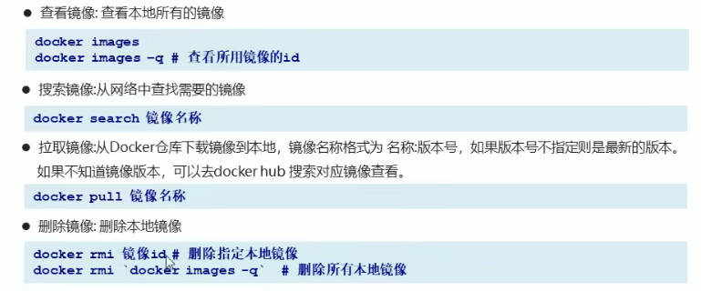
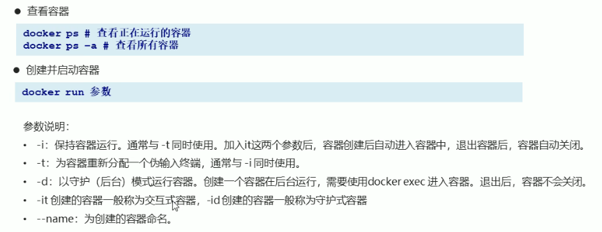
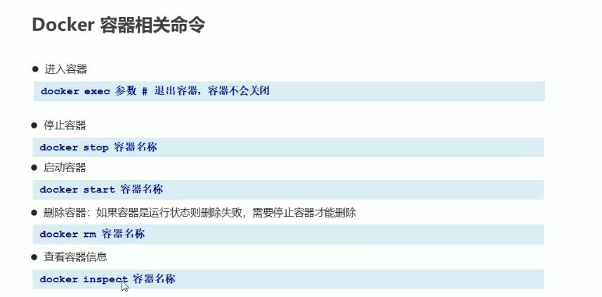
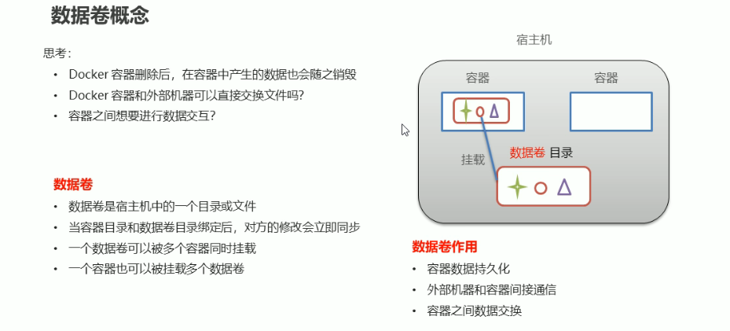
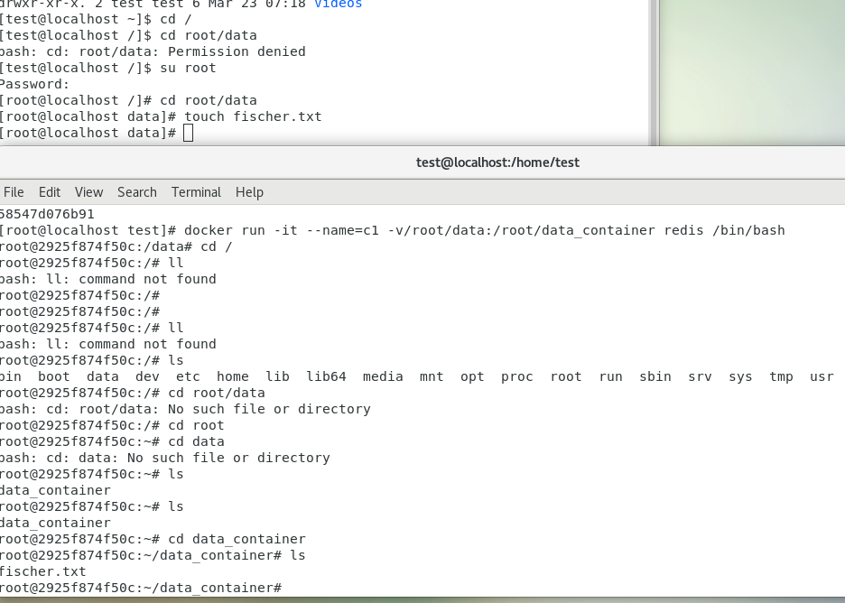
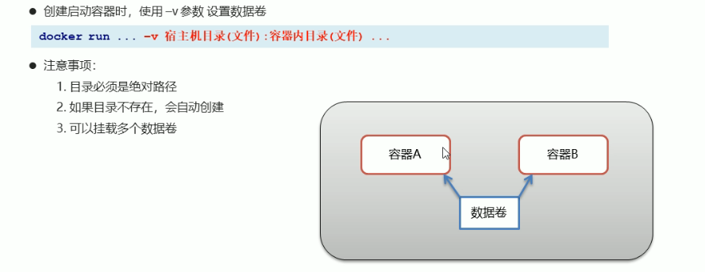
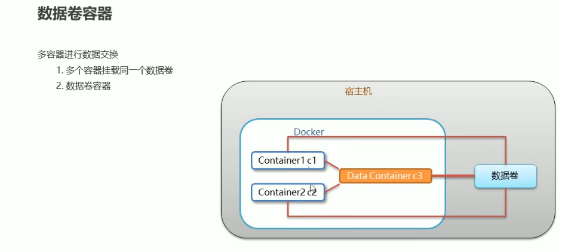
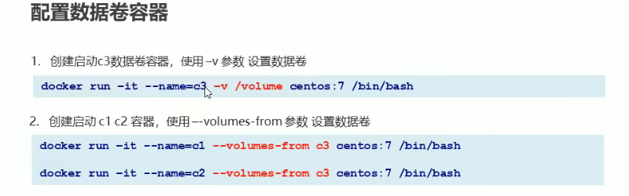
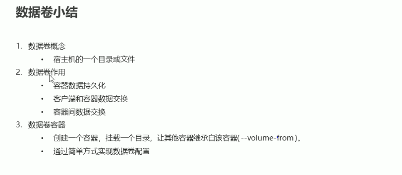
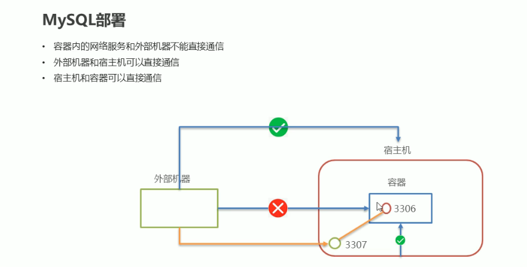

# docker

## 基础命令

[Docker 命令大全 | 菜鸟教程 (runoob.com)](https://www.runoob.com/docker/docker-command-manual.html)

- 启动docker

  ```shell
  systemctl start docker
  ```

- 自启docker

  ```she
  systemctl enable docker
  ```

- 停止docker

  ```shell
  systemctl stop docker
  ```

- 查看docker服务状态

  ```shell
  systemctl status docker
  ```

## 镜像相关命令

- 

## 容器相关命令





## 数据卷



```shell
docker run -it --name=c1 -v/root/data:/root/data_container redis /bin/bash


docker run -d -p 8010:8010 -p 8085:8085 --link mysql:mysql --link redis:redis [imageId] --name pm
```

- -v指定挂在到宿主机的什么目录以及容器中的什么目录

在宿主机中data进行的操作会同步到容器当中，反之也一样





## 数据卷容器







## Docker应用部署

### mysql

