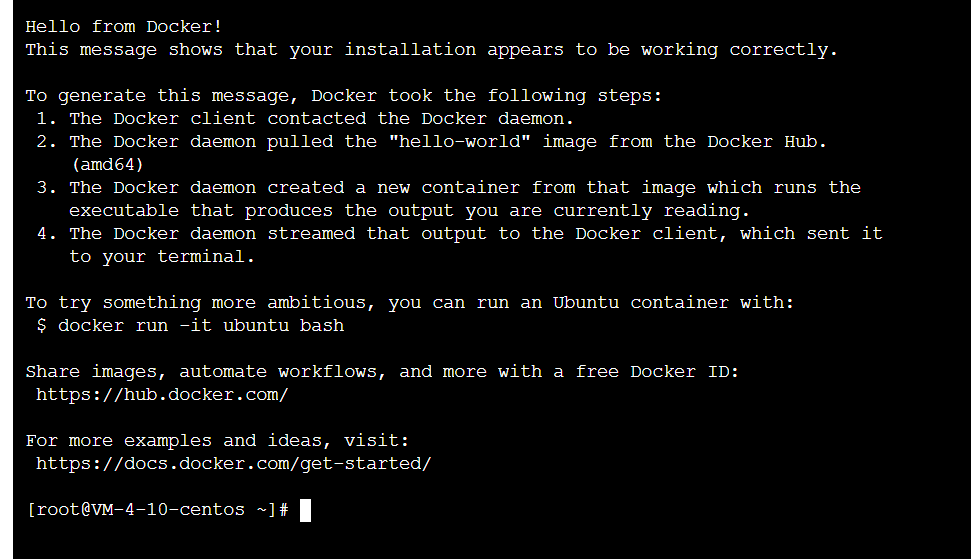
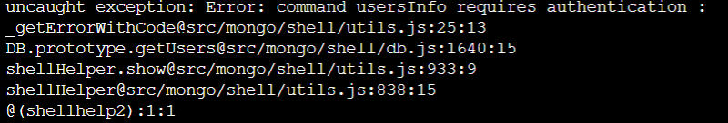
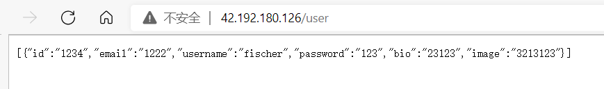

# docker部署springboot+mysql+Nosql

最近将自己的后端项目部署到云服务器上，因此整理了从安装docker到项目部署的全过程，仅供参考

**docker命令：**

[Docker 命令大全 | 菜鸟教程 (runoob.com)](https://www.runoob.com/docker/docker-command-manual.html)

## docker的下载与安装

安装的具体过程主要参考官方即可，此处我选的是centos版本

[Install Docker Engine on CentOS | Docker Documentation](https://docs.docker.com/engine/install/centos/)

具体安装步骤如下：

- 移除旧版本的内容，如果没安装此步跳过也可

  ```shell
   sudo yum remove docker \
                    docker-client \
                    docker-client-latest \
                    docker-common \
                    docker-latest \
                    docker-latest-logrotate \
                    docker-logrotate \
                    docker-engine

- gcc相关配置：

  ```shell
  yum -y install gcc
  ```

  ```shell
  yum -y install gcc-c++
  ```

- 安装`yum-utils`以及稳定的仓库，由于官网给出的仓库连接较慢，因此我们此处使用阿里云的镜像

  ```shell
   sudo yum install -y yum-utils
   sudo yum-config-manager \
      --add-repo \
      http://mirrors.aliyun.com/docker-ce/linux/centos/docker-ce.repo
  ```

- 安装docker

  ```shell
  sudo yum install docker-ce docker-ce-cli containerd.io
  ```

- 启动docker

  ```shell
  sudo systemctl start docker
  ```

- 测试docker

  ```shell
  sudo docker run hello-world
  ```

  由于本地不存在hello world的镜像资源，因此会自动去仓库拉取，当能够看到hello world正常运行时，证明docker已经成功安装



## Docker应用部署 

### mysql

1. 搜索mysql镜像

```shell
docker search mysql
```

2. 拉取mysql镜像

```shell
docker pull mysql:5.6
```

3. 创建容器，设置端口映射、目录映射

```shell
# 在/root目录下创建mysql目录用于存储mysql数据信息
mkdir ~/mysql
cd ~/mysql
```

```shell
docker run -id \
-p 3307:3306 \
--name=c_mysql \
-v $PWD/conf:/etc/mysql/conf.d \
-v $PWD/logs:/logs \
-v $PWD/data:/var/lib/mysql \
-e MYSQL_ROOT_PASSWORD=123456 \
mysql5.7_utf8mb4

```

- 参数说明：
  - **-p 3307:3306**：将容器的 3306 端口映射到宿主机的 3307 端口。
  - **-v $PWD/conf:/etc/mysql/conf.d**：将主机当前目录下的 conf/my.cnf 挂载到容器的 /etc/mysql/my.cnf。配置目录
  - **-v $PWD/logs:/logs**：将主机当前目录下的 logs 目录挂载到容器的 /logs。日志目录
  - **-v $PWD/data:/var/lib/mysql** ：将主机当前目录下的data目录挂载到容器的 /var/lib/mysql 。数据目录
  - **-e MYSQL_ROOT_PASSWORD=123456：**初始化 root 用户的密码。


4. 进入容器，操作mysql

```shell
docker exec –it c_mysql /bin/bash
```

5. 使用外部机器连接容器中的mysql，此处使用的是navicat


此后边与操作本地的mysql无异

### redis

1. 搜索redis镜像

```shell
docker search redis
```

2. 拉取redis镜像

```shell
docker pull redis:6.0.8
```

3. 配置redis.conf文件

   从redis官网找一个redis.conf文件

   - 设置密码

     ```
     requirepass 1234
     ```

   - 允许redis外地连接

     注释掉`#bind 127.0.0.1` 

   - daemonize no

     设置daemonize 为no，否则会和docker run -d冲突，导致容器启动失败

4. 创建容器，设置端口映射

```shell
docker run -p 6379:6379 --name c_redis --privileged=true -v /root/app/redis/redis.conf:/etc/redis/redis.conf -v /root/app/redis/data:/data -d redis:6.0.8 redis-server /etc/redis/redis.conf
```

- --privileged=true使container内的root拥有真正的root权限
- -v指定自己的redis配置文件映射到默认的redis.conf
- -v 设置数据卷，防止docker容器挂掉
- redis-server服务的启动去读取容器中已经被修改过的conf文件

5. 使用外部机器连接redis

```shell
redis-cli.exe -h 42.192.180.126 -p 6379
```

### Mongodb

**下拉镜像：**

```shell
docker pull mongodb:latest
```

**启动镜像：**

```
docker run -itd --name c_mongo -p 27017:27017 -v /mongodb/data/db:/data/db mongo:latest --auth
```

> -v：数据卷
>
> -p：端口映射
>
> --auth：授权参数

mongodb如果不进行密码的设置，此时便可以创建数据库进行连接了，但是这样所有人都可以连接你的数据库，

mongodb与mysql最大的不同是mongodb的每个数据库都有对应的用户，因此并不能像菜鸟教程上面那样只创建一个admin用户就与其进行连接，正确的做法是先创建admin用户和root用户，一个用于管理账户，一个用于管理数据库，最后在创建自己所用的数据库和管理该数据库的用户，再与该用户进行连接

==具体操作过程如下：==

**mongodb密码设置：**

1. 查看所有数据库(mongdb新版本没有admin数据库，但是不影响操作)

   ```
   show dbs
   ```

2. 进入admin数据库

   ```
   use admin
   ```

3. 创建管理员账户

   ```
   db.createUser({ user: "admin", pwd: "password", roles: [{ role: "userAdminAnyDatabase", db: "admin" }] })
   ```

4. mongodb中的用户是基于身份role的，该管理员账户的 role是 userAdminAnyDatabase。admin用户用于管理账号，不能进行关闭数据库等操作。

   ```
   db.createUser({user: "root",pwd: "password", roles: [ { role: "root", db: "admin" } ]})
   ```

   创建完admin管理员，创建一个超级管理员root。角色：root。root角色用于关闭数据库。

5. 创建用户自己的数据库的管理角色

   ```
   use yourdatabse
   ```

   ```
   db.createUser({user: "user",pwd: "password",roles: [ { role: "dbOwner", db: "yourdatabase" } ]})
   ```

   role: "dbOwner"代表数据库所有者角色，拥有最高该数据库最高权限。比如新建索引等当账号管理员和超级管理员，可以为自己的数据库创建用户了。（坑）这时候一定，一定要切换到所在数据库上去创建用户，不然创建的用户还是属于admin。

6. 查看用户

   ```
   show users
   ```

7. 删除用户

   删除用户必须有账号管理员来删，所有必须要切换到admin角色

   ```
   use admin
   db.auth("admin","password")
   ```

   删除单个用户

   ```
   db.system.users.remove({user:"XXXXXX"})
   ```

   删除所有用户

   ```
   db.system.users.remove({})
   ```

在操作的过程中，如果提示没有权限那么直接使用`db.auth("user","password")`授权一次即可



如果提示`logical sessions can't have multiple authenticated users`,mongodb不允许一次会话认证多个用户，不能重复认证的话那么重启一下shell即可，再次认证便可以认证成功

**之后便可以在springboot中配置进行连接**

```yaml
data:
    mongodb:
      uri: mongodb://username:password@ip:port/database
```

如果将用户名，密码等单独进行单独配置的话，mongodb会将其按照字符数组处理，因此纯数字的密码一定要加括号使用字符串的形式，

在navicat中连接同样需要指定用户名，密码，ip，端口，数据库


### ElasticSearch

**下拉镜像：**

```
docker pull elasticsearch:7.16.2
```

**环境准备：**

创建文件夹，用于挂载数据卷，实现数据持久化和配置文件

配置文件如下：

允许外网访问并且使其可以设置密码

```
cluster.name: "test_evescn"
network.host: 0.0.0.0
#xpack.security.enabled: true
http.cors.allow-headers: Authorization
xpack.security.enabled: true
xpack.security.transport.ssl.enabled: true
```

**启动镜像**

```
docker run -d --restart=always --user=root \
  --privileged=true \
  --name c_es \
  -p 9200:9200 \
  -p 9300:9300 \
  --ulimit nofile=65536:65536 \
  -v "/usr/local/sdyy/es7.16.2/elasticsearch.yml":/usr/share/elasticsearch/config/elasticsearch.yml \
  -v "/usr/local/sdyy/es7.16.2/data":/usr/share/elasticsearch/data \
  -v "/usr/local/sdyy/es7.16.2/logs":/usr/share/elasticsearch/logs \
  -v "/usr/local/sdyy/es7.16.2/plugins":/usr/share/elasticsearch/plugins \
  -e "discovery.type=single-node" \
  -e ES_JAVA_OPTS="-Xms256m -Xmx256m" \
  elasticsearch:7.16.2
```

> 分别把data，log和plugins挂载到宿主机上面，用于进行持久化和安装分词器插件
>
> 设置占用内存为256m
>
> 创建专有网络，单节点模式运行，不设置单节点或者集群则无法正常启动，报错为
>
> ```
> ERROR: Elasticsearch did not exit normally - check the logs at /usr/share/elasticsearch/logs/docker-cluster.log
> ```
>
> 端口映射

之后便可以正常访问，但是我仍无法启动，查看日志遇到了以下报错

```
max virtual memory areas vm.max_map_count [65530] is too low, increase to at least [262144]
```

系统虚拟内存默认最大映射数为65530，无法满足ES系统要求，需要调整为262144以上。

处理方法：

- 设置vm.max_map_count参数

```
#修改文件
sudo vim /etc/sysctl.conf
 
#添加参数
...
vm.max_map_count = 262144
```

- 重新加载/etc/sysctl.conf配置

```
sysctl -p
```

可能是修改配置的时候手滑，又遇到了以下问题，也是无语

```
IPv4 forwarding is disabled. Networking will not work.
```

再次修改配置：

修改/etc/sysctl.conf文件，添加如下内容：

```
net.ipv4.ip_forward=1
```

重新加载配置以及重启网络和docker

```
sysctl -p

systemctl restart network && systemctl restart docker
```

至此，elasticsearch终于启动起来了，可以对其9200端口进行访问（别忘了防火墙放行）

[](https://github.com/Fischer0522/note/blob/master/零碎知识点/Docker/docker部署springboot%2Bmysql%2Bnosql/docker部署springboot+mysql+redis.assets/1623101-20211007213733061-461079555.png)

**密码设置：**

为了安全显然不能使其在互联网上裸奔，因此需要进行密码设置，由于我们已经在es的配置文件中开启了设置密码的权限`xpack.security.enabled: true`，此处可以直接进行密码设置

首先进入到容器当中

```
docker exec -it c_es /bin/bash
```

启用密码

```
elasticsearch-setup-passwords interactive
```

然后再去手动输入6个密码，至此密码设置已经完成

此时在进行访问，使用浏览器则会提示进行安全认证，如果使用api调试工具则需设置auth

[](https://github.com/Fischer0522/note/blob/master/零碎知识点/Docker/docker部署springboot%2Bmysql%2Bnosql/docker部署springboot+mysql+redis.assets/image-20220410024231381.png)

用户名默认为elastic，密码则为自己设置的密码（暂时还没弄清楚为6个密码中的的哪一个）

**下载ik分词器**

直接在GitHub上面下载即可，下载好后解压的ik的文件夹中，上传到挂载数据卷的宿主机目录即可

重启docker，至此使用docker配置es的全过程已经结束，此时的es可以正常范围跟，可以配合springboot等正常使用

### nginx

1. 准备工作

   （1）确保已安装docker和nginx

   （2）签名文件

   （3）域名

2. 创建nginx映射文件、目录


```cpp
mkdir /root/docker-nginx

//存放nginx配置文件
mkdir /root/docker-nginx/conf.d

//存放nginx日志（方便查错）
mkdir /root/docker-nginx/logs

//存放签名文件
mkdir /root/docker-nginx/ssl

//项目
mkdir /root/docker-nginx/www
```

1. 在/root/docker-nginx/www 目录下创建个index.html文件，方便查看结果


```bash
cd /root/docker-nginx/www
vim index.html
```

index.html 页面内容如下


```xml
<!DOCTYPE html>
<html lang="en">
<head>
    <meta charset="UTF-8">
    <title>title</title>
</head>
<body>
<h1>恭喜你，配置成功！</h1>
</body>
</html>
```

1. 在/root/docker-nginx/ssl目录下存放你的签名证书
2. 在/root/docker-nginx下创建nginx默认配置文件


```bash
cd  /root/docker-nginx
vim nginx.conf
```

下面是nginx提供的默认配置


```ruby
user www-data;
worker_processes auto;
pid /run/nginx.pid;
include /etc/nginx/modules-enabled/*.conf;

events {
    worker_connections 768;
    # multi_accept on;
}

http {

    ##
    # Basic Settings
    ##

    sendfile on;
    tcp_nopush on;
    tcp_nodelay on;
    keepalive_timeout 65;
    types_hash_max_size 2048;
    # server_tokens off;

    # server_names_hash_bucket_size 64;
    # server_name_in_redirect off;

    include /etc/nginx/mime.types;
    default_type application/octet-stream;

    ##
    # SSL Settings
    ##

    ssl_protocols TLSv1 TLSv1.1 TLSv1.2; # Dropping SSLv3, ref: POODLE
    ssl_prefer_server_ciphers on;

    ##
    # Logging Settings
    ##

    access_log /var/log/nginx/access.log;
    error_log /var/log/nginx/error.log;

    ##
    # Gzip Settings
    ##

    gzip on;
    gzip_disable "msie6";

    # gzip_vary on;
    # gzip_proxied any;
    # gzip_comp_level 6;
    # gzip_buffers 16 8k;
    # gzip_http_version 1.1;
    # gzip_types text/plain text/css application/json application/javascript text/xml application/xml application/xml+rss text/javascript;

    ##
    # Virtual Host Configs
    ##

    include /etc/nginx/conf.d/*.conf;
    include /etc/nginx/sites-enabled/*;
}


#mail {
#   # See sample authentication script at:
#   # http://wiki.nginx.org/ImapAuthenticateWithApachePhpScript
# 
#   # auth_http localhost/auth.php;
#   # pop3_capabilities "TOP" "USER";
#   # imap_capabilities "IMAP4rev1" "UIDPLUS";
# 
#   server {
#       listen     localhost:110;
#       protocol   pop3;
#       proxy      on;
#   }
# 
#   server {
#       listen     localhost:143;
#       protocol   imap;
#       proxy      on;
#   }
#}
```

上面配置include /etc/nginx/conf.d/*.conf;这行可知，文件会包含conf.d目录下的所有.conf后缀的配置文件，所以我们只需要在conf.d目录下创建自己的配置文件即可。

1. 在 /root/docker-nginx/conf.d 目录下创建default.conf配置文件


```bash
cd /root/docker-nginx/conf.d
vim default.conf
```

内容如下


```bash
server {
    listen       80;
    server_name  你的域名;
    #转发到http
    rewrite ^(.*)$ https://$host$1 permanent;
}
server {
    listen 443 ssl;
    server_name  你的域名;
    root   /usr/share/nginx/html;
    index  index.html index.htm;
    ssl_certificate   /root/ssl/你的证书.pem;
    ssl_certificate_key  /root/ssl/你的证书.key;
    ssl_session_timeout 5m;
    ssl_ciphers ECDHE-RSA-AES128-GCM-SHA256:ECDHE:ECDH:AES:HIGH:!NULL:!aNULL:!MD5:!ADH:!RC4;
    ssl_protocols TLSv1 TLSv1.1 TLSv1.2;
    ssl_prefer_server_ciphers on;
}
```

1. 启动nginx容器


```jsx
docker run -d \
-p 80:80 -p 443:443\
-v /root/docker-nginx/conf.d:/etc/nginx/conf.d:ro \
-v /root/docker-nginx/nginx.conf:/etc/nginx/nginx.conf \
-v /root/docker-nginx/logs:/var/log/nginx \
-v /root/docker-nginx/www:/usr/share/nginx/html \
-v /root/docker-nginx/ssl:/root/ssl \
--name nginx \
nginx:latest 
```

==特别注意：这里需要把443端口也映射出去==

写在最后：
 以上只说明了nginx的一些相关配置。还有些其他配置需要注意，比如linux开发端口。如果是阿里云服务器，还需要在安全组开放端口


作者：efe7aae46f66
链接：https://www.jianshu.com/p/97dcf0d4270b
来源：简书
著作权归作者所有。商业转载请联系作者获得授权，非商业转载请注明出处。


## 项目部署

### demo

首先编写一个小demo用于测试

- 依赖

  ```xml
  <dependencies>
          <dependency>
              <groupId>org.springframework.boot</groupId>
              <artifactId>spring-boot-starter-web</artifactId>
          </dependency>
  
          <dependency>
              <groupId>org.projectlombok</groupId>
              <artifactId>lombok</artifactId>
              <optional>true</optional>
          </dependency>
          <dependency>
              <groupId>org.springframework.boot</groupId>
              <artifactId>spring-boot-starter-test</artifactId>
              <scope>test</scope>
          </dependency>
          <!-- https://mvnrepository.com/artifact/com.baomidou/mybatis-plus-boot-starter -->
          <dependency>
              <groupId>com.baomidou</groupId>
              <artifactId>mybatis-plus-boot-starter</artifactId>
              <version>3.5.1</version>
          </dependency>
          <dependency>
              <groupId>org.apache.commons</groupId>
              <artifactId>commons-pool2</artifactId>
          </dependency>
          <dependency>
              <groupId>com.alibaba</groupId>
              <artifactId>druid</artifactId>
              <version>1.2.8</version>
          </dependency>
          <dependency>
              <groupId>mysql</groupId>
              <artifactId>mysql-connector-java</artifactId>
              <scope>runtime</scope>
          </dependency>
          <dependency>
              <groupId>org.springframework.boot</groupId>
              <artifactId>spring-boot-starter-data-redis</artifactId>
          </dependency>
  
  
      </dependencies>
  
  ```

- pojo:

  ```java
  @AllArgsConstructor
  @NoArgsConstructor
  @Data
  @TableName(value = "users")
  public class User {
      private String id;
      private String email;
      private String username;
      private String password;
      private String bio;
      private String image;
  }
  
  ```

- 供mybatis-plus用于查询的UserDao

  ```java
  @Mapper
  public interface UserDao extends BaseMapper<User> {
  }
  
  ```

- controller:

  分别对mysql和redis进行测试，做一个简单的查询：

  ```java
  @RestController
  public class UserApi {
  
      @Autowired
      UserDao userDao;
      @Autowired
      StringRedisTemplate redisTemplate;
  
      @GetMapping("user")
      public ResponseEntity getUser(){
          List<User> users = userDao.selectList(null);
          return ResponseEntity.ok(users);
      }
  
      @GetMapping("name")
      public ResponseEntity getname(){
          String s = redisTemplate.opsForValue().get("name");
          return ResponseEntity.ok(s);
  
      }
  }
  
  ```

### 打包

在本地测试正常后，使用maven进行打包，同时编写dockerfile用于生成镜像资源：

==注：不要忘记将配置文件中的localhost换成部署的服务器的ip==

- 打包：看到build success即可，在target目录中会生成一个jar包


- dockerfile

```do
FROM java:8
COPY *.jar /app.jar

CMD ["--server.port=8080"]

#定义时区参数
ENV TZ=Asia/Shanghai

#设置时区
RUN ln -snf /usr/share/zoneinfo/$TZ /etc/localtime && echo '$TZ' > /etc/timezone

EXPOSE 8080

ENTRYPOINT ["java","-jar","/app.jar"]

```

- 依托于父镜像java8，可提前使用docker pull进行下载，不提前下载也会自动下载
- 将同目录下所有的jar包用于构建镜像
- docker默认使用的为UTC时区，会和本地差8小时，并且由于docker的隔离性，单独对宿主机设置时间并无效果，因此需要在dockerFile中设置相应的时区
- 暴露8080端口用于访问
- 运行java -jar

### 部署

将jar包与dockerfile上传到服务器的同一个目录下，运行：

```shell
docker bulid -t demo .
```

demo为名字

最后一定要加上`.`


此时便可以看到镜像已经制作成功


运行：

```
docker run -d -p 9000:8080 -v /root/blog/static/img:/root/blog/static/img --link c_mysql --link c_redis --link c_mongo --name blogdemo1 blogdemo1 
```

- -p指定端口映射
- --link使该容器与redis和mysql相连
- -v 挂载数据卷，将上传的图片保存到宿主机当中

运行该容器并且与mysql和redis容器通过`--link`命令进行互联，至此，容器已经可以成功运行




redis与mysql均可以正常运行

