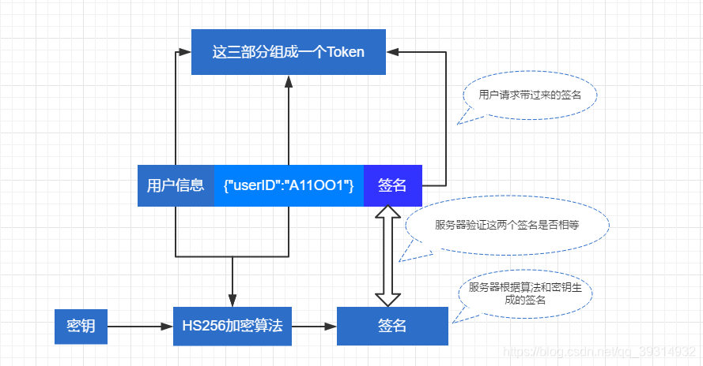

# Token&JWT

## 传统身份验证的方法

通过cookie和Session进行身份验证：

1、HTTP是一种没有状态的协议，也就是它并不知道是谁是访问应用
    ⑴客户端使用用户名还有密码通过了身份验证，不过下回这个客户端再发送请求时候，还得再验证一下用户名密码，这样就显得很麻烦
    
2、解决的方法就是，当用户请求登录的时候，如果没有问题，我们在服务端生成一条记录，这个记录里可以说明一下登录的用户是谁，然后把这条记录的ID号发送给客户端
    ⑴客户端收到以后把这个ID号存储在Cookie里，下次这个用户再向服务端发送请求的时候，可以带着这个Cookie，这样服务端会验证一个这个Cookie里的信息，看看能不能在服务端这里找到对应的记录
    ⑵如果可以，说明用户已经通过了身份验证，就把用户请求的数据返回给客户端

3、上面说的就是Session，我们需要在服务端存储为登录的用户生成的Session，这些Session可能会存储在内存，磁盘，或者数据库里。我们可能需要在服务端定期的去清理过期的Session

## Token

1、用户第一次登录，服务器通过数据库校验其UserId和Password合法，则再根据随机数字+userid+当前时间戳再经过DES加密生成一个token串
    ⑴当然具体生成token的方式是开发自己定义的
    
2、token的生成一般是采用uuid保证唯一性，当用户登录时为其生成唯一的token，存储一般保存在数据库中
    ⑴token过期时间采用把token二次保存在cookie或session里面，根据cookie和session的过期时间去维护token的过期时间

3、Token是在服务端产生的。如果前端使用用户名/密码向服务端请求认证，服务端认证成功，那么在服务端会返回Token给前端。前端可以在每次请求的时候带上Token证明自己的合法地位

4、Token，就是令牌，最大的特点就是随机性，不可预测。一般黑客或软件无法猜测出来

### Token的身份验证方法

1、使用基于Token的身份验证方法，在服务端不需要存储用户的登录记录(只保留用户签名过程中的加密算法和密钥即可)

2、大概的流程是这样的：
1)客户端使用用户名和密码请求登录
2)服务端收到请求，验证用户名和密码
3)验证成功后，服务端会签发一个token，再把这个token返回给客户端
4)客户端收到token后可以把它存储起来，比如放到cookie中
5)客户端每次向服务端请求资源时需要携带服务端签发的token，可以在cookie或者header中携带
6)服务端收到请求，然后去验证客户端请求里面带着的token，如果验证成功，就向客户端返回请求数据
3、请求参数中带token
    ⑴用户在调用需要登录操作的接口时，无需传递userid和password即可完成操作(因为token代表登录成功)
    ⑵服务器控制过期时间，假如一个极端情况，服务器端的token规则泄露，则可以控制用户可以重新登录，获取新的token

4、当然，token也是可以保存在专门一张数据库表中的
    ⑴将用户名、用户生成的token信息等放到一张表中
    ⑵用户每次请求时，从前端获取token，然后去表中进行查询
        ①如果未查询到，那么说明校验失败
        ②如果查询到，说明校验通过：通过token来获取用户名(用户信息)
    ⑶总的来说就是不同的设计人员可能有不同的实现方式，总的来说还是差不多的


## Json Web Token

### 实现流程

`JWT`就是上述流程当中`token`的一种具体实现方式

通俗地说，**JWT的本质就是一个字符串**，它是将用户信息保存到一个Json字符串中，然后进行编码后得到一个`JWT token`，**并且这个`JWT token`带有签名信息，接收后可以校验是否被篡改**，所以可以用于在各方之间安全地将信息作为Json对象传输。JWT的认证流程如下：

1. 首先，前端通过Web表单将自己的用户名和密码发送到后端的接口，这个过程一般是一个`POST`请求。建议的方式是通过SSL加密的传输(HTTPS)，从而避免敏感信息被嗅探
2. 后端核对用户名和密码成功后，**将包含用户信息的数据作为JWT的Payload，将其与JWT Header分别进行Base64编码拼接后签名**，形成一个`JWT Token`，形成的`JWT Token`就是一个如同`lll.zzz.xxx`的字符串
3. 后端将`JWT Token`字符串作为登录成功的结果返回给前端。前端可以将返回的结果保存在浏览器中，退出登录时删除保存的`JWT Token`即可
4. **前端在每次请求时将`JWT Token`放入HTTP请求头中的`Authorization`属性中**(解决XSS和XSRF问题)
5. 后端检查前端传过来的`JWT Token`，验证其有效性，比如检查签名是否正确、是否过期、token的接收方是否是自己等等
6. 验证通过后，后端解析出`JWT Token`中包含的用户信息，进行其他逻辑操作(一般是根据用户信息得到权限等)，返回结果


### 优势

- 简洁：`JWT Token`数据量小，传输速度也很快
- 因为JWT Token是以JSON加密形式保存在客户端的，所以JWT是**跨语言**的，原则上任何web形式都支持
- 不需要在服务端保存会话信息，也就是说**不依赖于cookie和session，所以没有了传统session认证的弊端，特别适用于分布式微服务**

### JWT结构

JWT由3部分组成：标头(Header)、有效载荷(Payload)和签名(Signature)。在传输的时候，会将JWT的3部分分别进行Base64编码后用`.`进行连接形成最终传输的字符串
$$
JWTString = Base64(Header).Base64(Payload).HMACSHA256(base64UrlEncode(header) + “.” + base64UrlEncode(payload), secret)
$$


#### Header

**JWT头**是一个描述JWT元数据的JSON对象，alg属性表示签名使用的算法，默认为HMAC SHA256（写为HS256）；typ属性表示令牌的类型，JWT令牌统一写为JWT。最后，使用Base64 URL算法将上述JSON对象转换为字符串保存

```
{
  "alg": "HS256",
  "typ": "JWT"
}
```


#### Payload

**有效载荷**部分，是JWT的主体内容部分，也是一个**JSON对象**，包含需要传递的数据。 JWT指定七个默认字段供选择

```
iss：发行人
exp：到期时间
sub：主题
aud：用户
nbf：在此之前不可用
iat：发布时间
jti：JWT ID用于标识该JWT

```

#### Signature

**签名哈希**部分是对上面两部分数据签名，需要使用base64编码后的header和payload数据，通过指定的算法生成哈希，以**确保数据不会被篡改**。首先，需要指定一个密钥（secret）。该密码仅仅为保存在服务器中，并且不能向用户公开。然后，使用header中指定的签名算法（默认情况下为HMAC SHA256）根据以下公式生成签名
$$
HMACSHA256(base64UrlEncode(header) + “.” + base64UrlEncode(payload), secret)
$$
在计算出签名哈希后，JWT头，有效载荷和签名哈希的三个部分组合成一个字符串，每个部分用`.`分隔，就构成整个JWT对象


### JWT的种类

其实JWT(JSON Web Token)指的是一种规范，这种规范允许我们使用JWT在两个组织之间传递安全可靠的信息，JWT的具体实现可以分为以下几种：

- `nonsecure JWT`：未经过签名，不安全的JWT
- `JWS`：经过签名的JWT
- `JWE`：`payload`部分经过加密的JWT


---

参考：[JWT详解 | 包包的Tech Pool (baobao555.tech)](https://www.baobao555.tech/posts/4cc42459/)

