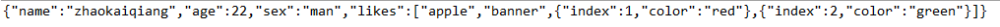
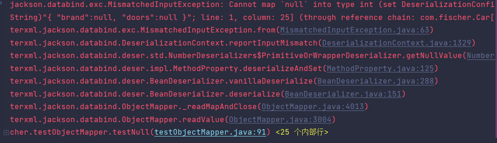
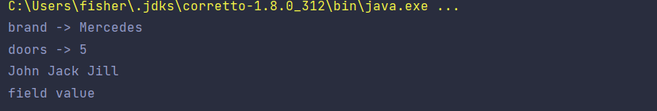

# Jackson

## 简介

**依赖**

- jackson-core
- jackson- annotations
- jackson-databind

其中 jackson-databind 内部依赖了 jackson-annotations 与 jackson-core，所以 Maven 应用时，只要导入 databind 一个，则同时也导入了 annotations 与 core 依赖。

**核心模块**

Streaming（jackson-core）：低阶API库，提供流式解析工具JsonParser，流式生成工具JsonGenerator；
Annotations（jackson-annotations）：jackson注解；
Databind (jackson-databind)：基于java对象的序列化、反序列化能力，需要前面两个模块的支持才能实现；

## Jackson常用的类

- JsonFactory：这个类是Jackson主要的工厂方法，主要用于配置和构建解析器(JsonParser)和生成器(如JsonGenerator)，这个工厂实例是线程安全的，如果有配置的话，可以重复使用。
- JsonGenerator：这个类主要是用来生成Json格式的内容的，我们可以使用JsonFactory 的方法生成一个实例。
- JsonParser：这个主要是用来读取Json格式的内容，并且完成解析操作的，我们可以使用JsonFactory的方法生成一个实例。
- ObjectMapper：这个类提供了Java对象和Json之间的转化，主要通过JsonParser和JsonGenerator实例来完成实际的对Json数据的读写操作。

## Jackson-core

1. jackson-core为一个低阶API库，提供流式解析工具JsonParser，流式生成工具JsonGenerator

2. 在日常的序列化和反序列化处理中，最常用的是jackson-annotations和jackson-databind，而jackson-core由于它提供的API过于基础，我们大多数情况下是用不上的；
3. 尽管jackson-databind负责序列化和反序列化处理，但它的底层实现是调用了jackson-core的API；

JsonGenerator是定义公共API编写的Json内容的基类，使用JsonFactory实例的工厂方法创建实例。

JsonGenerator的使用案例如下所示：

```java
package test;

import java.io.ByteArrayOutputStream;
import java.io.IOException;
import java.io.PrintWriter;
import org.codehaus.jackson.JsonGenerationException;
import org.codehaus.jackson.JsonGenerator;
import org.codehaus.jackson.map.ObjectMapper;

public class JsonGeneratorTest {
	
	public static void main(String[] args) throws JsonGenerationException, IOException {
		String ret = "";
		ByteArrayOutputStream bos = new ByteArrayOutputStream();
		
		ObjectMapper mapper = new ObjectMapper();
		JsonGenerator jg = mapper.getJsonFactory().createJsonGenerator(new PrintWriter(bos));
		
		jg.writeStartObject();
		
		jg.writeStringField("name", "zhaokaiqiang");
		jg.writeNumberField("age", 22);
		jg.writeObjectField("sex", "man");
		jg.writeArrayFieldStart("likes");
			jg.writeString("apple");
			jg.writeString("banner");
			jg.writeStartObject();
				jg.writeNumberField("index",1);
				jg.writeStringField("color","red");
			jg.writeEndObject();
			jg.writeStartObject();
				jg.writeNumberField("index",2);
				jg.writeStringField("color","green");
			jg.writeEndObject();
		jg.writeEndArray();
		
		jg.writeEndObject();
		
		jg.flush();
		jg.close();
		
		ret = bos.toString();
		bos.close();
		System.out.println(ret);

	}

}

```



## ObjectMapper

### 一)、从JSON中获取Java对象

#### 1.简单示例：

从Json字符串中解析数据并封装到实体类当中

readValue绑定实体类和json字符串，用于进行读取解析封装，返回一个实体类

```java
public class Car {
    private String brand = null;
    private int doors = 0;

    public String getBrand() { return this.brand; }
    public void   setBrand(String brand){ this.brand = brand;}

    public int  getDoors() { return this.doors; }
    public void setDoors (int doors) { this.doors = doors; }

}

```

```java
public class testObjectMapper {


    @Test
    public void test1(){
        ObjectMapper objectMapper= new ObjectMapper();
        String carJson="{ \"brand\" : \"Mercedes\", \"doors\" : 5 }";

        Car car;

        {
            try {
                car = objectMapper.readValue(carJson,Car.class);
                System.out.println("car brand"+ car.getBrand());
                System.out.println("car doors"+ car.getDoors());
            } catch (IOException e) {
                e.printStackTrace();
            }
        }

    }
```

```json
{
    "brand":"Mercedes",
    "doors":"5"
}
```

#### 2.ObjectMapper如何匹配JSON对象的字段和Java对象的属性

默认情况下，Jackson通过将JSON字段的名称与Java对象中的getter和setter方法进行匹配，将JSON对象的字段映射到Java对象中的属性。 Jackson删除了getter和setter方法名称的“ get”和“ set”部分，并将其余名称的第一个字符转换为小写。

#### 3.Json字符串->Java对象

从JSON字符串读取Java对象非常容易。 上面已经有了一个示例——JSON字符串作为第一个参数传递给ObjectMapper的readValue()方法。 这是另一个简单的示例：

```java
ObjectMapper objectMapper = new ObjectMapper();

String carJson =
    "{ \"brand\" : \"Mercedes\", \"doors\" : 5 }";

Car car = objectMapper.readValue(carJson, Car.class);

```

#### 3.Json字符输入流->Java对象

通过Reader实例加载的JSON中读取对象

```java
ObjectMapper objectMapper = new ObjectMapper();

String carJson =
        "{ \"brand\" : \"Mercedes\", \"doors\" : 4 }";
Reader reader = new StringReader(carJson);

Car car = objectMapper.readValue(reader, Car.class);

```

#### 4.JSON文件->Java对象

从文件读取JSON当然可以通过FileReader（而不是StringReader）来完成，也可以通过File对象来完成。

```java
@Test
    public void testFile(){
        ObjectMapper objectMapper=new ObjectMapper();
        File file=new File("D:\\learn_software\\program_file\\IDEAProgject\\jackson\\src\\main\\java\\com\\fischer\\data\\car.json");
        try {
            Car car = objectMapper.readValue(file, Car.class);
            System.out.println(car);

        } catch (IOException e) {
            e.printStackTrace();
        }
    }
```

``` java
Car{brand='Mercedes', doors=5}//输出结果
```

#### 5.JSON via URL -> Java对象

```java
ObjectMapper objectMapper = new ObjectMapper();

URL url = new URL("file:data/car.json");

Car car = objectMapper.readValue(url, Car.class);

```

示例使用文件URL，也可以使用HTTP URL（类似于http://jenkov.com/some-data.json）。

#### 6.JSON数组字符串->Java对象数组

Jackson ObjectMapper也可以从JSON数组字符串读取对象数组。 这是从JSON数组字符串读取对象数组的示例：

- 注意readValue中指定为数组类型的Car[]

```java
 @Test
    public void testArray(){
        String jsonArray = "[{\"brand\":\"ford\"}, {\"brand\":\"Fiat\"}]";
        ObjectMapper objectMapper=new ObjectMapper();
        try {
            for (Car car : objectMapper.readValue(jsonArray, Car[].class)) {
                System.out.println(car);
            }
        } catch (IOException e) {
            e.printStackTrace();
        }

    }
```

#### 7.JSON数组字符串->List

- TypeReference用于在反序列化时，将数据封装成泛型对象

  - 泛型中指定要封装成的对象，如TypeReference\<List\<Car>>,或TypeReference\<Car>

  - 不使用TperReference：

    ```java
     String jsonArray = "[{\"brand\":\"ford\"}, {\"brand\":\"Fiat\"}]";
            ObjectMapper objectMapper=new ObjectMapper(); 
    List list = objectMapper.readValue(jsonArray, List.class);
    ```

    ```json
    {brand='ford', doors=0},{brand='Fiat', doors=0}
    ```

  - 使用TypeReference(具体代码如下)

    ```json
    Car{brand='ford', doors=0},Car{brand='Fiat', doors=0}
    ```

```java
@Test
    public void testList(){
        String jsonArray = "[{\"brand\":\"ford\"}, {\"brand\":\"Fiat\"}]";
        ObjectMapper objectMapper=new ObjectMapper();
        try {
            for (Object o : (List) objectMapper.readValue(jsonArray, new TypeReference<List<Car>>() {
            })) {
                System.out.println(o);
            }
        } catch (IOException e) {
            e.printStackTrace();
        }
    }
```

#### 8.JSON字符串->Map

与List同理，借助TypeReference

```java
String jsonObject = "{\"brand\":\"ford\", \"doors\":5}";

ObjectMapper objectMapper = new ObjectMapper();
Map<String, Object> jsonMap = objectMapper.readValue(jsonObject,
    new TypeReference<Map<String,Object>>(){});

```

#### 9.忽略未知JSON字段

有时候，与要从JSON读取的Java对象相比，JSON中的字段更多。 默认情况下，Jackson在这种情况下会抛出异常，报不知道XYZ字段异常，因为在Java对象中找不到该字段。

但是，有时应该允许JSON中的字段多于相应的Java对象中的字段。 例如，要从REST服务解析JSON，而该REST服务包含的数据远远超出所需的。 在这种情况下，可以使用Jackson配置忽略这些额外的字段。 以下是配置Jackson ObjectMapper忽略未知字段的示例：

```
objectMapper.configure(
    DeserializationFeature.FAIL_ON_UNKNOWN_PROPERTIES, false);
```

- 日后研究研究是否可以在springboot的配置文件中进行设置:

  - Springboot中DeserializationFeature.XXX对应的关键词为deserialization.XXX

  - 在Springboot当中，对应的操作为：

    ```yml
    jackson:
        deserialization.FAIL_ON_UNKNOWN_PROPERTIES: false
    ```

    

#### 10.不允许基本类型为null

如果JSON字符串包含其值设置为null的字段（对于在相应的Java对象中是基本数据类型（int，long，float，double等）的字段），Jackson ObjectMapper默认会处理基本数据类型为null的情况，如：`int类型会默认赋值为0，字符串类型则为null`我们可以可以将Jackson ObjectMapper默认配置为失效，这样基本数据为null就会转换失败

```java
objectMapper.configure(DeserializationFeature.FAIL_ON_NULL_FOR_PRIMITIVES, true);
```

```java
@Test
    public void testNull(){
     String json="{ \"brand\":null, \"doors\":null }";
     ObjectMapper objectMapper=new ObjectMapper();
        objectMapper.configure(DeserializationFeature.FAIL_ON_NULL_FOR_PRIMITIVES, true);
        try {
            Car car = objectMapper.readValue(json, Car.class);
            System.out.println(car);
        } catch (IOException e) {
            e.printStackTrace();
        }

    }
```

得到以下报错：



#### 11.自定义反序列化

==暂时不大懂，日后用到了进一步研究==

有时，可能希望以不同于Jackson ObjectMapper缺省方式的方式将JSON字符串读入Java对象。 可以将自定义反序列化器添加到ObjectMapper，可以按需要执行反序列化。

这是在Jackson的ObjectMapper中注册和使用自定义反序列化器的方式：

```java
  String json = "{ \"brand\" : \"Ford\", \"doors\" : 6 }";

  SimpleModule module =
          new SimpleModule("CarDeserializer", new Version(3, 1, 8, null, null, null));
  module.addDeserializer(Car.class, new CarDeserializer(Car.class));

  ObjectMapper mapper = new ObjectMapper();
  mapper.registerModule(module);

  Car car = mapper.readValue(json, Car.class);


```

自定义反序列化器CarDeserializer类

```java
public class CarDeserializer extends StdDeserializer<Car> {

    public CarDeserializer(Class<?> vc) {
        super(vc);
    }

    @Override
    public Car deserialize(JsonParser parser, DeserializationContext deserializer) throws IOException {
        Car car = new Car();
        while(!parser.isClosed()){
            JsonToken jsonToken = parser.nextToken();

            if(JsonToken.FIELD_NAME.equals(jsonToken)){
                String fieldName = parser.getCurrentName();
                System.out.println(fieldName);

                jsonToken = parser.nextToken();

                if("brand".equals(fieldName)){
                    car.setBrand(parser.getValueAsString());
                } else if ("doors".equals(fieldName)){
                    car.setDoors(parser.getValueAsInt());
                }
            }
        }
        return car;
    }
}

```

### 二)、将对象写入JSON

#### 1.Java对象->JSON

Jackson ObjectMapper也可以用于从对象生成JSON。 可以使用以下方法之一进行操作：

- writeValue()
- writeValueAsString()
- writeValueAsBytes()

通过Car生成JSON：

```java
@Test
    public void testWrite(){
        ObjectMapper objectMapper=new ObjectMapper();
        Car car=new Car();
        car.setBrand("Tesla");
        car.setDoors(4);
        try {
            objectMapper.writeValue(new FileOutputStream("output-2.json"),car);
        } catch (IOException e) {
            e.printStackTrace();
        }
```

调用ObjectMapper的writeValue()方法，该方法将Car对象转换为JSON并将其写入给定的FileOutputStream,最后写入一个文件当中

ObjectMapper的writeValueAsString()和writeValueAsBytes()都从一个对象生成JSON，并将生成的JSON作为String或字节数组返回。 示例如下：

```java
@Test
    public void testWriteString() {
        ObjectMapper objectMapper = new ObjectMapper();
        Car car = new Car();
        car.setBrand("Tesla");
        car.setDoors(4);
        try {
            String s = objectMapper.writeValueAsString(car);
            System.out.println(s);
        } catch (IOException e) {
            e.printStackTrace();
        }

    }
```

```json
{"brand":"Tesla","doors":4}
```

#### 2.自定义序列化

有时，想要将Java对象序列化为JSON的方式与使用Jackson的默认方式不同。 例如，可能想要在JSON中使用与Java对象中不同的字段名称，或者希望完全省略某些字段。

Jackson可以在ObjectMapper上设置自定义序列化器。 该序列化器已为某个类注册，然后在每次要求ObjectMapper序列化Car对象时将调用该序列化器。

这是为Car类注册自定义序列化器的示例：

```java
  CarSerializer carSerializer = new CarSerializer(Car.class);
  ObjectMapper objectMapper = new ObjectMapper();

  SimpleModule module =
          new SimpleModule("CarSerializer", new Version(2, 1, 3, null, null, null));
  module.addSerializer(Car.class, carSerializer);

  objectMapper.registerModule(module);

  Car car = new Car();
  car.setBrand("Mercedes");
  car.setDoors(5);

  String carJson = objectMapper.writeValueAsString(car);

```

自定义序列化器CarSerializer类：

```java
public class CarSerializer extends StdSerializer<Car> {

    protected CarSerializer(Class<Car> t) {
        super(t);
    }

    public void serialize(Car car, JsonGenerator jsonGenerator,
                          SerializerProvider serializerProvider)
            throws IOException {

        jsonGenerator.writeStartObject();
        jsonGenerator.writeStringField("producer", car.getBrand());
        jsonGenerator.writeNumberField("doorCount", car.getDoors());
        jsonGenerator.writeEndObject();
    }
}

```

### 三)、Jackson日期转化

默认情况下，Jackson会将java.util.Date对象序列化为其long型的值，该值是自1970年1月1日以来的毫秒数。但是，Jackson还支持将日期格式化为字符串。

默认的Jackson日期格式，该格式将Date序列化为自1970年1月1日以来的毫秒数（long类型）。

日期pojo：

```java
public class Transaction {
    private String type = null;
    private Date date = null;
}
```

```java
@Test
    public void testDate(){
        Transaction transaction=new Transaction("transfer",new Date());
        ObjectMapper objectMapper=new ObjectMapper();
        try {
            String s = objectMapper.writeValueAsString(transaction);
            System.out.println(s);
        } catch (JsonProcessingException e) {
            e.printStackTrace();
        }
    }
```

```json
{"type":"transfer","date":1646377981781}//结果
```

设置Jackson日期格式

```java
@Test
    public void testDate(){
        Transaction transaction=new Transaction("transfer",new Date());
        ObjectMapper objectMapper=new ObjectMapper();
        try {

            SimpleDateFormat dateFormat=new SimpleDateFormat("yyyy-MM-dd");
            objectMapper.setDateFormat(dateFormat);
            String s = objectMapper.writeValueAsString(transaction);
            System.out.println(s);
        } catch (JsonProcessingException e) {
            e.printStackTrace();
        }
    }
```

```json
{"type":"transfer","date":"2022-03-04"}
```

### 四)、Jackson JSON树模型

Jackson具有内置的树模型，可用于表示JSON对象。 

- 如果不知道接收到的JSON的格式，或者由于某种原因而不能（或者只是不想）创建一个类来表示它，那么就要用到Jackson的树模型。 
- 如果需要在使用或转化JSON之前对其进行操作，也需要被用到Jackson树模型。

#### 1.快速入门

在原本传入实体类.class的位置变为传入JsonNode.class，即可将json字符串解析为JsonNode对象

```java
@Test
    public void testquickStart(){
        String carJson =
                "{ \"brand\" : \"Mercedes\", \"doors\" : 5 }";
        ObjectMapper objectMapper=new ObjectMapper();

        try {
            JsonNode jsonNode = objectMapper.readValue(carJson, JsonNode.class);
            System.out.println(jsonNode.toString());
        } catch (IOException e) {
            e.printStackTrace();
        }

    }
```

ObjectMapper类还具有一个特殊的readTree()方法，该方法返回JsonNode。 这是使用ObjectMapper readTree()方法将JSON解析为JsonNode的示例：

```java
String carJson =
        "{ \"brand\" : \"Mercedes\", \"doors\" : 5 }";

ObjectMapper objectMapper = new ObjectMapper();

try {

    JsonNode jsonNode = objectMapper.readTree(carJson);

} catch (IOException e) {
    e.printStackTrace();
}

```

#### 2. Jackson JsonNode类

通过JsonNode类，可以以非常灵活和动态的方式将JSON作为Java对象导航。这里了解一些如何使用它的基础知识。

将JSON解析为JsonNode（或JsonNode实例树）后，就可以浏览JsonNode树模型：

- 解析JSON字段（String，int）
- 解析数组
- 解析嵌套类型

```json
{
    "brand":"Mercedes",
    "doors":5,
    "owners":["John","Jack","Jill"],
    "nestedObject":{"field":"value"}
}
```


```java
 @Test
    public void testJsonNode(){
        String carJson =
                "{ \"brand\" : \"Mercedes\", \"doors\" : 5," +
                        "  \"owners\" : [\"John\", \"Jack\", \"Jill\"]," +
                        "  \"nestedObject\" : { \"field\" : \"value\" } }";

        ObjectMapper objectMapper = new ObjectMapper();

        try {
            //字符串类型字段
            JsonNode jsonNode = objectMapper.readValue(carJson, JsonNode.class);
            JsonNode brandNode = jsonNode.get("brand");
            String s = brandNode.asText();
            System.out.println("brand -> "+s);
            //int类型字段
            JsonNode doors = jsonNode.get("doors");
            int i = doors.asInt();
            System.out.println("doors -> "+i);
            //数组类型
            JsonNode owners = jsonNode.get("owners");
            for (JsonNode owner : owners) {
                String text = owner.asText();
                System.out.print(text+" ");
            }
            System.out.println("");
            //嵌套类型
            JsonNode nestedObject = jsonNode.get("nestedObject");
            JsonNode field = nestedObject.get("field");
            String asText = field.asText();
            System.out.println("field "+ asText);


        } catch (IOException e) {
            e.printStackTrace();
        }

    }
```

解析结果：



#### 3.Java对象->JsonNode

```java
ObjectMapper objectMapper = new ObjectMapper();

Car car = new Car();
car.brand = "Cadillac";
car.doors = 4;

JsonNode carJsonNode = objectMapper.valueToTree(car);
```

#### 4.JsonNode-> Java对象

```java
##ObjectMapper objectMapper = new ObjectMapper();

String carJson = "{ \"brand\" : \"Mercedes\", \"doors\" : 5 }";

JsonNode carJsonNode = objectMapper.readTree(carJson);

Car car = objectMapper.treeToValue(carJsonNode);

```

## JsonNode

Jackson JsonNode类com.fasterxml.jackson.databind.JsonNode是Jackson的JSON树形模型（对象图模型）。 Jackson可以将JSON读取到JsonNode实例中，然后将JsonNode写入JSON。 因此，这一节将说明如何将JSON反序列化为JsonNode以及将JsonNode序列化为JSON

### 1.JsonNode vs ObjectNode

Jackson JsonNode类是不可变的。 这意味着，实际上不能直接构建JsonNode实例的对象图。 而是创建JsonNode子类ObjectNode的对象图。 作为JsonNode的子类，可以在可以使用JsonNode的任何地方使用ObjectNode。

==暂时还不大懂，以后用到再琢磨琢磨==

### 2、JSON-> JsonNode

要使用Jackson将JSON读取到JsonNode中，首先需要创建一个Jackson ObjectMapper实例。 在ObjectMapper实例上，调用readTree()并将JSON源作为参数传递。 这是将JSON反序列化为JsonNode的示例：

```java
@Test
    public void testJavaToJsonNode(){
        String json = "{ \"f1\" : \"v1\" } ";
        ObjectMapper objectMapper=new ObjectMapper();
        try {
            JsonNode jsonNode = objectMapper.readTree(json);
            System.out.println(jsonNode.toString());
        } catch (IOException e) {
            e.printStackTrace();
        }

    }
```

### 3. JsonNode->JSON

要将Jackson的JsonNode写入JSON，还需要一个Jackson ObjectMapper实例。 在ObjectMapper上，调用writeValueAsString()方法或任何适合需要的写入方法。 这是将JsonNode写入JSON的示例：

```java
@Test
    public void testJNToNSON(){
        String json = "{ \"f1\" : \"v1\" } ";
        ObjectMapper objectMapper = new ObjectMapper();
        try {
            JsonNode jsonNode = objectMapper.readTree(json);
            String s=objectMapper.writeValueAsString(jsonNode);
            System.out.println(s);
        } catch (IOException e) {
            e.printStackTrace();
        }
    }
```


### 4.获取字段

- 通过get给出字段名获取

  ```json
  {
      "field1" : "value1",
      "field2" : 999
  }
  ```

  

  ```java
  JsonNode jsonNode = ... //parse above JSON into a JsonNode
  
  JsonNode field1 = jsonNode.get("field1");
  JsonNode field2 = jsonNode.get("field2");
  
  
  ```

- 通过at在路径中获取

  ```json
  {
    "identification" :  {
          "name" : "James",
          "ssn: "ABC123552"
      }
  }
  ```

  ```java
  JsonNode nameNode = jsonNode.at("/identification/name");
  ```

  注意传递给at()方法的参数：字符串/ identification / name。 这是一个JSON路径表达式。 此路径表达式指定从根JsonNode到您要访问其值的字段的完整路径。 这类似于从文件系统根目录到Unix文件系统中文件的路径。

### 5.转换JsonNode字段

Jackson JsonNode类包含一组可以将字段值转换为另一种数据类型的方法。 例如，将String字段值转换为long或相反。 这是将JsonNode字段转换为一些更常见的数据类型的示例：

```java
String f2Str = jsonNode.get("f2").asText();
double f2Dbl = jsonNode.get("f2").asDouble();
int    f2Int = jsonNode.get("f2").asInt();
long   f2Lng = jsonNode.get("f2").asLong();
```

**使用默认值转换:** 如果JsonNode中的字段可以为null，则在尝试转换它时可以提供默认值。 这是使用默认值调用转换方法的示例：

```java
ObjectMapper objectMapper = new ObjectMapper();

String json = "{ \"f1\":\"Hello\", \"f2\":null }";

JsonNode jsonNode = objectMapper.readTree(json);

String f2Value = jsonNode.get("f2").asText("Default");

```

### 6. ObjectNode

如前所述，JsonNode类是不可变的。 要创建JsonNode对象图，必须能够更改图中的JsonNode实例，例如 设置属性值和子JsonNode实例等。由于是不可变的，因此无法直接使用JsonNode来实现。

- 创建ObjectNode

  而是创建一个ObjectNode实例，该实例是JsonNode的子类。 这是一个通过Jackson ObjectMapper createObjectNode()方法创建ObjectNode的示例：

  ```java
  ObjectMapper objectMapper = new ObjectMapper();
  
  ObjectNode objectNode = objectMapper.createObjectNode();
  
  ```

- Set ObjectNode字段

  要在Jackson ObjectNode上设置字段，可以调用其set()方法，并将字段名称String和JsonNode作为参数传递。 这是在Jackson的ObjectNode上设置字段的示例：

  ```java
    String json = "{ \"f1\" : \"v1\" } ";
          ObjectMapper objectMapper=new ObjectMapper();
          ObjectNode objectNode = objectMapper.createObjectNode();
          try {
              JsonNode jsonNode = objectMapper.readTree(json);
              JsonNode brand = objectNode.set("childNode", jsonNode);
              System.out.println(brand.toString());
          } catch (IOException e) {
              e.printStackTrace();
          }
  
  ```

  ```json
  {"childNode":{"f1":"v1"}}//childNode字段
  ```

- Put ObjectNode字段

  ObjectNode类还具有一组方法，可以直接为字段put(设置)值。 这比尝试将原始值转换为JsonNode并使用set()进行设置要容易得多。 以下是使用put()方法为ObjectNode上的字段设置字符串值的示例：

  ```java
   ObjectMapper objectMapper=new ObjectMapper();
          ObjectNode objectNode = objectMapper.createObjectNode();
  
              objectNode.put("field1", "value1");
              objectNode.put("field2", 123);
              objectNode.put("field3", 999.999);
          System.out.println(objectNode.toString());
  ```

  ```json
  {"field1":"value1","field2":123,"field3":999.999}
  ```

- 删除ObjectNode字段：使用remove（"fieldname"）

- 循环ObjectNode字段

  JsonNode类具有一个名为fieldNames()的方法，该方法返回一个Iterator，可以迭代JsonNode的所有字段名称。 我们可以使用字段名称来获取字段值。 这是一个迭代Jackson JsonNode的所有字段名称和值的示例：

  ```java
   Iterator<String> stringIterator = objectNode.fieldNames();
          while (stringIterator.hasNext())
          {
              String next = stringIterator.next();
              JsonNode jsonNode = objectNode.get(next);
              System.out.println(jsonNode.toString());
          }
  ```

  

## Jackson注解

|        注解        | 用法                                                         |
| :----------------: | :----------------------------------------------------------- |
|   @JsonProperty    | 用于属性，把属性的名称序列化时映射为为另外一个名称。示例：<br/>@JsonProperty("birth_ d ate")<br/>private Date birthDate; |
|    @JsonFormat     | 用于属性或者方法，把属性的格式序列化时转换成指定的格式。示例：<br/>   @JsonFormat(timezone = "GMT+8", pattern = "yyyy-MM-dd HH:mm")  <br/>   public Date getBirthDate() |
| @JsonPropertyOrder | 用于类， 指定属性在序列化时 json 中的顺序 ， 示例：<br/>@JsonPropertyOrder({ "birth_Date", "name" })<br/>public class Person |
|    @JsonCreator    | 用于构造方法，和 @JsonProperty 配合使用，适用有参数的构造方法。 示例：                              @JsonCreator  <br/> public Person(@JsonProperty("name")String  name) {…} |
|   @JsonAnySetter   | 用于属性或者方法，设置未反序列化的属性名和值作为键值存储到 map 中   <br/>@JsonAnySetter                <br/>public void set(String key, Object value) {    <br/>map.put(key, value);   <br/>} |
|   @JsonAnyGetter   | 用于方法 ，获取所有未序列化的属性<br/>public Map<String, Object> any() { return map; } |
|   @JsonRootName    | 用于定义一个根Key，需要进行配置：<br/>jackson:<br/>   deserialization.UNWRAP_ROOT_VALUE: true |

### 一）、Read+Write注解

此类注解可以进行序列化以及反序列化，成为双向注解或者Read+Write注解

#### 1.@JsonIgnore

Jackson注解@JsonIgnore用于告诉Jackson忽略Java对象的某个属性（字段）。 在将JSON读取到Java对象中以及将Java对象写入JSON时，都将忽略该属性

```java
import com.fasterxml.jackson.annotation.JsonIgnore;

public class PersonIgnore {

    @JsonIgnore
    public long  personId = 0;

    public String name = null;
}

```

上面的类中，personId不会参与序列化以及反序列化

#### 2.@JsonIgnoreProperties

与@JsonIgnore的作用相同，但是放在类上面，在内部指定不参与序列化和反序列化的成员变量

```java
import com.fasterxml.jackson.annotation.JsonIgnoreProperties;

@JsonIgnoreProperties({"firstName", "lastName"})
public class PersonIgnoreProperties {

    public long   personId = 0;

    public String  firstName = null;
    public String  lastName  = null;

}
```

firstName与LastName均不参与序列化和反序列化

#### 3.@JsonIgnoreType

@JsonIgnoreType Jackson注解用于将整个类型（类）标记为在使用该类型的任何地方都将被忽略。

```java
@Data
@NoArgsConstructor
@JsonRootName("car")
public class Car {
    private String brand = null;
    private int doors = 0;
    @JsonIgnore
    private String type;
    @JsonProperty(value = "Driver")
    private Driver driver;
    
    public Car(String brand,int doors,String type,Driver driver){
        this.brand=brand;
        this.doors=doors;
        this.type=type;
        this.driver=driver;
    }
}
```


```java
@Data
@JsonIgnoreType
public class Driver {
    private String name;
    private String sex;
    private int age;
}
```

加上注解后，Driver整个类都将被忽略

```json
{"brand":"tesla","doors":5}
```

取消注解：

```json
{"brand":"tesla","doors":5,"Driver":{"name":"John Wick","sex":"male","age":29}}
```

#### 4.@JsonAutoDetect

==暂时没大看懂在干什么==

Jackson注解@JsonAutoDetect用于告诉Jackson在读写对象时包括非public修饰的属性。

这是一个示例类，展示如何使用@JsonAutoDetect注解：

```java
import com.fasterxml.jackson.annotation.JsonAutoDetect;

@JsonAutoDetect(fieldVisibility = JsonAutoDetect.Visibility.ANY )
public class PersonAutoDetect {

    private long  personId = 123;
    public String name     = null;
}
```

JsonAutoDetect.Visibility类包含与Java中的可见性级别匹配的常量，表示ANY，DEFAULT，NON_PRIVATE，NONE，PROTECTED_AND_PRIVATE和PUBLIC_ONLY。

#### 5.@JsonRootName

对于只有id和name两个字段的POJO来说，正常的序列化结果如下：

```json
{
  "id" : 1,
  "name" : "book"
}
```

jackson在序列化时，可以在上述json外面再包裹一层，官方叫做WRAP_ROOT_VALUE，本文中叫做root对象，如下所示，整个json的只有一个键值对，key是aaabbbccc，value内部才是POJO实例的id和name字段的值：

```json
{
  "aaabbbccc" : {
    "id" : 2,
    "name" : "food"
  }
}
```

- 配置：

  - 在使用ObjectMapper时，使用以下方法使root生效：

    ```java
    objectMapper.enable(SerializationFeature.WRAP_ROOT_VALUE);
    ```

  - 在Springboot项目中，可以通过配置文件的方法使其生效：

    ```yml
    jackson:
        serialization.UNWRAP_ROOT_VALUE: true
    ```

默认值：如果不使用@JsonRootName注解，则root字段默认为实体类的名称，@JsonRootName可以用于指定root的名称

在SSM项目当中，序列化的工作交给了ResponseEntity，可以将toString的字符数据转化为json的数据格式，因此序列化的工作不需要自己来完成,自己只需要关注反序列化的工作即可

下面来讨论反序列化的工作

- 配置

  反序列化，若不进行配置，jackson依旧无法识别root这个key，得到的值全为null同样需要进行配置

  - 使用ObjecMapper时：

    ```java
    mapper.enable(DeserializationFeature.UNWRAP_ROOT_VALUE);
    ```

  - 在Springboot项目当中，在配置文件中进行设置：

    ```yml
    jackson:
        deserialization.UNWRAP_ROOT_VALUE: true
    ```

若不进行配置，

在使用了@JsonRootName的注解后，@JsonRootName中的值应当与Json字符串的root的值一致，否则会反序列化失败

### 二）、Read注解

#### 1、@JsonSetter

当进行反序列化时，JSON字段与setter方法无法匹配时，通过该注解来指定setter函数，也可认为@JsonProperty的逆向操作

```json
{
  "id"   : 1234,
  "name" : "John"
}
```

此处id与成员变量personId无法匹配，因此指定setter方法来进行数据的封装

```java
public class Person {

    private long   personId = 0;
    private String name     = null;

    public long getPersonId() { return this.personId; }
    @JsonSetter("id")
    public void setPersonId(long personId) { this.personId = personId; }

    public String getName() { return name; }
    public void setName(String name) { this.name = name; }
}
```

@JsonSetter注解中指定的值是要与此setter方法匹配的JSON字段的名称。 在这种情况下，名称为id，因为这是我们要映射到setPersonId()setter方法的JSON对象中字段的名称。

#### 2、@JsonAnySetter

Jackson注解@JsonAnySetter表示Jackson为JSON对象中所有无法识别的字段调用相同的setter方法。 “无法识别”是指尚未映射到Java对象中的属性或设置方法的所有字段。

实体类

```java
@ToString
public class Bag {
    private Map<String,Object> properties=new HashMap<>();
    private int size;

    public void setSize(int size) {
        this.size = size;
    }

    @JsonAnySetter
    public void set(String fieldName,Object value){
        this.properties.put(fieldName,value);
    }
    public Object get(String fieldName){
        return this.properties.get(fieldName);
    }
}
```

```json
{
  "id"   : 1234,
  "name" : "John",
    "size":5
}
```

显然可知，id和name都不存在对应的setter函数，无法自动进行数据的封装，通过@JsonAnySetter指定该setter处理无法识别的id和name，进行数据封装，最后便可以正常装配,而对于size，存在对应的setter函数，因此正常装配即可，与@JsonAnySetter无关

#### 3、@JsonCreator

Jackson注解@JsonCreator用于告诉Jackson该Java对象具有一个构造函数（“创建者”），该构造函数可以将JSON对象的字段与Java对象的字段进行匹配。

```java
public class PersonImmutable {

    private long   id   = 0;
    private String name = null;

    @JsonCreator
    public PersonImmutable(
            @JsonProperty("id")  long id,
            @JsonProperty("name") String name  ) {

        this.id = id;
        this.name = name;
    }

    public long getId() {
        return id;
    }

    public String getName() {
        return name;
    }

}
```

要告诉Jackson应该调用PersonImmutable的构造函数，我们必须在构造函数中添加@JsonCreator注解。  我们还必须注解构造函数的参数，以告诉Jackson将JSON对象中的哪些字段传递给哪些构造函数参数。

### 三）、Write注解

Jackson还包含一组注解，这些注解可以影响Jackson将Java对象序列化（写入）到JSON的方式。

#### 1、@JsonInclude

Jackson注解@JsonInclude告诉Jackson仅在某些情况下包括属性。 例如，仅当属性为非null，非空或具有非默认值时，才应包括该属性。 这是显示如何使用@JsonInclude注解的示例：

```java
import com.fasterxml.jackson.annotation.JsonInclude;

@JsonInclude(JsonInclude.Include.NON_EMPTY)
public class PersonInclude {

    public long  personId = 0;
    public String name     = null;

}
```

此处表示该类的参数不能为null且不能为空字符串

同时还有者NON_ABSENT,NON_EMPTY等其他参数

- ALWAYS：表示总是序列化所有属性
- NON_NULL：表示序列化非null属性
- NON_ABSENT：表示序列化非null或者引用类型缺省值，例如java8的Optional类，这个选中通常与Optional一起使用
- NON_EMPTY：表示序列化非Empty的属性，例如空的集合不会被序列化
- NON_DEFAULT：仅包含与POJO属性默认值不同的值
- CUSTOM：由{@link JsonInclude＃valueFilter}指定值本身，或由{@link JsonInclude＃contentFilter}指定结构化类型的内容，由过滤器对象的equals方法进行序列化，返回true则会被排除，返回false会被序列化
  USE_DEFAULTS：使用默认值

#### 2、@JsonGetter

@JsonGetter Jackson注解用于告诉Jackson，应该通过调用getter方法而不是通过直接字段访问来获取某个字段值

  #### 3、@JsonAnyGetter

@JsonAnyGetter Jackson注解使您可以将Map用作要序列化为JSON的属性的容器。

```java
public class PersonAnyGetter {

    private Map<String, Object> properties = new HashMap<>();

    @JsonAnyGetter
    public Map<String, Object> properties() {
        return properties;
    }
}
```

```java
@Test
    public void test3(){
        Map<String,Object> map=new HashMap<>();
        map.put("name","Jhon Wick");
        Car car=new Car();
        car.setBrand("ford");
        car.setDoors(3);
        car.setType("oil");
        car.setDriver(null);
        map.put("car",car);
        map.put("age",29);
        PersonAnyGetter personAnyGetter=new PersonAnyGetter();
        personAnyGetter.setProperties(map);
        ObjectMapper objectMapper=new ObjectMapper();
        try {
            String s = objectMapper.writeValueAsString(personAnyGetter);
            System.out.println(s);
        } catch (JsonProcessingException e) {
            e.printStackTrace();
        }
    }
```

序列化的结果为：

```json
{
    "car":{"brand":"ford","type":"oil","doors":3,"Driver":null},
	"name":"Jhon Wick",
    "age":29
}
```


当看到@JsonAnyGetter注解时，Jackson将从@JsonAnyGetter注解的方法中获取返回的Map，并将该Map中的每个键值对都视为一个属性。 换句话说，Map中的所有键值对都将作为PersonAnyGetter对象的一部分序列化为JSON。

#### 4、@JsonPropertyOrder

@JsonPropertyOrder Jackson注解可用于指定将Java对象的字段序列化为JSON的顺序。

将上一个注解的结果进行排序后的结果为：

```java
@JsonPropertyOrder({"brand","type","doors","driver"})
```

```json
{"car":{"brand":"ford","type":"oil","doors":3,"Driver":null},"name":"Jhon Wick","age":29}
```

排序后type比doors首先序列化输出

#### 5、@JsonRawValue

@JsonRawValue Jackson注解告诉Jackson该属性值应直接写入JSON输出。 如果该属性是字符串，Jackson通常会将值括在引号中，但是如果使用@JsonRawValue属性进行注解，Jackson将不会这样做。

```java
@Data
public class Driver {
    private String name;
    @JsonRawValue
    private String sex;
    private int age;
}
```

```json
{
    "name":"Jhon Wick",
    "sex":male,
    "age":29
}
```

对比name与sex的结果，可以发现同为字符串，sex的引号消失

- 下面这个例子可以说明此注解究竟有何用处

```java
public class PersonRawValue {
    public long   personId = 0;
    @JsonRawValue
    public String address  =
            "{ \"street\" : \"Wall Street\", \"no\":1}";
}
```

序列化结果：得到了一个嵌套字段

```json
{
    "personId":0,
    "address":{ "street" : "Wall Street","no":1}
}
```

如果没有该注解，则得到以下结果,显然不是预期的结果

```json
{
    "personId":0,
    "address":"{ \"street\" : \"Wall Street\", \"no\":1}"
}

```

#### 6、@JsonValue

Jackson注解@JsonValue告诉Jackson，Jackson不应该尝试按照常规方法序列化对象本身，而应在对象上调用将对象序列化为JSON字符串的方法。

在下面的例子当中，按照自己自定义的toJson方法进行序列化

```java
@Data
public class Driver {
    private String name;
    @JsonRawValue
    private String sex;
    private int age;
    @JsonValue
    public String toJson(){
        return this.name+","+this.age;
    }
}
```

得到的结果为：

```json
"Jhon Wick,29"
```

**注**：得到的Json字符串中引号也属于其中的一部分，即s.charAt(0)="


---


原文1：https://www.cnblogs.com/klhans/p/12583751.html

原文2：https://blog.csdn.net/boling_cavalry/article/details/107135958

原文3：https://juejin.cn/post/6844904166809157639
