# Redis

## Redis常用命令

### 数据结构

key-value数据库，key为String类型，value多种多样

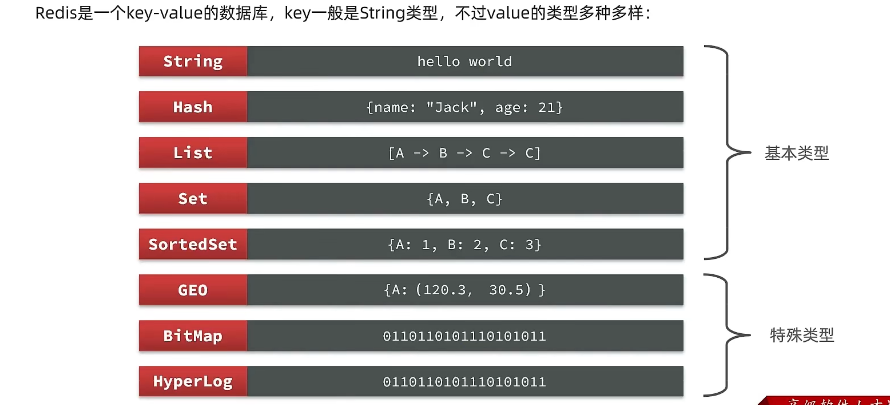

### 通用命令

可以通过 help+命令可以查看命令的用法，或者查询官方文档[Command reference – Redis](https://redis.io/commands)

- keys

  - 通过通配符搜索

    ```
    keys *//c查询所有
    keys *a//匹配以a开头的key
    ```

- del

  可删除一个或多个(只删除存在的key，不存在的不会报错)

  ```
  del k1 k2 k3 k4
  ```

- exists

  判断是否存在

  ```
  exists name
  ```
  
- expire

  设置已存在的key的剩余存活时间，单位为秒

  ```
  set age 30
  expire age 20//存活20s
  ```

- ttl

  与expire配套，查询key的剩余存活时间，

  - -2为已经被移除
  - -1为永久有效


### 数据类型的专有命令

#### String类型

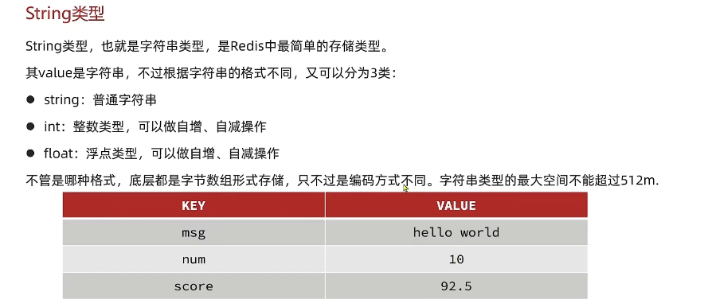

常见命令

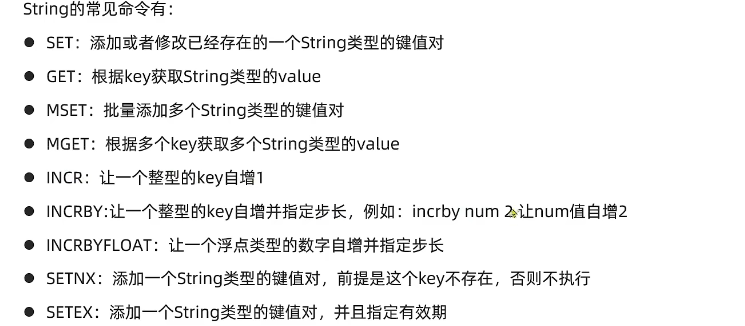

setnx才为真正意义上的新增

#### Key的层级格式

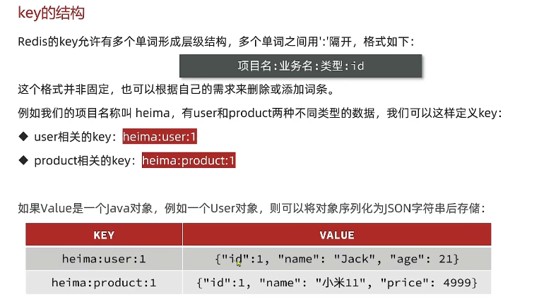

层级储存：

```redis
set company:product:1 '{"id":1, "name":"mi11", "price": 4999}'
set company:product:2 '{"id":2, "name":"honor6", "price": 2999}'
```

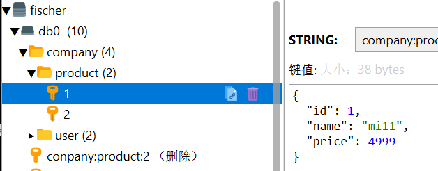

#### Hash类型

value为一个无序字典，类似于Java的HashMap结构

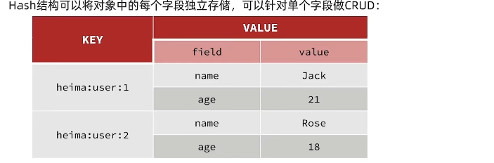

常见命令

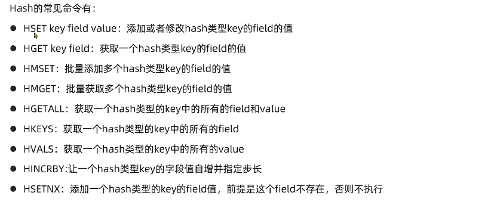

```redis
hset company:user:3 name lucy
hset company:user:3 age 17
```

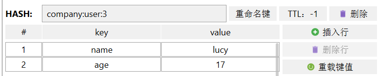

可直接当成Java中的map去理解操作

#### List类型

与LinkedList类似，可以看作一个双向链表，支持正向检索和反向检索

特征：

- 有序
- 元素可以重复
- 插入和删除快
- 查询速度一般

常见命令

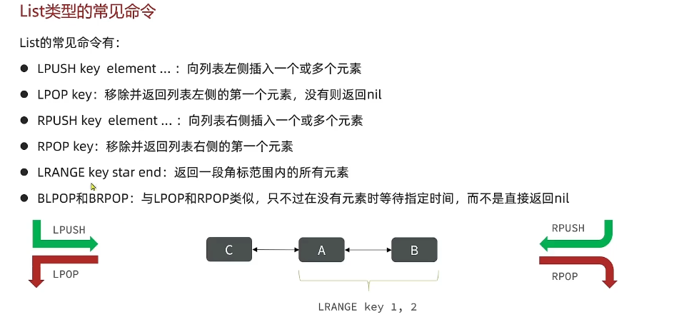

lrange取元素时的角标从0开始

#### Set类型

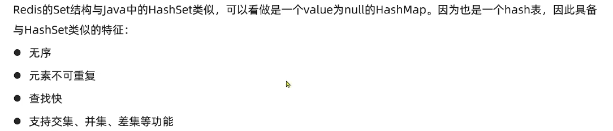

常见命令

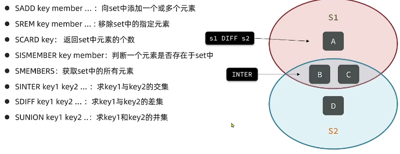

#### SortedSet类型


常见命令：

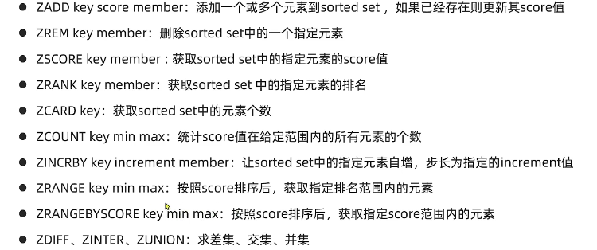

## Java客户端

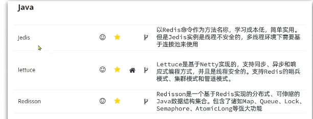

### Jedis

#### 快速入门

- 引入依赖

  ```xml
   		<dependency>
              <groupId>redis.clients</groupId>
              <artifactId>jedis</artifactId>
              <version>3.7.0</version>
          </dependency>
  ```

- 建立连接

  ```java
   @BeforeEach
      public void setUp(){
          jedis=new Jedis("127.0.0.1", 6379);
         jedis.auth("123321");//密码设置存在一定的问题，暂时无法设置
          jedis.select(0);
      }
  ```

- 基本操作

  完全基于redis基本命令，只做简答的展示

  ```java
   @Test
      public void testString(){
          String set = jedis.set("name", "google");
          System.out.println(set);
          String s = jedis.get("name");
          System.out.println(s);
      }
      @Test
      public void testHash(){
          jedis.hset("user:1","name","jack");
          jedis.hset("user:1","age","21");
          Map<String, String> stringStringMap = jedis.hgetAll("user:1");
          System.out.println(stringStringMap);
  
  ```

  

#### 连接池

Jedis本身线程不安全，并且频繁的创建和销毁连接会有性能损耗，因此使用连接池代替Jedis直连方式

- 创建静态代码块用于初始化，设置基本信息以及创建连接池对象
- 提供静态方法用于获取连接池

```java
public class JedisConnectionFactory {
    private static final JedisPool jedisPool;
    static {
        //配置连接池
        JedisPoolConfig jedisPoolConfig = new JedisPoolConfig();
        //最大连接
        jedisPoolConfig.setMaxTotal(8);
        //最大空闲连接
        jedisPoolConfig.setMaxIdle(8);
        //最小空闲连接
        jedisPoolConfig.setMinIdle(0);
        //最长等待时间
        jedisPoolConfig.setMaxWaitMillis(1000);
        //创建连接池对象
        jedisPool=new JedisPool(jedisPoolConfig,"127.0.0.1",6379,1000);
        
    }
    public static Jedis getJedis(){
        return jedisPool.getResource();
    }
}

```

通过连接池获取Jedis对象，不再通过new的方法

```java
		 /*jedis=new Jedis("127.0.0.1", 6379);*/
         jedis = JedisConnectionFactory.getJedis();
```


### SpringDataRedis

#### 快速入门

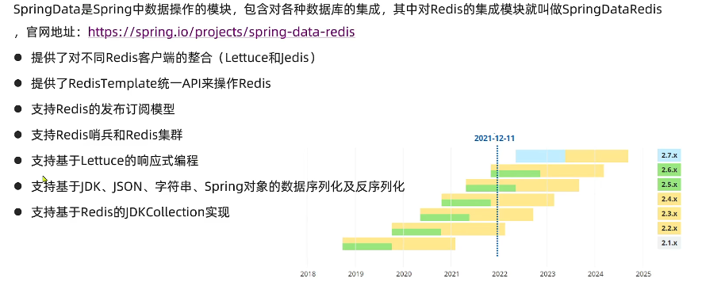

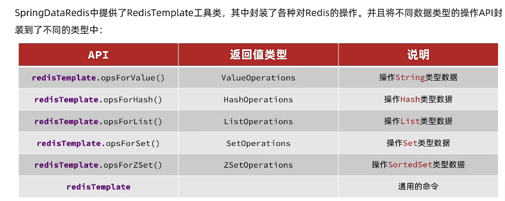

- 引入依赖

  ```xml
  		<dependency>
              <groupId>org.springframework.boot</groupId>
              <artifactId>spring-boot-starter-data-redis</artifactId>
          </dependency>
  		<!--连接池-->
          <dependency>
              <groupId>org.apache.commons</groupId>
              <artifactId>commons-pool2</artifactId>
          </dependency>
  
  ```

- 配置文件,配置对应的相关信息，如ip，端口连接池等

  ```yaml
  spring:
    redis:
      host: localhost
      port: 6379
      lettuce:
        pool:
          max-active: 8
          max-idle: 8
          min-idle: 0
          max-wait: 1000ms
  
  
  ```

- 注入RedisTemplate，调用API进行操作

  ```java
  @SpringBootTest
  class SpringDataRedisDemoApplicationTests {
      @Autowired
      private RedisTemplate redisTemplate;
      
      @Test
      void testString(){
          redisTemplate.opsForValue().set("name","fisherrrrr");
          Object name = redisTemplate.opsForValue().get("name");
          System.out.println(name);
      }
  }
  ```

#### RedisSErializer

  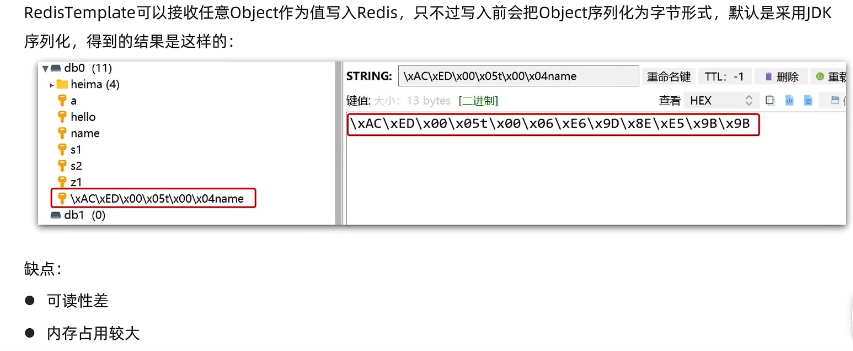

配置序列化工具

- RedisSerializer.string()用于对String类型的变量进行序列化，由于Key一般设置为String类型，因此使用其对key与hashKey进行序列化
- value可能为实体类的对象形式，即为json字符串，因此使用jsonRedisSerializer，进行序列化

配置类

```java
@Configuration
public class RedisConfig {

    @Bean
    public RedisTemplate<String,Object> redisTemplate(RedisConnectionFactory connectionFactory){
        //创建RedisTemplate对象
        RedisTemplate<String, Object> template = new RedisTemplate<>();

        //设置连接工厂
        template.setConnectionFactory(connectionFactory);
        //创建Json序列化工具
        GenericJackson2JsonRedisSerializer jsonRedisSerializer = new GenericJackson2JsonRedisSerializer();

        //设置key的序列化
        template.setKeySerializer(RedisSerializer.string());
        template.setHashKeySerializer(RedisSerializer.string());

        //设置value的序列化
        template.setValueSerializer(jsonRedisSerializer);
        template.setHashValueSerializer(jsonRedisSerializer);

        //返回
        return  template;
    }
}
```

- 测试，注入时声明泛型

```java
@SpringBootTest
class SpringDataRedisDemoApplicationTests {
    @Autowired
    private RedisTemplate<String,Object> redisTemplate;

    @Test
    void testString(){
        redisTemplate.opsForValue().set("name","fisherrrrr");
        Object name = redisTemplate.opsForValue().get("name");
        System.out.println(name);
    }
    @Test
    void testSaveUser(){
        redisTemplate.opsForValue().set("user:100",new User("fishcer",20));
        User user =(User) redisTemplate.opsForValue().get("user:100");
        System.out.println(user);
    }

}
```

结果：均可正常序列化，==但多了引号？？不知会有何影响==

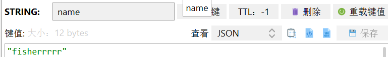

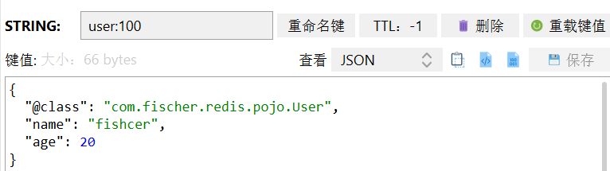

#### StringRedisTemplate


为节省内存空间，我们不使用JSON序列化器来处理value，而是统一使用的String序列化器，要求只能存储String类型的key和value，在手动进行序列化与反序列化(使用Jackson等)

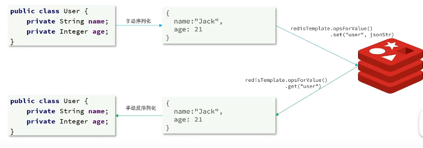

Spring提供了一个StringRedisTemplate，他的key和value的序列化方式默认为String方式，省去了自定义RedisTemplate的过程

```java
@SpringBootTest
class RedisStringTest {
    @Autowired
    private StringRedisTemplate redisTemplate;
    @Test
    void testSaveUser()throws Exception{
        User user=new User("fisher",21);
        ObjectMapper objectMapper=new ObjectMapper();
        String s = objectMapper.writeValueAsString(user);
        System.out.println(s);
        redisTemplate.opsForValue().set("user:100",s);
        String s1 = redisTemplate.opsForValue().get("user:100");
        User user1 = objectMapper.readValue(s1, User.class);
        System.out.println(user1);
    }
}

```

结果如下：

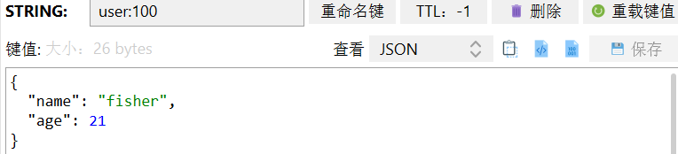


## 结合Token实现用户登录认证

主要实现的功能：

- 登录
- 登录/未登录时进行操作
- 退出登录

### 准备工作

**实体类：**

```java
@Data
@ToString
@AllArgsConstructor
@NoArgsConstructor
public class User {
    private String id;
    private String email;
    private String username;
    private String password;
    private String bio;
    private String image;

    public User(String email,String username,String password,String bio,String image)
    {
        this.id= UUID.randomUUID().toString();
        this.email=email;
        this.username=username;
        this.password=password;
        this.bio=bio;
        this.image=image;
    }
}
```

**token的生成与解析：**

- 接口：JwtSercice

```java
public interface JwtService {
    String toToken(User user);

    Optional<String> getSubFromToken(String token);
}
```

- 实现类：DefaultJwtService

```java
package com.fischer.token;

@Component
public class DefaultJwtService implements JwtService{
    private String secret;
    private int sessionTime;
    @Autowired
    public DefaultJwtService(@Value("${jwt.secret}") String secret,
                             @Value("${jwt.sessionTime}") int sessionTime) {
        this.secret = secret;
        this.sessionTime = sessionTime;
    };
    @Override
    public String toToken(User user) {
        String token = Jwts.builder()
                .setSubject(user.getId())
                .setExpiration(expireTimeFromNow())
                .signWith(SignatureAlgorithm.HS256, secret)
                .compact();
        return token;
    }

    @Override
    public Optional<String> getSubFromToken(String token) {
        try {
            Jws<Claims> claimsJws = Jwts.parser().setSigningKey(secret).parseClaimsJws(token);
            //
            return Optional.ofNullable(claimsJws.getBody().getSubject());
        } catch (Exception e){
            return Optional.empty();
        }
    }

    private Date expireTimeFromNow(){
        return new Date(System.currentTimeMillis()+sessionTime*1000);
    }
}

```

**登录表单：**

```java
@Data
@AllArgsConstructor
@NoArgsConstructor
public class RegisterParam {

    @Email(message = "请填写正确的邮箱格式")
    @NotBlank(message = "邮箱不能为空")
    private String email;

    @NotBlank(message = "用户名不能为空")
    private String username;

    @NotBlank(message = "请填写密码")
    private String password;
}
```

**返回数据：**

```java
@ToString
@Getter
public class UserWithToken {
    private String email;
    private String username;
    private String bio;
    private String image;
    private String token;

    public UserWithToken(User user,String token){
        this.email=user.getEmail();
        this.username=user.getUsername();
        this.bio=user.getBio();
        this.image=user.getImage();
        this.token=token;
    }
}
```

**判断字符串为空的工具类**

```java
package com.fischer.assitant;
public class Util {
    public static boolean isEmpty(String value) {
        return value == null || value.isEmpty();
    }
}
```

### 登录

用户进行登录时，提交登录的表单，获取表单中的UserId。

- 调用JwtService，签发一个token，一封装成UserWithToken返回给前端。
- 同时将用户的id存入redis当中，今后认证时从token中获取id，判断是否已经成功登录

在Redis当中使用分层次的方法，loginUser用于统一管理所有已经登录的用户

```java
@PostMapping
    public ResponseEntity userLogin(@Valid @RequestBody LoginParam loginParam){
        //实际开发中应为从数据库中查询信息进行校验，此处直接简单模拟
        System.out.println(loginParam.getEmail());
        System.out.println(loginParam.getPassword());
        String email="1809327837@qq.com";
        String password="1234";
        User user=new User(
                email,"fischer",password,"hey","noimage");

        if(email.equals(loginParam.getEmail())&&password.equals(loginParam.getPassword())){
            System.out.println("登录成功");

            //登录成功后，签发token
            String token = jwtService.toToken(user);
            
            //存入redis当中，表示用户已经成功登录，用于后续的权限认证
            String id="loginUser:"+user.getId();
            redisTemplate.opsForValue().set(id,"1");
            
            //将用户信息携带token返回给前端，用于进行其他操作时的认证
            UserWithToken userWithToken=new UserWithToken(user,token);
            return ResponseEntity.ok(userWithToken);

        }
        else{
            //正常开发过程中可以选择抛出异常，给异常处理类去捕捉处理，此处随意返回一下
            return ResponseEntity.ok("用户名或者密码错误，登陆失败");
        }
    }
```


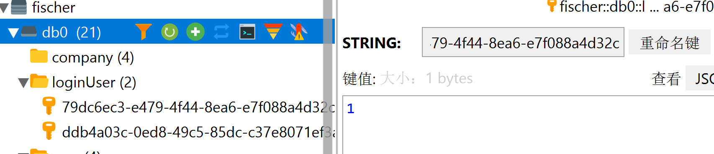


### 判断是否已经登录

通过单元测试模拟判断是否登录的过程

在实际开发过程中，判断是否已经登录应当在拦截器中进行完成，如果已经登录则放行，否则抛出未登录的异常

```java
@Test
    void testDo(){
       	//模拟操作过程中携带的token，可从header中获取
        String token="eyJhbGciOiJIUzI1NiJ9.eyJzdWIiOiI4NDAyY2E2NS1mNGFhLTRlOWItOWVkZS0xZjIzYjhlMWQyYTUiLCJleHAiOjE" +
                "2NDcxNDA5OTJ9.UGx0nCG3KVz1wKXucs9dbGMusohl0v7OVjEi4gXxbCo";
        //解析Token
        Optional<String> subFromToken = jwtService.getSubFromToken(token);
        //从redis中查询判断是否已经成功登录
        String userID="loginUser:"+subFromToken.get();
        String s = redisTemplate.opsForValue().get(userID);
        if(s!=null){
            System.out.println("已经成功登录，拦截器放行");
        }
        else
        {
            System.out.println("未登录，抛出未登录的异常");
        }
    }
```

### 退出登录

解析token获取Id后从redis中删除即可

```java
 @Test
    void logout(){
        String token="eyJhbGciOiJIUzI1NiJ9.eyJzdWIiOiI4NDAyY2E2NS1mNGFhLTRlOWItOWVkZS0xZjIzYjhlMWQyYTUiLCJleHAiOjE" +
                "2NDcxNDA5OTJ9.UGx0nCG3KVz1wKXucs9dbGMusohl0v7OVjEi4gXxbCo";
        Optional<String> id = jwtService.getSubFromToken(token);
        String deleteId="loginUser:"+id.get();
        Boolean delete = redisTemplate.delete(deleteId);
        System.out.println(delete);

    }
```

