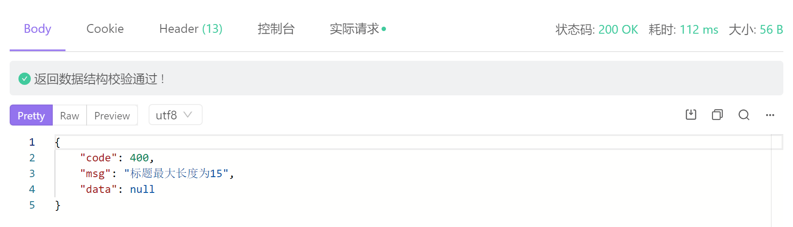
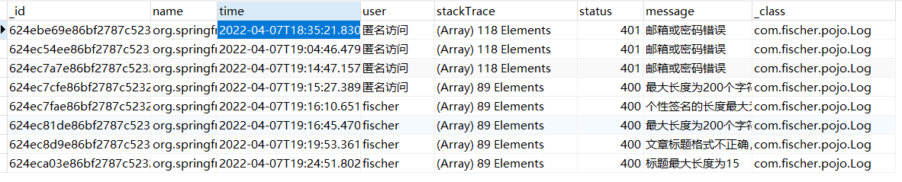
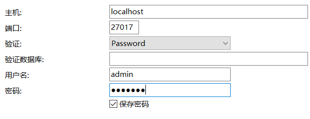

# Springboot+Mongodb实现日常日志存储

起因是最近部署项目遇到bug后需要反反复复去服务器上查看日志，判断原因，再加上想学一下mongodb，因此有了这么一个这么一个不是很实用的想法

基于这个，写一篇Springboot+mongodb的快速入门，实现异常日志的存储

## Mongodb的安装与安全设置

安装我采用的是docker，只需要简单操作即可

**下拉镜像：**

```shell
docker pull mongodb:latest
```

**启动镜像：**

```
docker run -itd --name c_mongo -p 27017:27017 -v /mongodb/data/db:/data/db mongo:latest --auth
```

> -v：数据卷
>
> -p：端口映射
>
> --auth：授权参数

安装较为简答，但是mongodb的配置相比mysql起来较为繁琐

mongodb如果不进行密码的设置，此时便可以创建数据库进行连接了，navicat中加密方式为none，springboot只写ip端口和数据库即可，但是这样所有人都可以连接你的数据库，

mongodb与mysql最大的不同是不像mysql那样，一个全局的user管理所有的数据库，mongodb的每个数据库都有对应的用户，因此并不能像菜鸟教程上面那样只创建一个admin用户就与其进行连接，正确的做法是先创建admin用户和root用户，一个用于管理账户，一个用于管理数据库，最后在创建自己所用的数据库和管理该数据库的用户，再与该用户进行连接

==具体操作过程如下：==

**mongodb密码设置：**

1. 查看所有数据库(mongdb新版本没有admin数据库，但是不影响操作)

   ```
   show dbs
   ```

2. 进入admin数据库

   ```
   use admin
   ```

3. 创建管理员账户

   ```
   db.createUser({ user: "admin", pwd: "password", roles: [{ role: "userAdminAnyDatabase", db: "admin" }] })
   ```

4. mongodb中的用户是基于身份role的，该管理员账户的 role是 userAdminAnyDatabase。admin用户用于管理账号，不能进行关闭数据库等操作。

   ```
   db.createUser({user: "root",pwd: "password", roles: [ { role: "root", db: "admin" } ]})
   ```

   创建完admin管理员，创建一个超级管理员root。角色：root。root角色用于关闭数据库。

5. 创建用户自己的数据库的管理角色

   ```
   use yourdatabse
   ```

   ```
   db.createUser({user: "user",pwd: "password",roles: [ { role: "dbOwner", db: "yourdatabase" } ]})
   ```

   role: "dbOwner"代表数据库所有者角色，拥有最高该数据库最高权限。比如新建索引等当账号管理员和超级管理员，可以为自己的数据库创建用户了。（坑）这时候一定，一定要切换到所在数据库上去创建用户，不然创建的用户还是属于admin。

6. 查看用户

   ```
   show users
   ```

7. 删除用户

   删除用户必须有账号管理员来删，所有必须要切换到admin角色

   ```
   use admin
   db.auth("admin","password")
   ```

   删除单个用户

   ```
   db.system.users.remove({user:"XXXXXX"})
   ```

   删除所有用户

   ```
   db.system.users.remove({})
   ```

在操作的过程中，如果提示没有权限那么直接使用`db.auth("user","password")`授权一次即可


如果提示`logical sessions can't have multiple authenticated users`,mongodb不允许一次会话认证多个用户，不能重复认证的话那么重启一下shell即可，再次认证便可以认证成功

**之后便可以在springboot中配置进行连接**

```yaml
data:
    mongodb:
      uri: mongodb://username:password@ip:port/database
```

如果将用户名，密码等单独进行单独配置的话，mongodb会将其按照字符数组处理，因此纯数字的密码一定要加括号使用字符串的形式，

在navicat中连接同样需要指定用户名，密码，ip，端口，数据库

## 异常处理

**导入依赖坐标**

使用spring data来操作mongodb，与redis大体一致

```xml
		<dependency>
            <groupId>org.springframework.boot</groupId>
            <artifactId>spring-boot-starter-data-mongodb</artifactId>
        </dependency>

```

**创建一个pojo类，向mongodb中存储数据**

类中设置想收集的信息，如异常的类名，抛出时间，进行操作的用户，stacktrace，响应码，提示信息等，用于追踪和处理异常

```java
package com.fischer.pojo;

@Data
@AllArgsConstructor
@NoArgsConstructor
public class Log {
    private String name;
    private String time;
    private String user;
    private List<String> stackTrace;
    private Integer status;
    private String message;

}

```

**异常收集方法**

在用于处理全局异常的`GlobalHandler`类中添加一个用于处理类的方法，每次处理异常时都调用一下，收集异常信息

```java
 void collectException(
            HttpServletRequest request,
            StackTraceElement[] stackTrace,
            String className,
            Integer status,
            String message){
        String token = request.getHeader("Authorization");
     //jwtService为自己编写的token加密与解析的工具类
        Optional<String> subFromToken = jwtService.getSubFromToken(token);
     //默认为匿名访问，如果携带了token，能从token中解析出，则设置为对应的用户
        String username="匿名访问";
        if(subFromToken.isPresent()){
             username = userDao.selectById(subFromToken.get()).getUsername();
        }
     //类型转换用于存储
        List<String> collect = Arrays
                .stream(stackTrace)
                .map(stackTraceElement -> stackTraceElement.toString())
                .collect(Collectors.toList());
	//填充pojo类
        Log log=new Log(
            className,
                LocalDateTime.now().toString(),
                username,
                collect,
                status,message
        );
     //存入数据库
        mongoTemplate.save(log);

    }
```

## 测试



只要能抛出异常被GlobalHandler捕获处理，则能够正确存入mongodb当中

但是前提为能够抛出异常才能进行处理，像向SpringSecurity登录校验失败情况，由AuthenticationEntryPoint处理不抛出异常的情况那么则不能存入数据库当中



## 常见Bug

```java
Exception authenticating MongoCredential{mechanism=SCRAM-SHA-1, userName='', source='test', password=<hidden>, mechanismProperties={}}; nested exception is com.mongodb.MongoSecurityException: Exception authenticating MongoCredential{mechanism=SCRAM-SHA-1, userName='', source='test', password=<hidden>, mechanismProperties={}}"}

```

mongodb没有正确配置导致的

如果只是像菜鸟教程那样配置：

`db.createUser({ user:'admin',pwd:'123456',roles:[ { role:'userAdminAnyDatabase', db: 'admin'},"readWriteAnyDatabase"]});`

通过navicat连接时如果不指定数据库，进行连接，确实是能连的上，也能对其进行操作，但是spinrgboot便会报以上的错误信息，使用navicat如果指定了数据库，同样会连接失败




