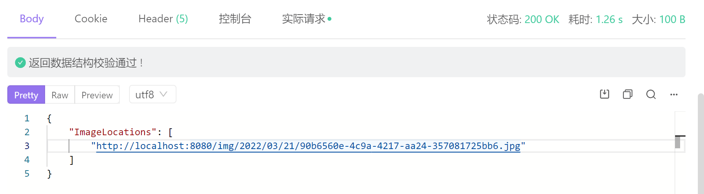

# Springboot实现文件的上传

## 路径配置

默认情况下，Spring Boot 将在 classpath 或者 `ServletContext` 根目录下从名为 `/static` （`/public`、`/resources` 或 `/META-INF/resources`）目录中服务静态内容。它使用了 Spring MVC 的 `ResourceHttpRequestHandler`，因此您可以通过添加自己的 `WebMvcConfigurerAdapter` 并重写 `addResourceHandlers` 方法来修改此行为。

但是通过这种方法进行配置，静态资源都存储在classpath下，无法将项目和文件分开存储

因此我们使用springboot提供的`spring.resources.static-locations`配置自定义静态文件的位置,在测试过程中，直接仍在项目路径下即可，在部署时才进行路径的具体设置

```java
web:
  upload-path: D:\learn_software\program_file\IDEAProgject\personal_blog\src\main\resources\static\img\

      
spring:
  web:
    resources:
      static-locations: classpath:/META-INF/resources/,classpath:/resources/,classpath:/static/,classpath:/public/,file:${web.upload-path}
      
```

- 配置`web.upload-path`为与项目代码分离的静态资源路径，即：文件上传保存根路径
- 配置`spring.resources.static-locations`，除了带上Spring Boot默认的静态资源路径之外，加上file:${web.upload-path}指向外部的文件资源上传路径。该路径下的静态资源可以直接对外提供HTTP访问服务。

## Controller实现

首先创建uploadFile方法，用于处理单一文件的存储

使用springboot提供的MutipartFile处理文件

```java
private String uploadFile(MultipartFile file,HttpServletRequest request){
        String format=sdf.format(new Date());//以当前时间创建文件存储路径，便于进行管理
        File folder=new File(uploadPath+format);
    //得到实际的存储路径，不存在则递归创建
        if(!folder.isDirectory()){
            folder.mkdirs();
        }
    //防止上传的文件重名，通过UUID得到新的不重复的文件名
        String oldName=file.getOriginalFilename();
        String newName= UUID.randomUUID()
                .toString()+oldName
                .substring(oldName.lastIndexOf("."),oldName.length());
        try {
            //保存文件
            file.transferTo(new File(folder,newName));
        } catch (IOException e) {
            e.printStackTrace();
        }
    //返回文件的访问路径，用于给前端直接访问获取
        return request.getScheme()+"://"+request.getServerName()
                +":"+request.getServerPort()+"/img"+format+newName;

    }

```

**批量处理多文件上传：**

- 无论单一还是多个文件的处理都使用此方法即可

- 遍历文件数组依次保存即可
- 返回所有文件的访问路径的List集合提供给前端

```java
@PostMapping
    public ResponseEntity uploadFiles(MultipartFile[] files, HttpServletRequest request){
        List<String> fileNames=new LinkedList<>();
        for(MultipartFile file: files){
			
            String s = uploadFile(file, request);
            fileNames.add(s);
        }
        return ResponseEntity.ok(
                new HashMap<String,Object>(){
                    {
                        put("ImageLocations",fileNames);
                    }
                }
        );
    }
```

**其他变量：**

```java
@Value("${web.upload-path}")
//注入存储路径
    private String uploadPath;
	//时间格式
    private SimpleDateFormat sdf=new SimpleDateFormat("/yyyy/MM/dd/");
```

## 拦截器配置

在实际应用过程中，如果不进行静态资源的放行，则最后获取图片的操作会被拦截器拦截：


因此需要对原本的拦截器进行配置，保证能够对要访问的静态资源进行放行

- 在拦截器中添加放行的路径：

  ```java
  registry.addInterceptor(myInterceptor())
                   .addPathPatterns("/**")
      			 .excludePathPatterns("/img/**")
  ```

- 将静态资源对外暴露

  如果只进行上述的拦截器放行路径，那么对于原本已经存在的文件确实可以绕过拦截器被访问到，但新上传的文件仍会被拦截器拦截从而无法访问，只有在重启服务器之后才能访问，因此进行以下配置

  ```java
  @Override
      public void addResourceHandlers(ResourceHandlerRegistry registry) {
          registry.addResourceHandler("/img/**").addResourceLocations("file:"+uploadFolder);
          WebMvcConfigurer.super.addResourceHandlers(registry);
      }
  ```

至此，上传文件并直接访问的功能以及可以实现，后面则为将文件的索引存入数据库当中，实现具体功能，上传图片后返回图片的访问地址，前端便可以直接访问被拦截器放行的文件



