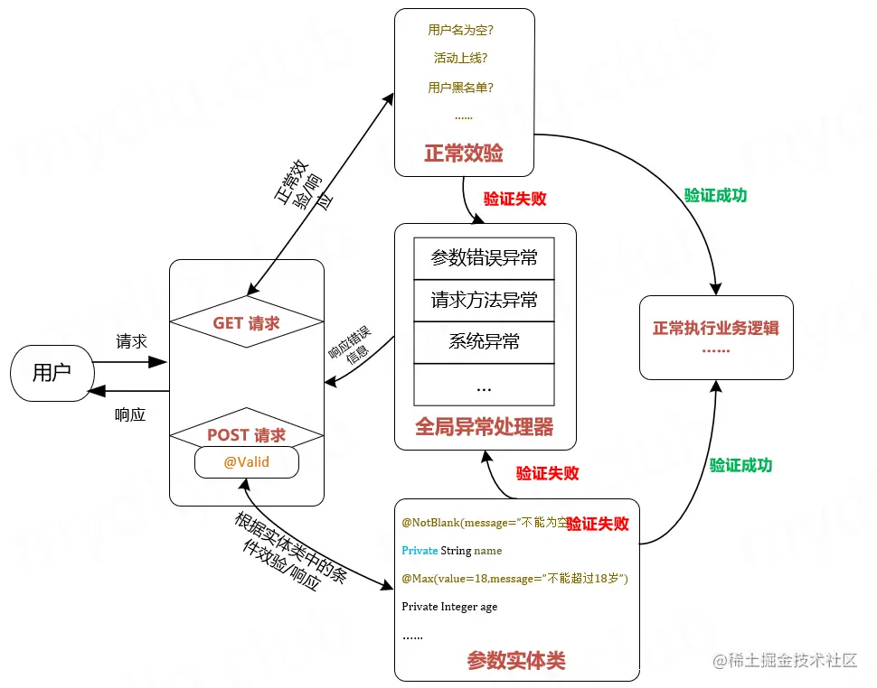
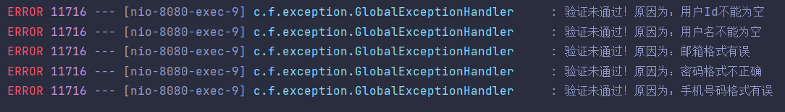

# validation



JSR303 是一套 JavaBean 参数校验的标准，它定义了很多常用的校验注解，我们可以直接将这些注解加在我们 JavaBean 的属性上面 

javax.validation主要用于进行提交表单时的参数校验，通过注解的形式进行校验，可以免于大量冗余的if-else工作

## 快速入门

以下为关于validation再实际开发中的简单应用

```java
package com.fischer.data;
@Getter
@JsonRootName("user")
@AllArgsConstructor
@NoArgsConstructor
@Validated
public class RegisterParam {
    @NotBlank(message = "邮箱不能为空")
    @Email(message = "请填写格式正确的邮箱")
    @DuplicatedEmailConstraint
    private String email;

    @NotBlank(message = "请给自己起个名字")
    @DuplicatedUsernameConstraint
    private String username;

    @NotBlank(message = "密码不能为空")
    @Pattern(regexp = "[a-zA-Z0-9]{3,20}",message = "密码格式应为：3到20位的大小写字母以及数字的组合")
    private String password;
}

```

在成员变量的上方添加注解，其中涉及到了validation自带的注解和自定义的验证注解，对成员变量按照注解的规则进行校验，当验证不通过时，便抛出异常MethodArgumentNotValidException,之后便可以对异常进行处理，满足开发需求

## 依赖

JSR303可以视为只是一套用于验证的规范，真正的数据校验要依赖于Hibernate校验框架，因此导入依赖时应当将二者一同导入，在 SpringBoot 中已经包含在 starter-web 中, 再其他项目中可以引用依赖, 并自行调整版本:

```xml
		<!--jsr 303-->
        <dependency>
            <groupId>javax.validation</groupId>
            <artifactId>validation-api</artifactId>
            <version>1.1.0.Final</version>
        </dependency>
        <!-- hibernate validator-->
        <dependency>
            <groupId>org.hibernate</groupId>
            <artifactId>hibernate-validator</artifactId>
            <version>5.2.0.Final</version>
        </dependency>
```

## 常用注解

hibernate validator官方文档：[Documentation - Hibernate Validator](http://hibernate.org/validator/documentation/)

以下只给出较为常用的注解，详细情况可以去官方文档查找

| 验证注解                                     | 验证的数据类型                                               | 说明                                                         |
| -------------------------------------------- | ------------------------------------------------------------ | ------------------------------------------------------------ |
| @AssertFalse                                 | Boolean,boolean                                              | 验证注解的元素值是false                                      |
| @AssertTrue                                  | Boolean,boolean                                              | 验证注解的元素值是true                                       |
| @NotNull                                     | 任意类型                                                     | 验证注解的元素值不是null                                     |
| @Null                                        | 任意类型                                                     | 验证注解的元素值是null                                       |
| @Min(value=值)                               | BigDecimal，BigInteger, byte,short, int, long，等任何Number或CharSequence（存储的是数字）子类型 | 验证注解的元素值大于等于@Min指定的value值                    |
| @Max（value=值）                             | 和@Min要求一样                                               | 验证注解的元素值小于等于@Max指定的value值                    |
| @DecimalMin(value=值)                        | 和@Min要求一样                                               | 验证注解的元素值大于等于@ DecimalMin指定的value值            |
| @DecimalMax(value=值)                        | 和@Min要求一样                                               | 验证注解的元素值小于等于@ DecimalMax指定的value值            |
| @Digits(integer=整数位数, fraction=小数位数) | 和@Min要求一样                                               | 验证注解的元素值的整数位数和小数位数上限                     |
| @Size(min=下限, max=上限)                    | 字符串、Collection、Map、数组等                              | 验证注解的元素值的在min和max（包含）指定区间之内，如字符长度、集合大小 |
| @Past                                        | java.util.Date,java.util.Calendar;Joda Time类库的日期类型    | 验证注解的元素值（日期类型）比当前时间早                     |
| @Future                                      | 与@Past要求一样                                              | 验证注解的元素值（日期类型）比当前时间晚                     |
| @NotBlank                                    | CharSequence子类型                                           | 验证注解的元素值不为空（不为null、去除首位空格后长度为0），不同于@NotEmpty，@NotBlank只应用于字符串且在比较时会去除字符串的首位空格 |
| @Length(min=下限, max=上限)                  | CharSequence子类型                                           | 验证注解的元素值长度在min和max区间内                         |
| @NotEmpty                                    | CharSequence子类型、Collection、Map、数组                    | 验证注解的元素值不为null且不为空（字符串长度不为0、集合大小不为0） |
| @Range(min=最小值, max=最大值)               | BigDecimal,BigInteger,CharSequence, byte, short, int, long等原子类型和包装类型 | 验证注解的元素值在最小值和最大值之间                         |
| @Email(regexp=正则表达式,flag=标志的模式)    | CharSequence子类型（如String）                               | 验证注解的元素值是Email，也可以通过regexp和flag指定自定义的email格式 |
| @Pattern(regexp=正则表达式,flag=标志的模式)  | String，任何CharSequence的子类型                             | 验证注解的元素值与指定的正则表达式匹配                       |
| @Valid                                       | 任何非原子类型                                               | 指定递归验证关联的对象如用户对象中有个地址对象属性，如果想在验证用户对象时一起验证地址对象的话，在地址对象上加@Valid注解即可级联验证 |

## 实际应用

### pojo

创建实体类并添加认证

```java
package com.fischer.pojo;

@Data
public class User {

    @NotNull(message = "用户Id不能为空")
    private Long userId;

    @NotBlank(message = "用户名不能为空")
    @Length(max = 12,message = "用户名最长为12个字符")
    private String username;

    @NotBlank(message = "手机号码不能为空")
    @Pattern(regexp = "1[3-9]\\d{9}",message = "手机号码格式有误")
    private String mobile;

    private String sex;

    @Email(message = "邮箱格式有误")
    private String email;

    @Pattern(regexp = "[a-zA-Z0-9]{6,20}",message = "密码格式不正确")
    private String password;
}

```

### Controller

创建Controller用于测试

```java
package com.fischer.api;

@RestController
@RequestMapping(path = "user")
public class UserApi {

    @PostMapping
    public ResponseEntity addUser(@Validated @RequestBody User user){

        return ResponseEntity.ok(user);
    }
}
```

### 异常处理

创建全局异常处理类，抓取校验失败异常，直接在控制台输出即可

```java
package com.fischer.exception;

@ControllerAdvice
public class GlobalExceptionHandler {
Logger logger= LoggerFactory.getLogger(GlobalExceptionHandler.class);
    @ExceptionHandler(MethodArgumentNotValidException.class)
    public ResponseEntity MotValidHandler(HttpServletRequest req, MethodArgumentNotValidException e){
        for (ObjectError allError : e.getAllErrors()) {
            String defaultMessage = allError.getDefaultMessage();
            logger.error("验证未通过！原因为："+defaultMessage);
        }
        return new ResponseEntity(HttpStatus.BAD_REQUEST);

    }
}
```

### 测试

提交的表单数据：

```json
{
    "userId": null,
    "username": "",
    "mobile": "186690031",
    "sex": "ut",
    "email": "2388231qq.com",
    "password": "litangdingzhendianziyanwangzi"
}
```

可以看到，userId,username,moblie,email,password均不满足要求

在控制台输出结果：



达到了预期的验证效果


此外，还可以在类上面标注@Validated，表示开启全局认证，然后再需要认证的地方添加@Valid，表示对该数据进行认证，如下：

```java
package com.fischer.api;

@RestController
@RequestMapping(path = "user")
@Validated
public class UserApi {

    @PostMapping
    public ResponseEntity addUser(@Valid @RequestBody User user){

        return ResponseEntity.ok(user);
    }
}

```

## 自定义参数注解

当hibernate validator提供的默认注解无法满足我们的需求时，便可以添加自定义注解

自定义注解分为两部分，分别是返回信息的Constraint和用于逻辑验证的Validator

- Contraint

  ```java
  package com.fischer.service.article;
  
  @Documented
  @Constraint(validatedBy = DuplicatedArticleValidator.class)
  @Target({ElementType.METHOD,ElementType.FIELD,ElementType.PARAMETER,ElementType.TYPE_USE})
  @Retention(RetentionPolicy.CLASS)
  public @interface DuplicatedArticleConstraint {
      String message() default "该文章的标题已存在";
  
      Class<?>[] groups() default {};
  
      Class<? extends Payload>[] payload() default {};
  }
  ```

  

- @Constraint指定提供逻辑验证的类

- 元注解：包括@Retention、@Target、@Document、@Inherited四种。

  - @Retention：指明在什么级别显示此注解
    -  @Retention(RetentionPolicy.SOURCE)  // 注解仅存在于源码中，在class字节码文件中不包含	
    - @Retention(RetentionPolicy.CLASS)   // 默认的保留策略，注解会在class字节码文件中存在，但运行时无法获得
    -   @Retention(RetentionPolicy.RUNTIME)  // 注解会在class字节码文件中存在，在运行时可以通过反射获取到

  - @Target：

    指定作用目标，可以传入一个值，也可传入一个数组指定多个目标，主要有以下几种：

    > ElementType.TYPE 用于类，接口，枚举但不能是注解
    >
    > ElementType.FIELD 作用于字段，包含枚举值
    >
    > ElementType.METHOD 作用于方法，不包含构造方法
    >
    > ElementType.PARAMETER 作用于方法的参数
    >
    > ElementType.CONSTRUCTOR 作用于构造方法
    >
    > ElementType.LOCAL_VERIABLE 作用于本地变量或者catch语句
    >
    > ElementType.ANNOTATION_TYPE 作用于注解
    >
    > ElementType.PACKAGE 作用于包

  - @Documented：

    指明拥有这个注解的元素可以被javadoc此类的工具文档化。这种类型应该用于注解那些影响客户使用带注释的元素声明的类型。
    
  - @Inherited：

    指明该注解类型被自动继承。如果用户在当前类中查询这个元注解类型并且当前类的声明中不包含这个元注解类型，那么也将自动查询当前类的父类是否存在Inherited元注解，这个动作将被重复执行知道这个标注类型被找到，或者是查询到顶层的父类。

- 内部信息
  - message定制化的提示信息，主要是从ValidationMessages.properties里提取，也可以依据实际情况进行定制
  - groups 这里主要进行将validator进行分类，不同的类group中会执行不同的validator操作
  - payload 主要是针对bean的，使用不多。

  group的使用方式暂时还为大看懂，等待后续再进行补充

- Validator

  ```java
  class DuplicatedArticleValidator
  implements ConstraintValidator<DuplicatedArticleConstraint,String> {
      @Autowired
      private ArticleQueryService articleQueryService;
  
      @Override
      public boolean isValid(String value, ConstraintValidatorContext constraintValidatorContext) {
          return !articleQueryService.findBySlug(Article.toSlug(value),null).isPresent();
  
      }
  }
  ```

  

---

参考：[这么写参数校验(validator)就不会被劝退了~ - 掘金 (juejin.cn)](https://juejin.cn/post/6844903902811275278)

[java自定义注解的使用（校验） - 呱呱的呱呱 - 博客园 (cnblogs.com)](https://www.cnblogs.com/guagua-join-1/p/10270350.html)

