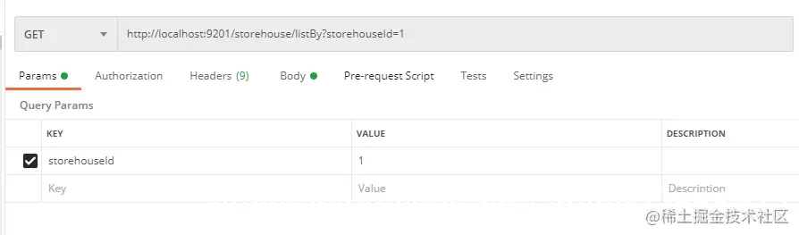
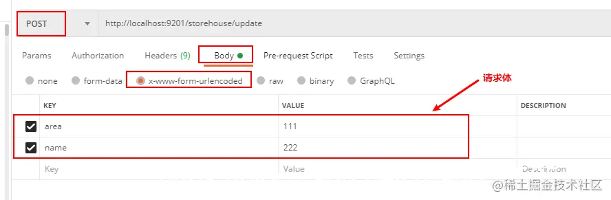
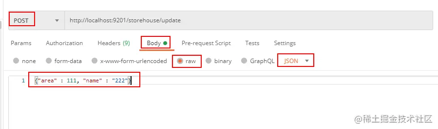
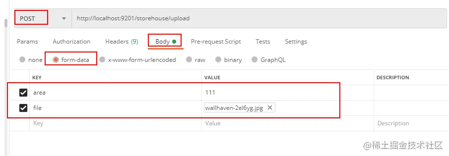
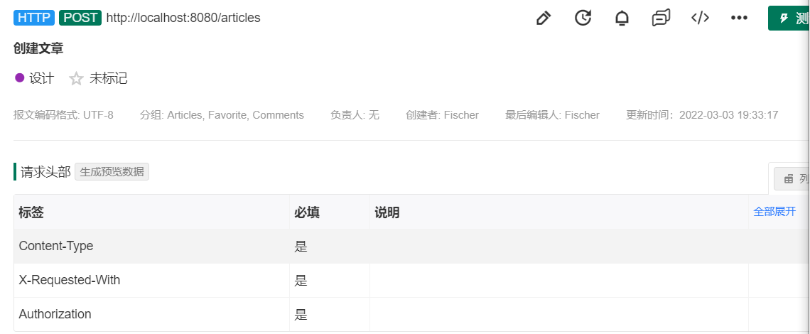

# 数据传输

## 后端->前端

==HttpMessageConverter==有待后续继续学习

简单来说，@ResponseBody可以直接返回json结果，ResponseEntity不仅可以返回json结果，还可以定义返回的HttpHeaders和HttpStatus

### @ResponseBody

@ResponseBody可以将java对象转为json格式的数据

@responseBody注解的作用是将controller的方法返回的对象通过适当的==转换器==转换为指定的格式之后，写入到response对象的body区，通常用来返回JSON数据或者是XML数据。

默认情况下，使用@ResponseBody返回的数据只能是String类型，其它类型返回时会出现异常：

​		若想转换为json格式，使用jackson即可，只需要引入jackson的依赖坐标，SpringMVC会自动添加Jackson的转换器

使用此注解后不会再走视图处理器，不进行页面跳转，直接将数据写入到输入流中

@ResponseBody通常用于web层，而web层在Spring项目当中还有另外一个注解，用于声明web层，即为@Controller，因此提供了一个新的注解@RestController，用于整合二者，因此，以后要进行数据返回时只需要加上一个@RestController即可，也就是说它既可以用于声明类为Controller，也可以给所有方法自动添加@ResponseBody注解。

以下是开发中的实际使用案例：

```java

/*对单篇文章进行CRUD*/
@RestController
@RequestMapping(path = "/articles/{slug}")
public class ArticleApi {
    private ArticleQueryService articleQueryService;
    private ArticleRepository articleRepository;
    private ArticleCommandService articleCommandService;
    private UserDao userDao;
    @Autowired
    public ArticleApi(
            ArticleQueryService articleQueryService,
            ArticleRepository articleRepository,
            ArticleCommandService articleCommandService,
            UserDao userDao) {
        this.articleQueryService=articleQueryService;
        this.articleCommandService=articleCommandService;
        this.articleRepository=articleRepository;
        this.userDao=userDao;
    }
    @GetMapping
    public ResponseEntity<?>article(
            @PathVariable("slug") String slug/*, User user*/){
        /*假User*/
        User user=userDao.selectById("1234");
        Optional<ArticleData> articleData = articleQueryService.findBySlug(slug, user);
        return articleData
                .map(articleData1 -> ResponseEntity.ok(articleResponse(articleData1)))
                .orElseThrow(ResourceNotFoundException::new);


    }
}
```

### ResponseEntity

ResponseEntity继承了HttpEntity，可以添加HttpStatus状态码的HttpEntity的扩展类。被用于RestTemplate和Controller层方法

ReponseEntity的最大作用为将响应数据的toString字符串转换为json格式，即当返回形式为ResponseEntity时，==@ResponseBody可写可不写,或者不使用@RestController只使用@Controller即可==

ResponseEntity标识整个http相应：状态码、头部信息以及相应体内容。因此我们可以使用其对http响应实现完整配置。由于可以设置状态码，因此其作用相当于==@ResponseStatus与@ResponseBody结合起来==

#### 使用方式

1. 构造方法

   ```java
   public class ResponseEntity<T> extends HttpEntity<T> {
       public ResponseEntity(HttpStatus status) {
   	    this((Object)null, (MultiValueMap)null, (HttpStatus)status);
   	}
   	
      public ResponseEntity(@Nullable T body, HttpStatus status) {
           this(body, (MultiValueMap)null, (HttpStatus)status);
       }
   	
      public ResponseEntity(MultiValueMap<String, String> headers, HttpStatus status) {
           this((Object)null, headers, (HttpStatus)status);
       }
   	
      public ResponseEntity(@Nullable T body, @Nullable MultiValueMap<String, String> headers, HttpStatus status) {
           super(body, headers);
           Assert.notNull(status, "HttpStatus must not be null");
           this.status = status;
       }
   
      private ResponseEntity(@Nullable T body, @Nullable MultiValueMap<String, String> headers, Object status) {
           super(body, headers);
           Assert.notNull(status, "HttpStatus must not be null");
           this.status = status;
       }
   }
   ```

   可以看到，ResponseEntity类提供的构造方法，状态码为必传的，header和响应体为可选的，使用时我们只需要new一个ResponseEntity对象作为API的返回值即可

   需要注意的是，在有headers作为参数的构造方法中，需要传入一个类型为MultiValueMap<String, String>的参数。MultiValueMap继承自Map这个抽象类，其中拥有一个叫做HttpHeaders的子类，我们可以当它为一个key和value都为String类型的HashMap使用。HttpHeaders里面保存了一些常用的Header的key值，例如"Accept-Charset"。当然也可以自定义一些特殊的key。

   ```java
   HttpHeaders headers = new HttpHeaders();
   headers.add("Access-Control-Expose-Headers", "AMP-Access-Control-Allow-Source-Origin");
   
   return new ResponseEntity<>(resultBody, headers, HttpStatus.OK);
   
   ```
**以下为具体使用案例：**

   如果需要使用ResponseEntity，必须在请求点返回，通常在spring rest中实现。ResponseEntity是通用类型，因此可以使用任意类型作为响应体：

   ```java
   @GetMapping("/hello")
   ResponseEntity<String> hello() {
       return new ResponseEntity<>("Hello World!", HttpStatus.OK);
   }
   ```

   可以通过指明响应状态，所以根据不同场景返回不同状态：

   ```java
   @GetMapping("/age")
   ResponseEntity<String> age(
     @RequestParam("yearOfBirth") int yearOfBirth) {
   
       if (isInFuture(yearOfBirth)) {
           return new ResponseEntity<>(
             "Year of birth cannot be in the future", 
             HttpStatus.BAD_REQUEST);
       }
   
       return new ResponseEntity<>(
         "Your age is " + calculateAge(yearOfBirth), 
         HttpStatus.OK);
   }
   ```

   设置响应头：

   ```java
   @GetMapping("/customHeader")
   ResponseEntity<String> customHeader() {
       HttpHeaders headers = new HttpHeaders();
       headers.add("Custom-Header", "foo");
   
       return new ResponseEntity<>(
         "Custom header set", headers, HttpStatus.OK);
   }
   ```

   ==header部分暂时用到的还不多，需要继续学习==

2. ResponseEntity.BodyBuilder

   ```java
       public static ResponseEntity.BodyBuilder status(HttpStatus status) {
           Assert.notNull(status, "HttpStatus must not be null");
           return new ResponseEntity.DefaultBuilder(status);
       }
   
       public static ResponseEntity.BodyBuilder status(int status) {
           return new ResponseEntity.DefaultBuilder(status);
       }
           public static ResponseEntity.BodyBuilder ok() {
           return status(HttpStatus.OK);
       }
       public static ResponseEntity.BodyBuilder created(URI location) {
           ResponseEntity.BodyBuilder builder = status(HttpStatus.CREATED);
           return (ResponseEntity.BodyBuilder)builder.location(location);
       }
   
       public static ResponseEntity.BodyBuilder accepted() {
           return status(HttpStatus.ACCEPTED);
       }
   
       public static ResponseEntity.HeadersBuilder<?> noContent() {
           return status(HttpStatus.NO_CONTENT);
       }
   
       public static ResponseEntity.BodyBuilder badRequest() {
           return status(HttpStatus.BAD_REQUEST);
       }
   
       public static ResponseEntity.HeadersBuilder<?> notFound() {
           return status(HttpStatus.NOT_FOUND);
       }
   
       public static ResponseEntity.BodyBuilder unprocessableEntity() {
           return status(HttpStatus.UNPROCESSABLE_ENTITY);
       }
       .........
   
   ```

    ResponseEntity提供了两个内嵌的构建器接口: HeadersBuilder 和其子接口 BodyBuilder。因此我们能通过ResponseEntity的静态方法直接访问。

最简单的情况是相应包括一个主体及http 200响应码：

```java
@GetMapping("/hello")
ResponseEntity<String> hello() {
    return ResponseEntity.ok("Hello World!");
}
```

大多数常用的http 响应码，可以通过下面static方法设置，也可使用HttpStatus枚举类手动设置

```java
BodyBuilder accepted();
BodyBuilder badRequest();
BodyBuilder created(java.net.URI location);
HeadersBuilder<?> noContent();
HeadersBuilder<?> notFound();
BodyBuilder ok();
```

另外，可以能使用BodyBuilder status(HttpStatus status)和BodyBuilder status(int status) 方法设置http状态。使用ResponseEntity BodyBuilder.[body](https://so.csdn.net/so/search?q=body&spm=1001.2101.3001.7020)(T body)设置http响应体:

```java
@GetMapping("/age")
ResponseEntity<String> age(@RequestParam("yearOfBirth") int yearOfBirth) {
    if (isInFuture(yearOfBirth)) {
        return ResponseEntity.badRequest()
            .body("Year of birth cannot be in the future");
    }

    return ResponseEntity.status(HttpStatus.OK)
        .body("Your age is " + calculateAge(yearOfBirth));
}
```

#### 替代方法

- @ReponseBody

  上述已经详细介绍，不再说明

- @ResponseStatus

  当请求点成功返回，spring提供http 200(ok)相应。如果请求点抛出异常，spring查找异常处理器，由其返回相应的http状态码。对这些方法增加@ResponseStatus注解，spring会返回自定义http状态码。

  例：

  ```java
  @ResponseStatus(HttpStatus.FORBIDDEN)
  public class NoAuthorizationException extends RuntimeException {
  }
  ```

  异常处理类，抛出该自定义异常时，返回自定义的HTTP Status.FORBIDEN（403）响应码

---

==实际开发中的应用：==

查询后如果未查询到，则抛出自定义的资源未找到异常,通过@ResponseStatus定义了响应码为404

```java
@ResponseStatus(value = HttpStatus.NOT_FOUND)
public class ResourceNotFoundException extends RuntimeException{
}

```

若授权未通过，则抛出自定义的无权限异常处理类，响应码为403

```java
@ResponseStatus(HttpStatus.FORBIDDEN)
public class NoAuthorizationException extends RuntimeException {
}
```

若无异常则，通过ResponseEntity.ok封装响应体和响应码200OK

```java
 @PutMapping
  public ResponseEntity<?> updateArticle(
      @PathVariable("slug") String slug,
      @AuthenticationPrincipal User user,
      @Valid @RequestBody UpdateArticleParam updateArticleParam) {
    return articleRepository
        .findBySlug(slug)
        .map(
            article -> {
              if (!AuthorizationService.canWriteArticle(user, article)) {
                throw new NoAuthorizationException();
              }
              Article updatedArticle = articleCommandService.updateArticle(article, updateArticleParam);
              return ResponseEntity.ok(
                  articleResponse(articleQueryService.findBySlug(updatedArticle.getSlug(), user).get()));
            })
        .orElseThrow(ResourceNotFoundException::new);
  }

```


realworld项目之中的例子遇到再进行补充

```java
@GetMapping("/age")
ResponseEntity<String> age(
  @RequestParam("yearOfBirth") int yearOfBirth) {

    if (isInFuture(yearOfBirth)) {
        return new ResponseEntity<>(
          "Year of birth cannot be in the future", 
          HttpStatus.BAD_REQUEST);
    }

    return new ResponseEntity<>(
      "Your age is " + calculateAge(yearOfBirth), 
      HttpStatus.OK);
}
```

## 前端->后端

  常见的接口有如下四种类型，分别是**含有查询参数的接口，表单类型的接口，json类型的接口以及含有上传文件**的接口。

- 含有查询参数的（query参数）：

- 表单类型的：

  

- json类型

  

- 包含上传文件的

  

### @RequsetParam（一个方法中能使用多次）

1. 用来处理Content-Type为：application/x-www-form-urlencoded编码的内容。（Http协议中，如果不指定Content-Type，则默认传递的参数就是application/x-www-form-urlencoded类型）
2. RequestParam用于处理query参数时，实质是将Request.getParameter()中的Key-value参数Map利用Spring的转化机制ConversionService配置，转化成参数接收对象或字段。
3. 在Content-Type: application/x-www-form-urlencoded的请求中， get 方式中queryString的值，和post方式中 body data的值都会被Servlet接受到并转化到Request.getParameter()参数集中，所以@RequestParam可以获取的到。

实际应用：

```java
 @GetMapping
    public ResponseEntity getArticles(
            @RequestParam(value = "offset",defaultValue = "0") int offset,
            @RequestParam(value = "limit",defaultValue = "20") int limit,
            @RequestParam(value = "tag",required = false) String tag,
            @RequestParam(value = "favorited",required = false) String favoritedBy,
            @RequestParam(value = "author",required = false) String author
            /*User user*/) {
        /*假User*/
        User user=userDao.selectById("1234");
        ArticleDataList recentArticles = articleQueryService.findRecentArticles(
                tag,
                author,
                favoritedBy,
                new MyPage(offset, limit),
                user);
        return ResponseEntity.ok(recentArticles);

    }
```

@RequestParam用于形参上

- value为request.getParameter()中的参数，表示把以value为key的值赋给该形参
- required表示该参数是否为必须，true为必须，默认情况下为true，在false的情况下，如果不传入则按null处理，不影响service层，dao层的工作(前提是已经对空值进行了处理)
- defaultValue：默认值

### @RequestBody（可使用多次，但建议只使用一次）

1. 处理HttpEntity传递过来的数据，一般用来处理非Content-Type: application/x-www-form-urlencoded编码格式的数据。

2. GET请求中，因为没有HttpEntity，所以@RequestBody并不适用。

3. POST请求中，通过HttpEntity传递的参数，必须要在请求头中声明数据的类型Content-Type，SpringMVC通过使用HandlerAdapter 配置的HttpMessageConverters来解析HttpEntity中的数据，然后绑定到相应的bean上。

   如：

   数据形式为：

   ```
   Content-Type:application/json
   X-Requested-With:XMLHttpRequest
   Authorization:Token {{token}}

4. @RequestBody注解一次性将请求体中的数据全部取出来，所以不建议在一次方法中使用多次

以下为项目中的实际使用案例：

```java
 @PostMapping
    public ResponseEntity createArticle(
     @Valid @RequestBody NewArticleParam newArticleParam/*, User user*/){
        /*假User*/
        User user=userDao.selectById("1234");
        Article article = articleCommandService.createArticle(newArticleParam, user);
        return ResponseEntity.ok(
                new HashMap<String,Object>() {
                    {
                    put("article",articleQueryService.findById(article.getId(),user).get());
                }
                });

    };
```

通过@RequestBody从请求体中获取全部数据赋给NewArticleParam，用于进行文章的创建,后台会根据Content-Type然后结合接收到的内容，进行json的反序列化,将json变成对象

请求体中的数据为json格式，如下：

```json
{"article":{
    "title":"How to train your dragon",
    "description":"Ever wonder how?", 
    "body":"Very carefully.",
    "tagList":["training", "dragons"]
}
}
```

json字符串中，如果value为""的话，后端对应属性如果是String类型的，那么接受到的就是""，如果是后端属性的类型是Integer、Double等类型，那么接收到的就是null。

json字符串中，如果value为null的话，后端对应收到的就是null。

如果某个参数没有value的话，在传json字符串给后端时，要么干脆就不把该字段写到json字符串中；要么写value时， 必须有值，null  或""都行。

### @PathVariable（一个方法中可以使用多次）

需要配合rest风格url使用，目的是接收rest Url中的参数，可以拼接多个

例如： 请求路径`http://127.0.0.1:8082/hello/4/zs`

```java
@RequestMapping(value = "/hello/{pageSize}/{name}", method = RequestMethod.GET)
    public String say(@PathVariable("pageSize") String pageSize，@PathVariable("name") String name) {
        return pageSize;
    }
```

实际开发中的应用：从url中获取参数赋给slug

```java
@RequestMapping(path = "/articles/{slug}")
public class ArticleApi {
     @GetMapping
    public ResponseEntity<?>article(
            @PathVariable("slug") String slug/*, User user*/){
        /*假User*/
        User user=userDao.selectById("1234");
        Optional<ArticleData> articleData = articleQueryService.findBySlug(slug, user);
        return articleData
                .map(articleData1 -> ResponseEntity.ok(articleResponse(articleData1)))
                .orElseThrow(ResourceNotFoundException::new);


    }
}
```

### @RequestPart(主要用来接收文件)

==有待后续继续学习==

1. @RequestPart这个注解用在multipart/form-data表单提交请求的方法上。

2. 支持的请求方法的方式MultipartFile，属于Spring的MultipartResolver类。这个请求是通过http协议传输的。

3. @RequestParam也同样支持multipart/form-data请求。（即两者都能用于后端接收文件）

4. 他们最大的不同是，当请求方法的请求参数类型不再是String类型的时候。

5. @RequestParam适用于name-valueString类型的请求域，@RequestPart适用于复杂的请求域（像JSON，XML）。

### 总结

1. 在GET请求中，不能使用@RequestBody。

2. 在POST请求中，可以使用@RequestBody和@RequestParam，但是如果使用@RequestBody，对于参数转化的配置必须统一。

3. 如果使用@RequestParam来接受参数，可以在接受参数的model中设置@DateFormat指定所需要接受时间参数的格式。

4. 另外，使用@RequestBody接受的参数是不会被Servlet转化统一放在request对象的Param参数集中，@RequestParam是可以的。

5. 综上所述，一般情况下，推荐使用@RequestParam注解来接受Http请求参数。

6. Get请求不能使用表单（没有请求体），只能在url中传参，传参方式只有这一种。 Post请求可以使用表单，也可以在url中传参。

### 实际使用情况

1. 如果项目组规定使用 rest 风格的api 并且参数不是很复杂不是很多的得情况下优先使用 @PathVariable 注解接收路径穿过来的参数
2. 能使用@PathVariable 注解的地方都能使用 @RequestParam 进行替换 ，@RequestParam 注解既能接收get请求 问号传参过来的参数，也能接收post请求 问号传参，（post也能使用问号传参）以及post请求 并且Content-Type: 为 application/x-www-form-urlencoded  通常用于接收文件
3. @RequestPart 注解可以用来替换 @RequestParam 接收文件以及其他更为复杂的数据类型（json xml等等）
4. @RequestBody 多用于接收post请求 中的请求体的内容，（json数据，大多对应后端的一个实体，或Map类型的数据 等等）
5. @PathVariable @RequestParam  @RequestBody   @RequestPart 这四个注解能混合使用，并且每一次注解都支持使用 (required = false）


   


---


参考：

1. [@RequestBody、@RequestParam 、@PathVariable @RequestPart 傻傻分不清 - 掘金 (juejin.cn)](https://juejin.cn/post/7030967272223031303)

2. [常见的接口请求类型和@RequestBody、@RequestParam的使用 - 掘金 (juejin.cn)](https://juejin.cn/post/6986219104193478686)

3. [(68条消息) 使用spring ResponseEntity处理http响应_neweastsun的专栏-CSDN博客_responseentity](https://blog.csdn.net/neweastsun/article/details/81142870)

4. [(68条消息) 使用ResponseEntity处理API返回_学习即修行-CSDN博客_responseentity 返回](https://blog.csdn.net/imaginehero/article/details/102810792?spm=1001.2101.3001.6650.1&utm_medium=distribute.pc_relevant.none-task-blog-2~default~LandingCtr~Rate-1.queryctrv4&depth_1-utm_source=distribute.pc_relevant.none-task-blog-2~default~LandingCtr~Rate-1.queryctrv4&utm_relevant_index=2)

5. https://blog.csdn.net/qq_39038793/article/details/104647434

   

