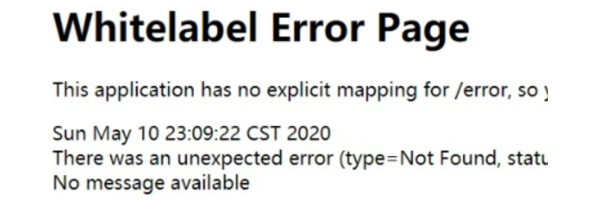
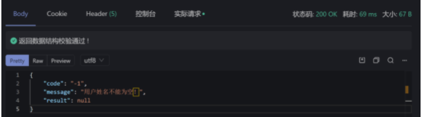
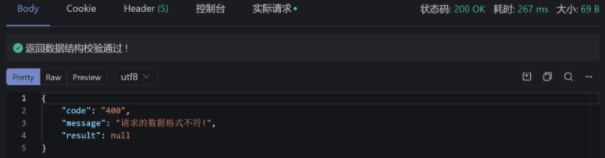
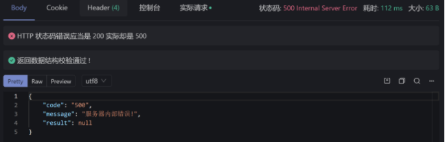
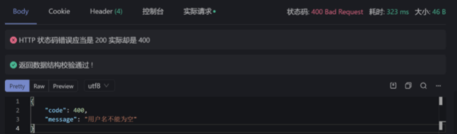
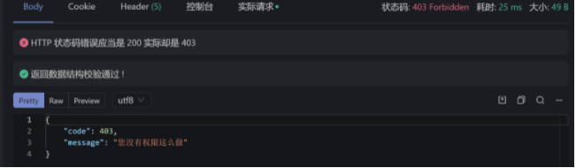
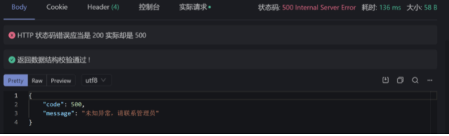

# 异常处理

本文总结了学习过程中的Springboot项目的异常处理情况，主要采用了两种方法，分别为自定义ReslutBody和使用提供的ResponseEntity，比较了二者的优劣，使用ResponseEntity能够取得较好的效果，若想直接使用可以跳转到ResponseEntity部分直接阅读

Springboot存在一套默认的异常处理机制，可以进行简单的异常处理

- 在发生异常时就进行页面跳转，显示异常的信息



- 在前后端数据传输上，如果不进行自定义的异常处理，则只会给前端如下结果

  ```json
  {
      "timestamp": "2022-03-06T03:09:16.397+00:00",
      "status": 403,
      "error": "Forbidden",
      "path": "/articles/how-to-train-your-dragon/comments/1858dbc8-06be-4c66-aed3-d42ddb62f93e"
  }
  ```

  

这显然难以满足日常使用的需要

## 配置

配置只需使用Springboot本身和web的starter，若需配合验证则再导入validation即可(Lombok用于简化实体类的开发)

```xml
 <dependency>
            <groupId>org.springframework.boot</groupId>
            <artifactId>spring-boot-starter-web</artifactId>
        </dependency>

        <dependency>
            <groupId>org.springframework.boot</groupId>
            <artifactId>spring-boot-starter-test</artifactId>
            <scope>test</scope>
        </dependency>
        <dependency>
            <groupId>org.projectlombok</groupId>
            <artifactId>lombok</artifactId>
        </dependency>
        <dependency>
            <groupId>org.springframework.boot</groupId>
            <artifactId>spring-boot-starter-validation</artifactId>
        </dependency>
        <dependency>
            <groupId>com.alibaba</groupId>
            <artifactId>fastjson</artifactId>
            <version>1.2.41</version>
        </dependency>
```

## 方法一：使用自定义返回类型ResultBody

### 枚举类

定义枚举类及其接口类用于设置发生异常时返回的状态码以及信息

其中状态码可以按照自己的需求进行定义，不必一定使用Http_status的状态码，和前端人员达成约定即可

```java
package com.fischer.result;

@Getter
@AllArgsConstructor
public enum CommonEnum implements BaseErrorInfoInterface {
    // 数据操作错误定义
    SUCCESS("200", "成功!"),
    BODY_NOT_MATCH("400","请求的数据格式不符!"),
    SIGNATURE_NOT_MATCH("401","请求的数字签名不匹配!"),
    NOT_FOUND("404", "未找到该资源!"),
    INTERNAL_SERVER_ERROR("500", "服务器内部错误!"),
    SERVER_BUSY("503","服务器正忙，请稍后再试!")
    ;
    /** 错误码 */
    private String resultCode;

    /** 错误描述 */
    private String resultMsg;
}
```

接口类：

```java
package com.fischer.result;

public interface BaseErrorInfoInterface {
    String getResultCode();

    String getResultMsg();
}
```

### 返回的数据格式

定义ResultBody用于专门处理异常时的数据返回

- 内部存储响应码以及自定义的异常信息
- 提供多种静态的error方法用于处理不同情况下的异常信息

正常情况下返回ResponseEntity实体类即可，不再过多赘述

```java
package com.fischer.result;

@Data
public class ResultBody {

    private String code;

    private String message;

    private Object result;

    public ResultBody() {
    }

    public ResultBody(BaseErrorInfoInterface errorInfo) {
        this.code = errorInfo.getResultCode();
        this.message = errorInfo.getResultMsg();
    }
   /*
    *//**
     * 成功
     *
     * @return
     *//*
    public static ResultBody success() {
        return success(null);
    }

    *//**
     * 成功
     * @param data
     * @return
     *//*
    public static ResultBody success(Object data) {
        ResultBody rb = new ResultBody();
        rb.setCode(CommonEnum.SUCCESS.getResultCode());
        rb.setMessage(CommonEnum.SUCCESS.getResultMsg());
        rb.setResult(data);
        return rb;
    }*/

    /**
     * 失败
     */
    public static ResultBody error(BaseErrorInfoInterface errorInfo) {
        ResultBody rb = new ResultBody();
        rb.setCode(errorInfo.getResultCode());
        rb.setMessage(errorInfo.getResultMsg());
        rb.setResult(null);
        return rb;
    }
    /**
     * 失败
     */
    public static ResultBody error(String code, String message) {
        ResultBody rb = new ResultBody();
        rb.setCode(code);
        rb.setMessage(message);
        rb.setResult(null);
        return rb;
    }

    /**
     * 失败
     */
    public static ResultBody error( String message) {
        ResultBody rb = new ResultBody();
        rb.setCode("-1");
        rb.setMessage(message);
        rb.setResult(null);
        return rb;
    }

    @Override
    public String toString() {
        return JSONObject.toJSONString(this);
    }

}


```

### 自定义异常类

我们自定义一个异常类，继承自RuntimeException，用于处理发生的业务异常，内部创建了多个构造方法，针对不同情况进行构造

```java
package com.fischer.exception;


@Data
public class BizException extends RuntimeException {

    private static final long serialVersionUID = 1L;

    protected String errorCode;
    
    protected String errorMsg;

    public BizException() {
        super();
    }

    public BizException(BaseErrorInfoInterface errorInfoInterface) {
        super(errorInfoInterface.getResultCode());
        this.errorCode = errorInfoInterface.getResultCode();
        this.errorMsg = errorInfoInterface.getResultMsg();
    }

    public BizException(BaseErrorInfoInterface errorInfoInterface, Throwable cause) {
        super(errorInfoInterface.getResultCode(), cause);
        this.errorCode = errorInfoInterface.getResultCode();
        this.errorMsg = errorInfoInterface.getResultMsg();
    }

    public BizException(String errorMsg) {
        super(errorMsg);
        this.errorMsg = errorMsg;
    }

    public BizException(String errorCode, String errorMsg) {
        super(errorCode);
        this.errorCode = errorCode;
        this.errorMsg = errorMsg;
    }

    public BizException(String errorCode, String errorMsg, Throwable cause) {
        super(errorCode, cause);
        this.errorCode = errorCode;
        this.errorMsg = errorMsg;
    }

    @Override
    public Throwable fillInStackTrace() {
        return this;
    }

}

```

### 全局异常处理类

自定义全局异常处理类，在运行过程中处理抓取并处理除访问路径错误导致的404以外的所有异常

注解：

- @ControllerAdvice：用于开启全局的异常捕获

  该注解可以限定生效范围：

  - 按注解：@ControllerAdvice(annotations=RestController.class)

  - 按包名：

    @ControllerAdvice("com.fischer.api")

  - 按类型：

    @ControllerAdvice(assignableTypes={ControllerInterface.class,AbstractController.class})

- ExceptionHandler：说明捕获哪些异常，对哪些异常进行处理，内部的参数填写指定要处理的异常，可以为Java提供的异常类，可以为自定义的异常类

  ```java
  @ExceptionHandler(value = BizException.class)
  @ExceptionHandler(value =NullPointerException.class)
  ```

对于需要进行处理的异常类别，根据需求在项目中进行具体的完善

```java
package com.fischer.exception;

@ControllerAdvice
public class GlobalExceptionHandler {
    private static final Logger logger = LoggerFactory.getLogger(GlobalExceptionHandler.class);

    /**
     * 处理自定义的业务异常
     * @param req
     * @param e
     * @return
     */
    @ExceptionHandler(value = BizException.class)
    @ResponseBody
    public ResultBody bizExceptionHandler(HttpServletRequest req, BizException e){
        logger.error("发生业务异常！原因是：{}",e.getErrorMsg());
        return ResultBody.error(e.getErrorCode(),e.getErrorMsg());
    }

    /**
     * 处理空指针的异常
     * @param req
     * @param e
     * @return
     */
    @ExceptionHandler(value =NullPointerException.class)
    @ResponseBody
    public ResultBody exceptionHandler(HttpServletRequest req, NullPointerException e){
        logger.error("发生空指针异常！原因是:",e);
        return ResultBody.error(CommonEnum.BODY_NOT_MATCH);
    }
    /**
     * 处理其他异常
     * @param req
     * @param e
     * @return
     */
    @ExceptionHandler(value =Exception.class)
    @ResponseBody
    public ResultBody exceptionHandler(HttpServletRequest req, Exception e){
        logger.error("未知异常！原因是:",e);
        return ResultBody.error(CommonEnum.INTERNAL_SERVER_ERROR);
    }
}
```

- bizExceptionHandler用于处理多种业务异常（RuntimeException）
- exceptionHandler（NullPointerException.class）用于处理空指针异常
- exceptionHandler（Exception.class）用于处理所有其他的未知异常

额外的技术点：

- LoggerFactory用于显示日志信息。

  - 使用指定的类初始化 LoggerFactory，输出日志所在类的信息。

    ```java
    private static final Logger logger = LoggerFactory.getLogger(GlobalExceptionHandler.class);
    ```

  - 输出日志信息，通过方法指定级别，如`debug`，`info`，`error`等

    ```java
    logger.error("发生业务异常！原因是：{}",e.getErrorMsg());
    ```

### 实体类

```java
package com.fischer.pojo;

@Data
@NoArgsConstructor
public class User implements Serializable {
    private static final long serialVersionUID = 1L;
    /** 编号 */
    private int id;
    /** 姓名 */
    private String name;
    /** 年龄 */
    private int age;
    
    public String toString() {
        return JSONObject.toJSONString(this);
    }
}

```

### Controller

定义一个简单的Controller用于进行异常的测试

```java
package com.fischer.controller;

@RestController
@RequestMapping(value = "/api")
public class UserRestController {

    @PostMapping("/user")

    public boolean insert( @RequestBody User user) {
        System.out.println("开始新增...");
        //如果姓名为空就手动抛出一个自定义的异常！
        if(user.getName()==null){
            throw  new BizException("-1","用户姓名不能为空！");
        }
        return true;
    }

    @PutMapping("/user")
    public boolean update() {
        System.out.println("开始更新...");
        //这里故意造成一个空指针的异常，并且不进行处理
        String str=null;
        str.equals("111");
        return true;
    }

    @DeleteMapping("/user")
    public boolean delete()  {
        System.out.println("开始删除...");
        //这里故意造成一个异常，并且不进行处理
        Integer.parseInt("abc123");
        return true;
    }

    @GetMapping("/user")
    public List<User> findByUser(User user) {
        System.out.println("开始查询...");
        List<User> userList =new ArrayList<>();
        User user2=new User();
        user2.setId(1);
        user2.setName("xuwujing");
        user2.setAge(18);
        userList.add(user2);
        return userList;
    }

}
```

### 测试结果

- insert

  在insert中，对异常进行手动处理，为空则抛出

  测试数据故意令name为null，用于抛出BizException，测试异常处理的结果

  ```json
  {"id":1,"age":18}
  ```

  返回结果：

  
  
  由于抛出异常时传入的code为-1，因此并未使用枚举类中定义的响应码以及响应说明
  
- allUser

  不对异常进行手动处理，测试自动抓取异常的功能

  造一个空指针异常

  返回结果：

  

  可以看到，返回结果与我们预期的BODY_NOT_MATCH相符

### 小结

  可以看到，使用ResultBody和枚举类的方法可以处理一些常见的异常，在全局处理类当中分别对RuntimeException和空指针异常以及其他异常分别进行处理。

  但这个方法最大的问题是返回结果全部为200OK，与ResultBody中的我们设定的响应码不符，在处理空指针和其他异常时，我们可以通过`@ResponseStatus`手动设置响应码，从而与ResultBody中的响应码一致

  ```java
   @ResponseStatus(HttpStatus.INTERNAL_SERVER_ERROR)
  ```



  但是，在全局异常处理类当中，bizExceptionHandler方法通过不同的抛出方式处理不同的异常，但是在此只有一个方法，也只能通过`@ReponseStatus`指定一种响应码，因此存在响应码与ResultBody响应码不符的问题，并且所有的RuntimeException只有一种响应码，这便无法满足的需求。

   **既然本来为了简化异常处理而设定的ResultBody和枚举类便没有存在的必要了，因此可以直接使用ResponseEntity，通过在抛出BizException时传入响应码，使用ResponseEntity设置返回时的响应码**

## 方法二：使用ResponseEntity

### 实体类

在实体类当中，通过Validation进行表单验证

```java
@Data
public class User {
    String id;
    @NotBlank(message = "用户名不能为空")
    String username;
    int age;
}
```

### 自定义异常类

为了配合ResponseEntity设置响应码，因此这里直接将status设置为HttpStatus类，可以在抛出时传入自定义的Message，也可直接通过响应码获取默认的message

```java
package com.fischer.exception;

@Getter
public class BizException extends RuntimeException{
    private HttpStatus status;
    private String message;

    public BizException(HttpStatus status,String message){
        super(message);
        this.status=status;
        this.message=message;

    }
    public BizException(HttpStatus status){
        this(status,status.getReasonPhrase());
    }

}
```

### 全局异常处理类

目前可以单独处理:

- 手动抛出的异常
- 空指针异常
- 表单校验失败的异常

其他的异常按未知异常来处理交给Exception统一处理,可以根据开发中的具体情况来合理设计

```java
package com.fischer.exceptionHandler;

@RestControllerAdvice
public class GlobalExceptionHandler {
    private static final Logger logger = LoggerFactory.getLogger(GlobalExceptionHandler.class);
    @ExceptionHandler(value = BizException.class)
    @ResponseBody
    /*用于处理自定义异常*/
    public ResponseEntity bizExceptionHandler(HttpServletRequest req,BizException e){
        Map<String,Object> map=new HashMap<>();
        map.put("message",e.getMessage());
        map.put("code",e.getStatus().value());
        return new ResponseEntity(map,e.getStatus());
    }
    /*配合Validation进行表单认证*/
    @ExceptionHandler(MethodArgumentNotValidException.class)
    public ResponseEntity notValid(HttpServletRequest req,MethodArgumentNotValidException e){
        Map<String,Object> map=new HashMap<>();
        List<ObjectError> allErrors = e.getAllErrors();
        ObjectError objectError = allErrors.get(0);
        map.put("message",objectError.getDefaultMessage());
        map.put("code", HttpStatus.BAD_REQUEST.value());
        return new ResponseEntity(map,HttpStatus.BAD_REQUEST);
    }
    /*处理空指针异常*/
    @ExceptionHandler(NullPointerException.class)
    public ResponseEntity notpointer(HttpServletRequest req,NullPointerException e){
        logger.error("空指针异常");
        Map<String,Object> map=new HashMap<>();
        map.put("message","服务器异常，请联系管理员");
        map.put("code", HttpStatus.INTERNAL_SERVER_ERROR.value());
        return new ResponseEntity(map,HttpStatus.INTERNAL_SERVER_ERROR);
    }

    /*处理其他未知异常*/
    @ExceptionHandler(Exception.class)
    public ResponseEntity unknowError(HttpServletRequest req,Exception e){
        logger.error("未知异常");
        Map<String,Object> map=new HashMap<>();
        map.put("message","未知异常，请联系管理员");
        map.put("code",HttpStatus.INTERNAL_SERVER_ERROR.value());
        return new ResponseEntity(map,HttpStatus.INTERNAL_SERVER_ERROR);
    }

}
```

获取Validation中的认证失败信息：

在使用Validation进行认证时，如果直接使用和处理其他异常的相同的获取方法，会得到如下的结果

```java
{
    "code": 400,
    "message": "Validation failed for argument [0] in public org.springframework.http.ResponseEntity<?> com.fischer.api.UserController.addUser(com.fischer.pojo.User): [Field error in object 'user' on field 'username': rejected value [null]; codes [NotBlank.user.username,NotBlank.username,NotBlank.java.lang.String,NotBlank]; arguments [org.springframework.context.support.DefaultMessageSourceResolvable: codes [user.username,username]; arguments []; default message [username]]; default message [用户名不能为空]] "
}
```

如此的message显然不利于阅读，因此我们需要从中获取我们自己设置的message

```
// MethodArgumentNotValidException e
List<ObjectError> allErrors = e.getAllErrors();
        ObjectError objectError = allErrors.get(0);
        map.put("message",objectError.getDefaultMessage());
```

最后得到的结果为：

```java
{
    "code": 400,
    "message": "用户名不能为空"
}
```

### Controller

```java
package com.fischer.api;

@RestController
@ControllerAdvice
@RequestMapping("api/user")
@Validated
public class UserController {

    /*通过提交post方式提交进行表单验证*/
    @PostMapping
    public ResponseEntity<?> addUser(@Valid @RequestBody User user){

        return ResponseEntity.ok(user);

    }
    /*模拟测试请求时无权限的情况*/
    @GetMapping
    public ResponseEntity alluser(){
        throw new BizException(HttpStatus.FORBIDDEN,"您没有权限这么做");
    }
    @DeleteMapping
    public ResponseEntity deleteUser(){
        String test=null;
        test.equals("123");
        return  ResponseEntity.ok("123");
    }
    /*测试未找到资源，手动抛出404情况*/
    @GetMapping(path = "1")
    public ResponseEntity user(){
        throw new BizException(HttpStatus.NOT_FOUND,"未找到该资源，请求失败");
    }
    /*测试其他未知异常*/
    @DeleteMapping("all")
    public ResponseEntity deleteAll(){
        Integer.parseInt("abc123");
        return ResponseEntity.ok("123");
    }
}

```

创建一个Controller类用于模拟开发中遇到的各种异常情况，进行测试

### 测试结果

- addUser

  在该方法中，使用post请求提交数据 ，刻意令username为null，测试`@Notblank`的验证情况以及自定义的异常处理情况

```json
{"id":1,
"age":18}
```



- allUser

  在其中手动抛出403，测试未经授权的情况



- deleteUser

  在其中手动造一个空指针异常，测试空指针的自动捕捉处理情况


- user

  手动抛出404，结果如下


- deleteAll

  设置一个转换形式的异常，模拟出现的其他未知异常



### 小结

通过ResponseEntity的返回形式，能够针对多种手动抛出的异常都设置正确的响应码，并且通过增加map中的额外键值对，便可以补充自定义的信息

该方法可以处理后端由于资源不存在而抛出的404，但是对于url填写错误导致的404，依旧无法处理

如果想使用自定义的响应码，可以在BizException中在添加一个code的成员变量，当抛出异常时，指定Http响应码和内部code，这样便可以保证了Http响应码能符合基本的错误信息的要求，并且内部的code，可以自定义，方便前后端进行交流，这里就不再进行演示

