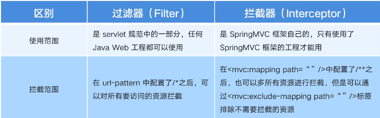
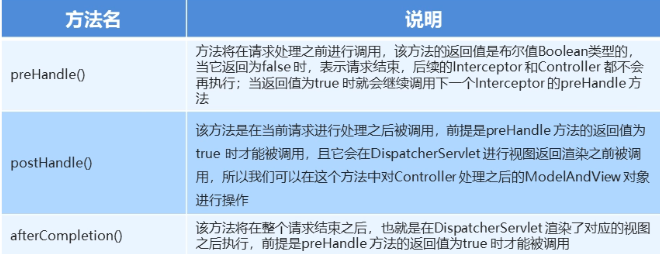

# SpringMVC拦截器

SpringMVC的拦截器类似于Servlet开发过程中的过滤器Filter，用于对处理器进行预处理和后处理

将拦截器按一定顺序联结成一条链，成为拦截器链，当访问被拦截的方法或字段时，拦截器链中的拦截器就会按定义的顺序被调用，拦截器也是AOP思想的具体实现

拦截器与过滤器的区别



## 快速入门

### 配置

- 通过bean标签告诉springmvc自定义的拦截器的位置
- path表明对那些资源进行拦截`/**`表示对所有资源进行拦截

```xml
	<mvc:interceptors>
        <mvc:interceptor>
            <!--对那些资源执行拦截操作-->
            <mvc:mapping path="/**"/>
            <bean class="com.fischer.interceptor.MyInterceptor"/>
        </mvc:interceptor>
    </mvc:interceptors>
```


### 自定义拦截器

自定义Interceptor类，实现`HandlerIntercepor`

返回值为false时表示直接拦截，后面所有的方法都不执行，返回值为true表示放行

```java
package com.fischer.interceptor;

public class MyInterceptor implements HandlerInterceptor {
    //目标方法执行之前
    @Override
    public boolean preHandle(HttpServletRequest request, HttpServletResponse response, Object handler) throws Exception {
        System.out.println("pre handle");
        return false;//返回值为false时表示直接拦截，后面所有的方法都不执行
    }
    //执行方法之后，返回视图之前
    @Override
    public void postHandle(HttpServletRequest request, HttpServletResponse response, Object handler, ModelAndView modelAndView) throws Exception {
        HandlerInterceptor.super.postHandle(request, response, handler, modelAndView);
    }
    //流程都执行完毕之后执行
    @Override
    public void afterCompletion(HttpServletRequest request, HttpServletResponse response, Object handler, Exception ex) throws Exception {
        HandlerInterceptor.super.afterCompletion(request, response, handler, ex);
    }
}

```

但是只能对于项目中的方法进行拦截，对于静态资源，如jsp，html等仍可以直接访问

通过prehandle进行拦截，判断参数，符合要求则放行，否则则拦截并转发到指定页面

```java
@Override
    public boolean preHandle(HttpServletRequest request, HttpServletResponse response, Object handler) throws Exception {
        System.out.println("pre handle");
        String param = request.getParameter("param");
        if(param!=null&&param.equals("yes")){
            return true;
        }
        else{
            request.getRequestDispatcher("/index.jsp").forward(request,response);
            return false;
        }
    }
```



  平时使用较多的为prehandle()，用于进行拦截，判断是否已经登录，或是否有权限等

开发步骤：

- 创建拦截器类实现HandlerInterceptor接口
- 配置拦截器
- 测试拦截器的拦截效果

## 配置类开发

在Springboot项目当中，可以通过配置类的方式替代xml的配置方法，从而达到同样的效果

**配置类**：

- @Configuration注解用于声明此为Springboot的一个配置类
- 实现WebMvcConfigurer接口
- 重写addIntercepetors的方法
  - 指定自定义的拦截器
  - 设置要拦截的路径
  - 以及放行的路径，除`/user/test1`以外其他的均被拦截

```java
@Configuration
public class InterceptorConfigs implements WebMvcConfigurer {
    @Override
    public void addInterceptors(InterceptorRegistry registry) {
        registry.addInterceptor(new MyInterceptor())
                .addPathPatterns("/**")
                .excludePathPatterns("/user/test1");
    }
}
```

其他的如拦截器等均与使用xml时一致

