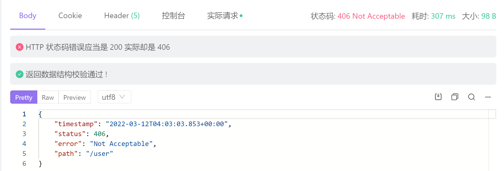

# 406无法解析

在进行由后端向前端返回数据时，遇到了一个非常低级的错误，如下：



报错结果如下：

```java
Resolved [org.springframework.web.HttpMediaTypeNotAcceptableException: Could not find acceptable representation]
```


406状态码的意思为后端向前端传输的数据无法解析

在实体类中忘添加getter方法，导致对象中的数据前端无法拿到，相当无语，补充上去即可，但也存在其他情况如序列化等可能出现类似的情况。

