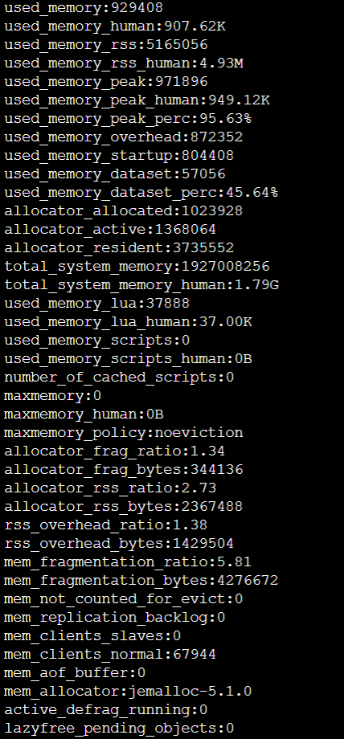
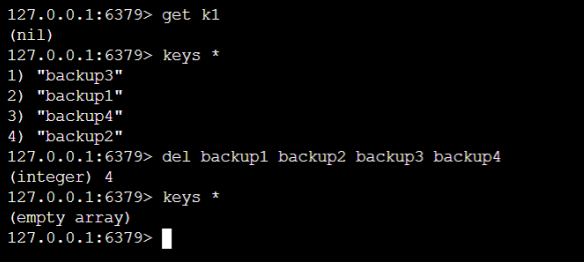
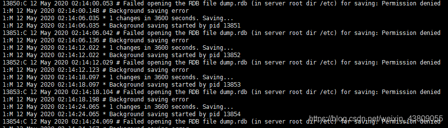

# Redis被攻击

今日服务器上的键值对莫名全部丢失，最初以为是内存设置的问题，因为通过info memory查询到的maxmemory为0：



但是在修改问maxmerory之后过来一段时间键值对依然全部丢失，并且又重新出现了四个backup，删掉之后一段时间又重新出现了，此时发现了问题不对劲





搜索backup并且打开日志中的文件一看，才知道被攻击了，原因是没用开启保护模式并且没有设置密码。

该问题是由 Redis 的配置不当引起的，满足以下三个条件：

- 服务端以 root 启动
- 服务端无密码认证或者使用的是弱口令进行认证
- redis.conf 的 bind ip 设为了允许外部连接

redis被彻底暴露在互联网上

修改配置文件，打开保护模式：

```conf
protected-mode yes
```

设置密码: foobared设置为自己的密码

```conf
requirepass foobared
```

```
config set requirepass foobared
```

设置好后，重新创建一个docker容器即可，可得到一个干净的redis-server，至此问题结束，成功解决