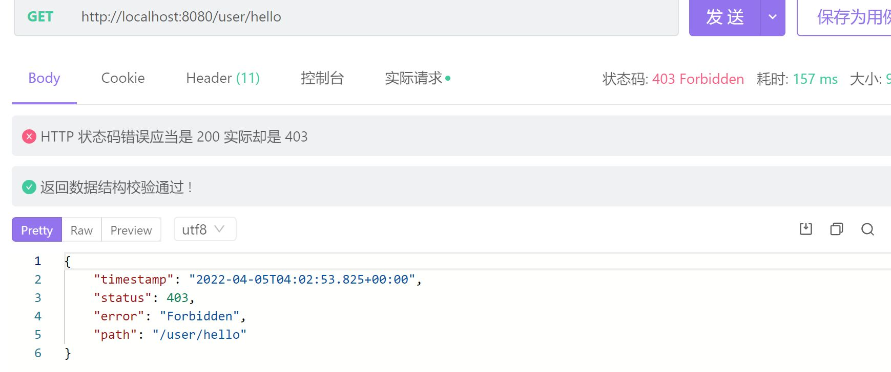
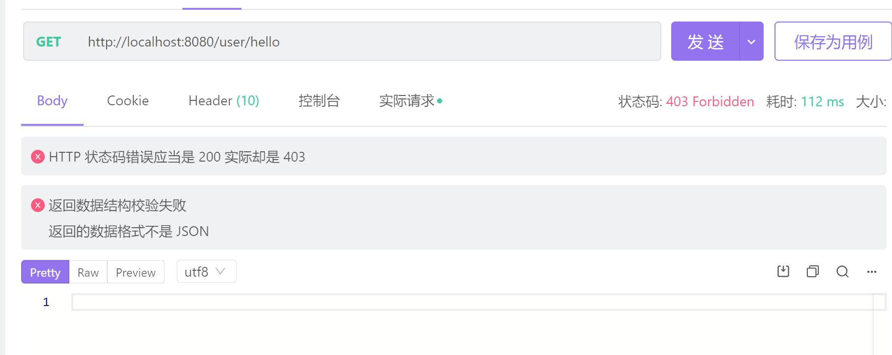

# SpringSecurity自定义处理403

SpringSecurity对于未授权的情况存在着默认的处理方式，具体处理方式根据版本而定，在springboot使用2.5.0时返回的状态为



在springboot使用2.6.3及以上时，响应体则为空



SpringSecurity的版本根据springboot自动配置，具体版本暂时未研究

因此当跟着教程学的时候发现自己的403没有响应体无需慌张，一样能够自定义进行处理

主要针对未认证和未授权两种状态，但是似乎springsecurity默认返回的响应码全为403，有待后续测试

## 代码实现

**Controller：**

```java
@RestController
@RequestMapping("user")
public class UserController {

    @Autowired
    private UserService userService;
    @Autowired
    StringRedisTemplate redisTemplate;

    @GetMapping
    public ResponseEntity hello(){
        ResultType resultType=new ResultType(200,"hello","访问成功");
        return ResponseEntity.ok(resultType);
    }

    @PostMapping("login")
    public ResponseEntity login(@RequestBody LoginParam loginParam){
        UserWithToken user=userService.login(loginParam);
        ResultType resultType=new ResultType(200,user,"登陆成功");
        return ResponseEntity.ok(resultType);
    }

    @DeleteMapping
    public ResponseEntity logout(@RequestHeader("Authorization") String token){
        Boolean logout = userService.logout(token);
        if(logout){
            return ResponseEntity.ok(new ResultType(204,null,"注销成功"));
        }
        else{
            throw new BizException(HttpStatus.INTERNAL_SERVER_ERROR,"服务器异常，注销失败");
        }
    }

}

```


在配置中可以看出，只有user/login可以直接访问，访问user则会被拦截

**配置：**

```java
@Configuration
@EnableGlobalMethodSecurity(prePostEnabled = true)
public class SecurityConfig extends WebSecurityConfigurerAdapter {

    //创建BCryptPasswordEncoder注入容器
    @Bean
    public PasswordEncoder passwordEncoder(){
        return new BCryptPasswordEncoder();
    }
    @Autowired
    private Myfilter jwtAuthenticationTokenFilter;
    @Autowired
    private AccessDeniedHandler accessDeniedHandler;
    @Autowired
    private AuthenticationEntryPoint authenticationEntryPoint;

    @Override
    protected void configure(HttpSecurity http) throws Exception {
        http
                //关闭csrf
                .csrf().disable()
                //不通过Session获取SecurityContext
                .sessionManagement().sessionCreationPolicy(SessionCreationPolicy.STATELESS)
                .and()
                .authorizeRequests()
                // 对于登录接口 允许匿名访问
                .antMatchers("/user/login").permitAll()
                .antMatchers("/img/**").permitAll()
//                .antMatchers("/testCors").hasAuthority("system:dept:list222")
                // 除上面外的所有请求全部需要鉴权认证
                .anyRequest().authenticated();

        //添加过滤器       http.addFilterBefore(jwtAuthenticationTokenFilter, UsernamePasswordAuthenticationFilter.class);

        //配置异常处理器
        http.exceptionHandling()
                //配置认证失败处理器              .authenticationEntryPoint(authenticationEntryPoint)
                .accessDeniedHandler(accessDeniedHandler);
    }
    @Override
    public void configure(WebSecurity web) throws Exception {
        web.ignoring().antMatchers("/img/**");
    }
    @Bean
    @Override
    public AuthenticationManager authenticationManagerBean() throws Exception {
        return super.authenticationManagerBean();
    }

}

```


定义两个实现类：

**AccessDeniedHandlerImpl**

```java
@Component
public class AccessDeniedHandlerImpl implements AccessDeniedHandler {
    @Override
    public void handle(HttpServletRequest request, HttpServletResponse response, AccessDeniedException accessDeniedException) throws IOException, ServletException {
        ResultType resultType=new ResultType(403,null,"暂无权限访问");
        ObjectMapper objectMapper=new ObjectMapper();
        String s = objectMapper.writeValueAsString(resultType);
        response.setStatus(200);
        response.setContentType("application/json");
        response.setCharacterEncoding("utf-8");
        response.getWriter().print(s);
    }
}
```

**AuthenticationEntryPointImpl **

```java
@Component
public class AuthenticationEntryPointImpl implements AuthenticationEntryPoint {
    @Override
    public void commence(HttpServletRequest request, HttpServletResponse response, AuthenticationException authException) throws IOException, ServletException {
        ResultType resultType=new ResultType(403,null,"暂无权限访问");
        ObjectMapper objectMapper=new ObjectMapper();
        String s = objectMapper.writeValueAsString(resultType);
        response.setStatus(200);
        response.setContentType("application/json");
        response.setCharacterEncoding("utf-8");
        response.getWriter().print(s);
    }
}
```

**SecurityConfig进行配置**

```java
 //配置异常处理器
        http.exceptionHandling()
                //配置认证失败处理器
                .authenticationEntryPoint(authenticationEntryPoint)
                .accessDeniedHandler(accessDeniedHandler);
```

## 理论分析

**AuthenticationEntryPoint**

AuthenticationEntryPoint 是 Spring Security Web 一个概念模型接口，顾名思义，他所建模的概念是：“认证入口点”。
它在用户请求处理过程中遇到认证异常时，被 ExceptionTranslationFilter 用于开启特定认证方案 (authentication schema) 的认证流程。

这里参数 `request `是遇到了认证异常 `authException `用户请求，`response `是将要返回给客户的相应，方法 `commence `实现，也就是相应的认证方案逻辑会修改 `response `并返回给用户引导用户进入认证流程。

**AccessDeniedHandler**

AccessDeniedHandler 仅适用于已通过身份验证的用户。未经身份验证的用户的默认行为是重定向到登录页面（或适用于正在使用的身份验证机制的任何内容）。

而二者失败时返回的状态码均未403，并不是像网上搜到的那样，只要是403就是用AccessDeniedHandler进行处理，被CSDN上的部分文章坑了好久

而对于直接在未登录就进行访问user路径时，显然属于认证入口点问题，应当归AuthenticationEntryPoint管，定义其实现类就可进行完成自定义处理

之后便可正常进行异常处理，与springboot的版本无关

简单测试一下


