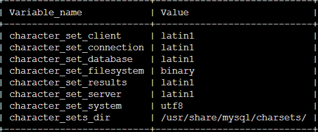

# mysql插入emoji

## 出错原因

主要原因是因为mysql数据库编码的问题，mysql默认的编码为latin或者utf-8，为三个字节，而emoji为四个字节，因此无法处理

同时低版本的navicat不支持utf8mb4编码，即使成功将编码修改为utf8mb4使用navicat进行插入依旧会失败，同时也无法正常显示，建议更换高版本的navicat

## 解决方案

使用docker部署mysql后，默认不存在mysql.cnf文件，因此需要自己设置

1.创建文件utf8mb4.cnf,其内容如下，这个就是sql的配置文件，作用是把默认字符集改为utf8mb4

```cnf
[client]
default-character-set = utf8mb4

[mysql]
default-character-set = utf8mb4

[mysqld]
character-set-client-handshake = FALSE
character-set-server = utf8mb4
collation-server = utf8mb4_unicode_ci
```

在utf8mb4.cnf同一目录，创建文件Dockerfile，内容如下，作用是基于mysql5.6 官方的docker镜像，把utf8mb4.cnf 复制到容器的/etc/mysql/conf.d/目录下，构建新镜像

```dockerfile
FROM mysql:5.6
COPY utf8mb4.cnf /etc/mysql/conf.d/
```

**部署命令：**

```shell
docker run -id \
-p 3307:3306 \
--name=c_mysql \
-v $PWD/conf:/etc/mysql/conf.d \
-v $PWD/logs:/logs \
-v $PWD/data:/var/lib/mysql \
-e MYSQL_ROOT_PASSWORD=123456 \
mysql5.7_utf8mb4
```

`show variables like 'character%';`查看编码：



但是不知为何还是寄了，因此手动编写配置文件

```cnf
[client]
default-character-set = utf8mb4

[mysql]
default-character-set = utf8mb4

[mysqld]
character-set-client-handshake = FALSE
character-set-server = utf8mb4
collation-server = utf8mb4_unicode_ci
```

在部署命令中，进行的数据卷映射为`-v root/mysql/conf:/etc/mysql/conf.d \`,

因此将写的mysql.cnf文件放在`root/mysql/conf`目录下

至此mysql的默认编码变为utf8mb4，建表时编码采用默认编码的均变为utf8mb4，但是建表时使用其他编码，如直接指定为u8，无法改变，需要手动去每个字段的编码

使用navicat修改即可，注意时一个个字段的去改


此处只是修改了description，并不是修改了整张表😭，需要一个个修改

至此，mysql能够正常插入emoji，如果navicat插入或者显示仍有问题的请换高版本的navicat，(至少11.1版本不行)